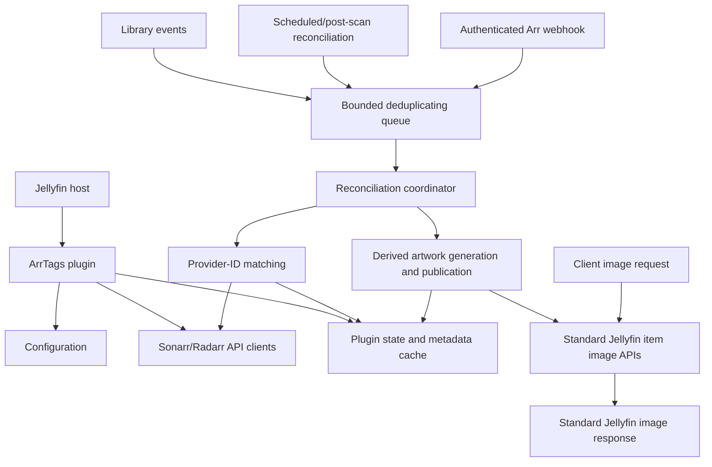

# Architecture

**Status:** Accepted v1 (frozen for V1; Phase 1 complete)

**Last reviewed against:**
- Jellyfin 12.x
- Sonarr v4.x
- Radarr v5.x

**Purpose:** Canonical architectural design before implementation begins.

This document is the authoritative design for ArrTags. The companion research
documents contain API details, source evidence, and alternatives; they do not
override the decisions recorded here.

## 1. Scope and principles

ArrTags is a Jellyfin 12 plugin that reads Sonarr and Radarr metadata and
publishes derived badge artwork through Jellyfin's item-image APIs. The plugin
is read-only with respect to Sonarr and Radarr; its only Jellyfin artwork
mutation is the guarded publication of its own derived image.

The architecture follows these principles:

- Preserve the original poster source through plugin-owned provenance and
  restoration state; a validated derived poster may become Jellyfin's active
  artwork through the supported image APIs.
- Deliver badges through Jellyfin's normal image endpoints so all clients can
  receive the same result.
- Keep external I/O, image processing, artwork publication, and cache
  maintenance outside library event handlers and image request paths.
- Prefer stable provider IDs and documented Jellyfin APIs over names, paths,
  database access, or third-party plugin internals.
- Treat missing, stale, ambiguous, or unavailable external metadata as a
  recoverable condition and leave the current usable artwork unchanged when
  necessary.
- Make every derived result fingerprinted, bounded, cancellable, and safe to
  regenerate after a restart.

## 2. Goals and non-goals

### Goals

- Support Jellyfin 12 only for the initial implementation.
- Support independently configured Sonarr and Radarr connections.
- Match Jellyfin movies to Radarr and TV content to Sonarr.
- Display actual file metadata, especially actual quality, rather than treating
  a configured quality profile as the file's quality.
- Update badges after Jellyfin changes, Arr changes, webhooks, and scheduled
  reconciliation.
- Preserve the original source artwork through plugin-owned provenance and
  restoration state; avoid modifying media files or Jellyfin's image cache.
- Remain safe alongside Jellyfin Enhanced.
- Fail without degrading Jellyfin library operations or image serving.

### Non-goals

- Writing to Sonarr or Radarr.
- Modifying media files, media-folder posters, or Jellyfin's image cache.
- Replacing Jellyfin's metadata refresh or image-provider pipeline.
- Depending on Jellyfin Enhanced's DOM, JavaScript, configuration, or private
  endpoints.
- Supporting arbitrary Arr applications or Jellyfin versions before 12.

## 3. System architecture



The plugin has two related but separate paths:

1. **Reconciliation path:** obtains and fingerprints Arr metadata ahead of image
   requests. It is asynchronous, bounded, and restart-safe.
2. **Artwork path:** observes validated metadata and source-artwork state,
   renders derived artwork outside the image request path, and publishes it
   through Jellyfin's supported item-image APIs. Native clients then receive it
   through Jellyfin's standard image routes.

The artwork path is the canonical rendering strategy. ArrTags must retain
enough plugin-owned source and provenance state to avoid repeatedly overlaying
its own output and to restore the original source when appropriate. The active
derived image is delivered by Jellyfin's normal image controller, rather than
by an ArrTags response interceptor.

## 4. Plugin components and boundaries

| Component | Responsibility | Boundary |
| --- | --- | --- |
| `Plugin` | Identity, configuration, data-folder ownership, uninstall hook | Thin `BasePlugin<PluginConfiguration>` entry point |
| Service registrator | Register services, hosted services, controllers, artwork publication, and tasks | Parameterless `IPluginServiceRegistrator` |
| Configuration service | Validate and publish immutable configuration snapshots | Uses plugin configuration persistence; never exposes secrets |
| Credential boundary | Publish the private versioned secret snapshot and issue bounded credential leases | Singleton `IPluginSecretResolver`; never serializes or persists secret values |
| Sonarr client | Read Sonarr v3 resources and probe connections | `IHttpClientFactory`; no write endpoints |
| Radarr client | Read Radarr v3 resources and probe connections | `IHttpClientFactory`; no write endpoints |
| Matching service | Match a Jellyfin item to one configured Arr record | Provider IDs first; ambiguity is not auto-accepted |
| Metadata cache | Store current Arr snapshot and badge-relevant fingerprint | Versioned plugin-owned state under `DataFolderPath` |
| Reconciliation coordinator | Fetch, match, fingerprint, and enqueue affected items | Runs outside event handlers and image requests where possible |
| Work queue | Coalesce item work and bound memory/concurrency | Hosted service with cancellation-aware workers |
| Artwork publisher | Publish validated derived artwork through Jellyfin's public image APIs | Does not write media files or Jellyfin's image-cache directory directly |
| Badge renderer | Draw configured labels onto retained source artwork | Plugin-owned, provider-neutral SkiaSharp service with bundled DejaVu Sans Bold 2.37; bounded input/output and render concurrency |
| Render work cache | Avoid repeated generation before publication where useful | Optional, bounded, fingerprint-keyed work state; not the client response path |
| Webhook controller | Accept authenticated low-latency Arr hints | Validates token and payload; never trusts payload as source of truth |
| Scheduled task | Manual and periodic full reconciliation | Cancellable, progress-reporting, retry-safe |

No component accesses Jellyfin database tables, image-cache directories,
`ImageSaver`, or concrete Jellyfin implementation types when a plugin-facing
API is available.

## 5. Plugin lifecycle and registration

### Startup

1. Jellyfin discovers the `BasePlugin<PluginConfiguration>` implementation.
2. Jellyfin constructs the parameterless service registrator before building
   the service provider.
3. The registrator registers configuration, API clients, caches, matching and
   rendering services, the hosted worker, scheduled task, webhook controller,
   and artwork publication services.
4. The hosted service subscribes to library events and starts the bounded queue
   consumer after the host is ready.
5. Startup must not perform unbounded Arr requests or a full-library render
   synchronously.

### Shutdown and uninstall

- Unsubscribe library events during hosted-service shutdown.
- Establish a durable disable/uninstall fence, stop accepting new publication
  work, and recover or terminally classify in-flight artwork operations before
  artifact cleanup.
- Cancel queued work and await workers within host shutdown limits, but never
  discard a non-terminal artwork operation or its source/derived artifacts.
- Do not leave unmanaged threads or fire-and-forget tasks running.
- Plugin-owned cache/state and source-artwork provenance may be removed on
  uninstall only after the lifecycle fence and all artwork operations are
  terminal. Active ArrTags artwork must be restored first when it is still
  identified as ArrTags-owned; unresolved or externally changed artwork keeps
  the recovery records and artifacts for later reconciliation.

## 6. Configuration and persisted state

### Configuration

`PluginConfiguration` is persisted through Jellyfin's plugin configuration
mechanism. Updates are treated as replacement snapshots, not as mutable objects
shared with background workers. A candidate configuration is validated before it
becomes active; an invalid replacement is rejected and the last valid snapshot
stays active so invalid configuration cannot bring down Jellyfin.

The persisted configuration includes:

- Independently enabled Sonarr and Radarr connections.
- Base URL, API key, timeout, and explicit TLS exception policy per connection.
- Enabled libraries (collection-folder/library identifiers, not display names),
  eligible image/item types, and V1 badge surfaces. V1 badge-bearing item types
  are Movie and Episode posters; Series and Season are structural only and
  aggregation remains post-V1 (ADR-006).
- Badge fields, placement, colors, scale, margins, output limits, and renderer
  version settings. DG-3 is resolved by ADR-009: V1 uses the bounded,
  provider-neutral Movie/Episode Primary-poster specification in that ADR.
- Operational limits supplied by `OperationalLimits`: queue capacity, provider
  and render concurrency, request timeout, retry count/backoff, provider
  response and artifact sizes, decoded image dimensions, reconciliation batch
  size, cache TTL/quota, provenance retention, and the stale-data window (see
  section 12 and ADR-004).
- V1 does not persist or publish path mappings. Configured path fallback is
  deferred out of V1 by ADR-008.
- Webhook token or equivalent secret for inbound Arr notifications.
- Jellyfin Enhanced coexistence and duplicate-badge policy.

API keys and webhook secrets must not appear in logs, status responses, cache
keys, fingerprints, or exception messages. TLS certificate validation is strict
by default; any exception is explicit and scoped to one connection.

### Secret access boundary

Jellyfin's persisted `PluginConfiguration` is the only V1 source of truth for
the Sonarr API key, Radarr API key, and inbound webhook shared secret. ArrTags
does not add a second secret file, state record, database table, environment
variable, or external secret manager. Protection at rest therefore follows the
Jellyfin configuration/data-folder permissions and administrative boundary.

The configuration service creates a safe `SecretReference` for each configured
credential slot and an in-memory private secret snapshot when it creates the
public `PluginConfigurationSnapshot`. The active configuration is one atomic
versioned pair: a public snapshot containing no secret values and a private map
from typed references to secret material. V1 has one stable API-key slot for
each provider and one separate webhook-secret slot. References are generated by
the configuration boundary, contain no secret, and are safe to carry in an
`ArrConnection`, queue hint, or diagnostic status.

The DI boundary is a singleton `IPluginSecretResolver`. Its semantic contract is
`TryAcquire(reference, expectedConfigurationVersion)`, returning a short-lived,
disposable, non-serializable `SecretLease` or no result. The lease has no public
diagnostic/string representation. The provider transport boundary uses an
API-key lease only to add `X-Api-Key` to the current request; a future webhook
boundary uses its distinct lease for constant-time candidate comparison. The
HTTP client factory remains secret-free.

Workers capture the public configuration version before resolving a connection
and acquire the matching lease before sending a request. A version mismatch,
disabled connection, unknown reference, or missing secret produces no lease and
causes the bounded operation to discard or restart against the current snapshot.
Queue items, caches, canonical models, state envelopes, and fingerprints carry
only the safe reference or configuration version, never a lease or secret.
The resolver publishes immutable maps for concurrent workers; each worker gets
an independent lease, no lock is held across external I/O, and a lease is
released when the bounded request or authentication comparison completes,
cancels, or times out.

Configuration replacement validates the candidate first, then creates both
snapshot components and swaps them together. Invalid input leaves both the
public and private active state unchanged. A key rotation retains the same
safe reference and connection identity when the provider and base URL are
unchanged, but increments the configuration version. New work uses the new
lease; an already acquired lease may finish its bounded cancellable request with
the old value. A retry must reacquire against the current version rather than
reuse an old authentication failure. Restart reconstructs the private snapshot
from persisted plugin configuration; no plugin state or metadata cache contains
credentials.

### Plugin state

State is stored under `DataFolderPath`, not in Jellyfin's database or image
cache. Each record is written as a versioned envelope carrying a schema version
and a SHA-256 integrity hash over its payload. Writes go through a flushed
temporary file and an atomic replacement in the same directory, and record kinds
and identifiers are validated as single path segments so state cannot escape its
root. Corrupt non-authoritative cache state may be ignored or rebuilt;
authoritative artwork state and operation records are quarantined and retained
for recovery rather than treated as `NotPublished`. Cache records are bounded by
age and quota, while authoritative records are never pruned as ordinary cache
entries; only explicitly terminal provenance records are eligible for retention
cleanup.

Publication and restoration use a durable write-ahead operation journal under
the same plugin data boundary. `ArtworkOperation` records, operation manifests,
and staged artifacts are not evictable render-cache entries. They remain until
the operation is committed, safely aborted, or durably tombstoned as removed.
An invalid or torn operation record is quarantined and causes recovery to fail
closed rather than replaying an unknown mutation.

The retained source artwork is stored as a content-addressed, immutable artifact
under the plugin data folder (the `artifacts/source` area, sharded by hash). The
exact source bytes are accompanied by an authoritative manifest containing the
MIME type, byte length, and SHA-256, persisted through the versioned state
boundary so it is never treated as ordinary cache and a corrupt manifest is
quarantined. Promotion is atomic and bounded: the bytes pass size, MIME/magic
byte, and hash validation before an identical artifact is reused (content
addressing makes promotion idempotent). When the authoritative artifact storage
quota would be exceeded, new derived work is rejected and the current artwork is
preserved rather than evicting provenance. `PublishedArtworkState` is persisted
as authoritative state under the same boundary; a valid envelope whose payload
violates the documented ownership invariants is quarantined and never replayed.

Each item record may contain:

- Jellyfin item ID and provider IDs.
- Arr connection identity and the typed Arr record/file identity.
- Last successful Arr metadata snapshot or normalized badge input.
- `PublishedArtworkState`, including the retained source artifact, expected
  active-image identity, ownership/publication tokens, and restoration state,
  when ArrTags has published an image.
- Badge-relevant metadata fingerprint.
- Jellyfin image tag/date observations used as supporting published-artwork
  evidence and invalidation; these are not ownership proof by themselves.
- Renderer/configuration version.
- Last refresh, error, retry, and reconciliation status.
- Non-terminal artwork operations and lifecycle fences, when publication,
  restoration, disable, uninstall, or removal is in progress.

The metadata record and artwork publication state have different purposes. A
metadata snapshot may be retained as last-known-good state during a temporary
Arr outage. A derived image published through Jellyfin is active artwork and is
not an ephemeral response artifact. The original source and restoration
provenance remain plugin-owned and must not be confused with the active image.
The operation journal is the recovery authority until a final artwork state is
durably committed; cache entries never serve that role.

## 7. Sonarr and Radarr integration

### HTTP clients

Use Jellyfin's `IHttpClientFactory` and a dedicated named or typed client per
Arr service. Requests use the configured base URL, `/api/v3`, `Accept:
application/json`, and `X-Api-Key`. The connection-scoped provider client
acquires the current version-matched API-key lease immediately before creating
the authenticated request; the key is never put in a URL or query string. The
client must support cancellation,
finite timeouts, bounded retries for transient transport failures, redacted
logging, and tolerant JSON deserialization.

The integration is read-only. It must not call write endpoints, access Arr
databases, or infer success from an HTML login page or redirect.

### Matching policy

The initial matching order is:

- **Movie to Radarr:** Jellyfin TMDb ID, then IMDb ID. Use Radarr's local movie
  library endpoints; do not use lookup endpoints for routine refreshes.
- **Series to Sonarr:** Jellyfin TVDB ID, then a cached catalogue comparison of
  other stable provider IDs when available.
- **Episode to Sonarr:** episode TVDB ID, then exact season and episode numbers
  after the series match, under the explicit V1 numbering policy (ADR-007).
  Number fallback applies only to regular, single episodes: season zero
  specials and multi-episode spans are excluded, and absolute/scene numbering is
  never an identity key. Specials, spans, and absolute-numbered anime match by
  the episode TVDB id only when number fallback is ineligible.
- **Path:** path matching is not an automatic V1 rule. Raw Jellyfin and Arr
  paths are location context only; V1 never normalizes or compares them and must
  not assume container and host paths are equivalent. Configured path fallback
  is deferred out of V1 by ADR-008.
- **Title and year:** candidate or manual-disambiguation data only; never an
  automatic badge match when zero or multiple candidates remain.

Missing IDs, ambiguous matches, missing files, virtual items, and remote items
produce no new badge rather than a guessed badge.

### Metadata semantics

Badge inputs come from the current Arr file resource:

- Actual quality comes from the file's quality model.
- Technical values such as codec, dynamic range, audio, language, release
  group, and custom-format score come from the file resource where available.
- Unreported technical values remain explicitly unknown rather than being
  presented as `false` or as an empty confirmed value; provider custom values
  are bounded before they enter canonical metadata.
- `qualityCutoffNotMet` is the authoritative upgrade-pending signal.
- Quality profiles describe requested policy and must not be presented as actual
  file quality.

Radarr's embedded movie file may omit custom-format fields; request the
  dedicated movie-file endpoint when those fields are enabled. Sonarr episode
  files must be joined using `episodeFileId == episodeFile.id`.

## 8. Reconciliation and update flow

Library event handlers are deliberately short:

1. Check whether the event is relevant to an enabled library/item type.
2. Ignore ArrTags-generated internal state changes where applicable.
3. Enqueue the Jellyfin item ID and a reason/version hint.
4. Return without external I/O, rendering, or image writes.

Work is coalesced by item ID and connection. A worker re-reads the item and
current configuration before processing. It then:

1. Resolves the applicable Sonarr/Radarr connection.
2. Matches the item using the policy above.
3. Fetches or reuses the current Arr record and file metadata.
4. Produces a normalized badge input and fingerprint.
5. Atomically publishes the metadata state.
6. Re-observes the configured image surface and evaluates the persisted
   `PublishedArtworkState` ownership contract.
7. Enqueues artwork generation when the publication fingerprint changes or when
   a new recoverable source baseline is required.
8. Creates or resumes the durable `ArtworkOperation`; source capture and
   rendering produce durable staged artifacts before any Jellyfin image API is
   called.
9. Delegates publication, item persistence, postcondition verification, and
   final `PublishedArtworkState` commit to the crash-recoverable operation
   protocol in section 9.

The worker must re-check the item and relevant metadata before publishing a
result if the operation was long-running. A changed fingerprint causes stale
work to be discarded rather than published. A non-terminal artwork operation
also fences new work for its item/image surface until recovery reaches a
terminal outcome.

Work items contain only item, connection, reason, and safe configuration-version
hints. They never capture API keys or secret leases. A worker must resolve the
current public snapshot and acquire a matching lease at the external-I/O
boundary; configuration rotation or disablement therefore fences new provider
requests without requiring queue contents to be scrubbed for credentials.

Refresh triggers are:

- Jellyfin `ItemAdded`, relevant `ItemUpdated`, and `ItemRemoved` events.
- Post-scan reconciliation.
- Manual and periodic scheduled reconciliation.
- Authenticated Sonarr/Radarr webhooks as low-latency hints.

Webhooks are accelerators, not the source of truth. Payloads are validated,
bounded, and converted into the same deduplicated work as other triggers. A
periodic reconciliation repairs missed or forged notifications.

## 9. Persisted artwork rendering

### Publication flow

1. The reconciliation worker checks configuration, item type, image type,
   library scope, current `PublishedArtworkState`, and whether current badge
   input exists.
2. It observes the current Jellyfin image surface. If no ArrTags ownership
   session exists, it captures the exact current image bytes into an immutable
   plugin-owned source artifact, or records that the surface was absent. If the
   persisted session is still owned, it reuses that artifact instead.
3. It includes all output-affecting values in a publication fingerprint:
   source-artwork identity, metadata fingerprint, render configuration, and
   renderer/schema versions.
4. It renders from the retained original source artifact, never from an
   ArrTags-generated image without a successful ownership comparison.
5. It promotes the validated render output to a durable operation artifact. An
   evictable `ArtworkCacheEntry` is never the only copy needed for recovery.
6. It creates a durable `Prepared` operation containing the before identity,
   candidate after content identity, artifact references, generation, and
   ownership/publication tokens.
7. It re-observes the before identity immediately before mutation. A changed or
   unverifiable identity aborts the operation and leaves the active image
   unchanged.
8. It durably records `MutationStarted`, calls `SaveImage`, durably records the
   repository-update phase, calls the normal item update flow, and then reads
   back the effective image identity.
9. Only a verified after identity permits the durable `PublishedArtworkState`
   commit. The operation is marked `Committed` only after that final state is
   durable; source and derived artifacts remain until then.
10. Jellyfin's standard image routes then provide authorization, image tags,
   resizing, and response caching to clients.
11. Any unavailable source, cancellation, decode failure, size violation, or
   render exception leaves the current usable artwork unchanged.

ArrTags must not write media-folder artwork or Jellyfin's `resized-images`
cache directly. It may use the supported item-image APIs to publish a derived
active image. The original source must remain recoverable through plugin-owned
provenance state.

The exact Jellyfin `12.0.0` publication/read ABI, the standard item-image route
variants, the read/write authorization split, and the confirmed cache/resize
ownership are pinned in
[`docs/research/jellyfin-12-architecture.md`](research/jellyfin-12-architecture.md)
section 4.4 (task 5.1) and asserted by
`tests/ArrTags.Tests/JellyfinImageAbiTests.cs` and
`tests/ArrTags.Tests/JellyfinImageRouteTests.cs`. That section confirms the ABI;
it does not change the publication semantics defined here.

### Provenance and ownership contract

Jellyfin 12's supported persisted-image surface does not include an artwork
owner, plugin token, or restoration pointer. `IProviderManager.SaveImage` accepts
image bytes and a type/index, and the normal item-image update flow persists the
result. Jellyfin's `ImageInfo` can expose an image tag, path, dimensions, and
size, but the image tag is a Jellyfin representation/cache validator, not an
actor identity or content digest. ArrTags therefore owns the following evidence
in `PublishedArtworkState`:

- An immutable retained source artifact containing the exact original bytes and
  integrity hash, or an explicit record that no source image existed.
- A source-capture identity for the image surface before the first publication.
- A stable random ownership token for one original-to-derived session.
- A new random publication token for each derived publication in that session.
- The expected active-image identity, including the image surface, content hash,
  and available Jellyfin image metadata.

The ownership token is a plugin correlation value, not something Jellyfin reads
or returns. Ownership is proven only when a fresh active-image observation
matches the persisted expected identity. The content hash is required; a path,
date, size, or Jellyfin image tag alone is insufficient. When a required
observation is unavailable, ownership is unknown and ArrTags must not mutate the
active image.

When ArrTags publishes v2 after v1, it must first prove that v1 is still active,
then render v2 from the retained original artifact. It updates the publication
token and expected active identity but keeps the original source artifact and
ownership token. An ArrTags output is never eligible to become a new original.

Any active-image mismatch is recorded as `OwnershipLost` without attempting to
identify the actor. A mismatch may be caused by a user, Jellyfin, a provider, or
another plugin; all are external for restoration purposes. `OwnershipLost` and
`OwnershipUnknown` both block automatic publication, restoration, and removal.

On disable or uninstall, ArrTags enters `RestorePending` and revalidates the
expected active identity immediately before mutation. If it still matches and
the source artifact passes integrity validation, ArrTags restores the retained
source through the supported item-image API. If the baseline was absent, it
removes the ArrTags image through the supported item-image API instead. It marks
the state `Restored` only after the resulting surface is verified. A changed,
unverifiable, missing, or corrupt baseline leaves the active image untouched and
results in `OwnershipLost`, `OwnershipUnknown`, or `RestoreBlocked`. If an
attempted restoration has an uncertain result, ArrTags does not perform another
automatic mutation; the associated operation enters `RecoveryBlocked` until the
postcondition can be reconciled.

The persisted artifact, expected identity, and tokens are sufficient to
re-evaluate ownership after a normal Jellyfin or plugin restart. This section
does not define a distributed transaction with Jellyfin; the operation protocol
below provides durable intent, postcondition reconciliation, and fail-closed
recovery instead.

### Crash-consistent publication and recovery

Jellyfin's `SaveImage`, item repository update, and ArrTags state persistence do
not share a transaction. ArrTags therefore uses a write-ahead operation protocol
rather than claiming atomicity it cannot obtain.

#### Durable publication protocol

1. Serialize work by Jellyfin item and image surface and assign a monotonically
   increasing generation. A stale generation cannot publish or finalize.
2. Capture the Blocker 1 source artifact, if needed, into a bounded temporary
   artifact. Validate its format, size, and hash, flush it to stable storage,
   and promote it to its immutable artifact ID before publication work proceeds.
   An absent baseline is recorded explicitly.
3. Render the derived image into a temporary artifact. Validate and hash it,
   flush it to stable storage, and promote it to the operation's durable
   `derivedArtifactId`. A crash before this promotion has no Jellyfin side
   effect and only requires temporary-artifact cleanup.
4. Write and durably replace an `ArtworkOperation` in `Prepared` phase. The
   record includes the exact `expectedBeforeIdentity`, candidate after content
   hash, source/derived artifact IDs, ownership token, publication token,
   generation, and target final state. This intent is the write-ahead record for
   all later external mutations.
5. Re-read the item and active image. If the before identity no longer matches,
   commit `OwnershipLost` or `OwnershipUnknown` and abort without calling a
   Jellyfin image mutation API.
6. Durably advance the operation to `MutationStarted`, then call the supported
   `SaveImage` API with the durable derived artifact. The phase is written before
   the call because a crash can occur before the call, during it, or after it.
7. Durably advance to `RepositoryUpdateStarted`, then call the normal Jellyfin
   item update flow. This call is replayable for the same item state, but its
   completion is considered uncertain until readback.
8. Durably advance to `VerificationPending` and re-read the item image through
   the supported item-image information and image representation paths. Record
   the observed after identity only after the effective active image is known.
9. If the after identity matches the durable candidate and image surface, write
   the final `PublishedArtworkState` with its new state revision and operation
   ID. Flush that state before marking the operation `Committed`.
10. Cleanup is a separate, replayable step after commit. It may remove only
    temporary or staged artifacts proven not to be the active image. Source
    artifacts referenced by the committed ownership state remain retained.

The candidate content hash is not treated as proof that Jellyfin stored the
same representation. The selected Jellyfin ABI and host configuration must be
validated so the active representation can be read back and compared. If it
cannot, the operation enters `RecoveryBlocked` rather than guessing.

#### Restart reconciliation

At startup, before new artwork work is accepted for an item/surface, ArrTags
loads its valid final state and any non-terminal operation record, validates
artifact integrity, and obtains the current item and active-image identity.

- If the item is absent, ArrTags writes an `ItemRemoved` tombstone and performs
  no image mutation. It does not replay an old operation if the item later
  reappears; that item requires a new baseline and operation.
- If the current identity matches the recorded after identity, or matches the
  validated candidate after representation, ArrTags ensures the normal item
  update is persisted, commits the intended final plugin state, and marks the
  operation `Committed`.
- If the current identity matches the expected before identity, ArrTags
  revalidates the generation and lifecycle fence and may retry the same
  deterministic operation only when that fence permits it. A disable or
  uninstall fence aborts a prepared publication; a mutation already in flight
  is reconciled before the guarded restoration operation is created. ArrTags
  never captures the current image as a new source.
- If the current identity matches neither before nor after, ArrTags records
  `OwnershipLost` when the image is observable or `OwnershipUnknown` when it is
  not. It aborts the operation and never restores, removes, or overwrites that
  image automatically.
- If state, the operation record, or an artifact cannot pass integrity checks,
  ArrTags quarantines the invalid record, enters `RecoveryBlocked`, and performs
  no automatic image mutation.

If the final state was durably written but the journal was not marked committed,
the final state and verified active identity take precedence; startup completes
the journal and performs safe cleanup. If the journal was durably committed but
the final state is absent or invalid, ArrTags reconstructs it only from the
operation's verified postcondition and artifacts; otherwise it remains blocked.

#### Disable, uninstall, and item removal

- Disable and uninstall first write a durable lifecycle fence that prevents new
  publication operations. Existing operations are reconciled to a terminal
  result before restoration or cleanup begins.
- A still-owned `Published` state then creates a separate `Restoration`
  operation with the derived image as its before identity and the retained
  source or explicit absence as its after target. It uses the same durable
  phases, readback, and postcondition commit rules.
- If restoration is blocked, externally changed, or uncertain, ArrTags leaves
  the active image and recovery records in place. Uninstall must not delete the
  source artifact or journal needed to recover that state; cleanup is deferred
  and the incomplete lifecycle result is reported.
- An `ItemRemoved` event is a hint until the item is re-read. Once absence is
  confirmed, ArrTags tombstones in-flight operations, performs no Jellyfin image
  calls, and cleans only plugin-owned artifacts under the retention policy.

### Rendering constraints

- Cap source bytes, output bytes, decoded dimensions, and concurrent renders.
- Publish only completed, validated images through the supported item-image API;
  do not implement a parallel response validator or image route.
- Verify that the normal Jellyfin image route supplies the published image with
  correct authorization, image tags, conditional requests, and cache headers.
- Do not block library scans or synchronous library event delivery.

### V1 rendering contract

ADR-009 is authoritative for the complete V1 visual contract. The architectural
boundary is summarized here so implementation does not infer a second policy:

- Only the `Primary` poster surface without an image index is rendered, and only
  for Movie and Episode items. Series and Season remain structural entities.
- The renderer consumes `RenderRequest`, `BadgeMetadata`, and ordered
  provider-neutral `BadgeDefinition` values. It never branches on Sonarr,
  Radarr, provider DTOs, provider record IDs, or quality profiles.
- The default priority is actual quality, resolution, dynamic range/Dolby
  Vision, source, video codec, one composite audio value, then custom values.
  An explicitly true upgrade-pending value is a separate `UPGRADE` status pill.
- Technical pills use a bottom-left, two-row rail; the status pill is top-right.
  The rail has no more than three pills per row. Reference geometry is based on
  a 1000 pixel width and scales by `clamp(width / 1000, 0.5, 4.0)`.
- Labels are single-line, bounded to 24 Unicode scalar values after
  normalization, and end-truncated with `...`. Unknown values are omitted, not
  rendered as claims or placeholders.
- Output is an 8-bit lossless PNG at the source dimensions. Opaque inputs remain
  RGB; meaningful source alpha is preserved as RGBA. Badge backing and text are
  opaque and use the ADR-009 contrast-validated palette.
- The renderer ignores client size and device pixel ratio. Decode, output,
  cancellation, and artifact limits use the accepted operational bounds. Any
  failure returns pass-through and leaves current artwork unchanged.

All output-affecting source, metadata, definition, style, font, geometry,
format, limit, schema, and renderer values belong in the render/publication
fingerprint. Timestamps and request correlation IDs do not. Publication,
provenance, caching, stale-artwork lifecycle, and Enhanced coexistence remain
separate concerns and are not redefined by this rendering contract.

### Renderer implementation contract

ADR-010 is authoritative for the V1 renderer implementation. The renderer is a
plugin-owned direct SkiaSharp service with exact managed/native package pins and
no use of Jellyfin's global image services. It loads the bundled DejaVu Sans
Bold 2.37 font by resource bytes and has no host-font fallback.

The host boundary supplies a bounded, read-only `SourceImageInput` containing
the exact source bytes or artifact handle, content type, dimensions, and source
hash. It does not pass paths, Jellyfin entities, provider DTOs, credentials, or
mutable image objects into the renderer. The conceptual service contract is:

```text
RenderAsync(RenderRequest request, CancellationToken cancellationToken)
    -> RenderResult
```

The renderer has no external side effects. Successful output is bounded,
non-interlaced 8-bit sRGB PNG with RGB or RGBA channels, fixed encoder settings,
stripped nondeterministic metadata, and canonical transparent-pixel values.
Invalid input, missing runtime/font assets, cancellation, decode/layout/encode
errors, and resource-limit violations return a safe bounded result without
mutating source bytes. An input without an embedded color profile is treated as
sRGB, a supported embedded profile is converted to sRGB, and a malformed or
unsupported embedded profile fails closed with a bounded reason instead of being
guessed as sRGB.

Renderer configuration is part of the immutable versioned plugin configuration
snapshot and contains only enabled V1 selectors, bounded templates, and
contrast-validated style overrides. Format, alpha/color policy, geometry/text
limits, font identity, and renderer version remain code-owned and fingerprinted
inputs. Renderer validation uses synthetic fixtures, decoded-pixel goldens,
same-runtime byte determinism, and explicit cross-runtime anti-aliasing
tolerances as defined by ADR-010.

## 10. Jellyfin Enhanced coexistence

ArrTags has no source-level dependency on Jellyfin Enhanced. Enhanced's quality
tags are client-side Web overlays; ArrTags' badges are persisted through the
standard server-side image path. Therefore:

- Native clients receive ArrTags badges without requiring the Web UI.
- Jellyfin Web may show both systems and duplicate information.
- ArrTags exposes a policy to disable or limit its server badges where needed.
- Documentation may recommend disabling overlapping Enhanced quality tags, but
  ArrTags does not alter Enhanced configuration.
- Spoiler Guard and hidden/blurred image behavior must be tested through the
  normal image route; ArrTags must not depend on Enhanced filter ordering.

## 11. Failure, consistency, and security policy

Failures are isolated by layer:

- Arr connection failures preserve last-known-good metadata for a bounded
  period, then leave the current usable artwork unchanged when no usable state
  remains.
- Authentication, malformed JSON, unsupported fields, and version drift are
  reported as connection/item status, not Jellyfin failures.
- No match or ambiguous match produces no badge.
- Renderer failures leave the current usable artwork unchanged and record a
  rate-limited error.
- A provenance mismatch or unverifiable active-image identity leaves the current
  artwork unchanged and disables automatic publication/restoration for that
  item.
- A missing or corrupt retained source artifact blocks restoration rather than
  permitting a guessed source or an unsafe replacement.
- Queue overflow coalesces or drops redundant work; it never blocks a library
  event indefinitely.
- Cancellation prevents publication of partial state or partial image output.
- Non-publication state is versioned and persisted for normal restart
  re-evaluation; non-terminal artwork operations are recovered before new work
  is accepted.
- Corrupt, torn, or ambiguous operation records fail closed and never trigger a
  blind image replay or cleanup.

Inbound webhook endpoints require a configured shared secret or equivalent
boundary authentication, validate content size and payload shape, and rate-limit
or coalesce requests. They must not accept arbitrary item IDs as permission to
perform unbounded work.

API-key and webhook-secret values are available only through the versioned
private secret boundary described in section 6 and ADR-005. Authentication
failures expose only bounded safe status codes; request headers, bodies, URLs,
and secret-bearing exceptions are never retained in diagnostics. ADR-005 does
not by itself decide whether or how a webhook route is exposed.

## 12. Performance and operational limits

The decision that accepts these foundation defaults and its rationale are
recorded in [ADR-004](decisions.md). The accepted values, units, validation
ranges, and safe failure behavior are listed below. Limits are validated at
configuration load time; a value outside its documented range, or a non-finite
value where a finite value is required, rejects the new configuration and
retains the last valid snapshot rather than partially applying it.

| Limit | Default | Unit | Validation range | Safe failure behavior |
| --- | --- | --- | --- | --- |
| Update queue capacity | 512 | entries | integer `1`–`100000` | Overflow coalesces or drops redundant work; library events never block. |
| Per-item/surface in-flight work | 1 | operations | integer `1`–`1` | Additional hints coalesce into one pending work item. |
| Provider concurrency per connection | 4 | requests | integer `1`–`16` | Excess requests wait; no request is dropped silently. |
| Provider concurrency, all connections | 8 | requests | integer `1`–`32` | Bounds total concurrent Sonarr/Radarr requests. |
| Render concurrency | 2 | renders | integer `1`–`8` | Excess render work remains queued under the queue cap. |
| HTTP request timeout | 15 | seconds | `1`–`120` | Request is cancelled and classified as transient. |
| Transient retries | 2 | attempts | integer `0`–`5` | After exhaustion the connection is unhealthy and bounded last-known-good state applies. |
| Retry backoff | 1 initial, factor 2, 15 cap | seconds | base `1`–`60`, cap at least base and at most `120` | Retries are bounded; no unbounded retry loop. |
| Provider JSON response size | 8 | MiB | `64 KiB`–`64 MiB` | Response is rejected, classified invalid, and produces no badge. |
| Source artifact size | 32 | MiB | `64 KiB`–`128 MiB` | Capture is rejected and the current artwork is preserved. |
| Derived artifact size | 32 | MiB | `64 KiB`–`128 MiB` | Render output is discarded and the current artwork is preserved. |
| Decoded image dimensions | 8192 per side | pixels | `512`–`16384` per side | Oversized input is rejected before decode. |
| Full-reconciliation batch size | 100 | records | integer `1`–`1000` | Cancellation is checked between pages and work yields between batches. |
| Metadata last-known-good window | 24 | hours | `5 min`–`7 days` | After expiry, stale metadata is not used and the current artwork is left unchanged. |
| Render work-cache TTL | 24 | hours | `1 min`–`30 days` | Expired entries are evicted. |
| Render work-cache quota | 1 | GiB | `64 MiB`–`64 GiB` | LRU eviction bounded by the quota; never evicts authoritative state. |
| Authoritative artifact/provenance storage quota | 4 | GiB | `256 MiB`–`256 GiB` | On exhaustion, reject new derived work and preserve the current artwork. |
| Terminal provenance retention | 30 | days | `1`–`365 days` | Cleanup only after the operation is terminal and cleanup is proven safe. |

Active provenance and any non-terminal artwork operation are never evicted as
ordinary cache entries. They remain until the operation is committed, safely
aborted, or tombstoned, regardless of cache or quota pressure. The render
work cache is bounded independently from authoritative provenance. When the
authoritative storage quota is exhausted, ArrTags rejects new derived work and
preserves the current artwork instead of evicting recovery state.

Metrics or diagnostic status should distinguish queue depth, API health,
matching failures, cache hits/misses, render failures, and stale metadata
without exposing credentials or full external payloads.

## 13. Testing and validation gates

Before implementation is considered complete, validate against the exact
Jellyfin 12.x ABI and supported Arr versions.

### Unit tests

- Configuration validation and secret redaction.
- Secret-boundary startup hydration, invalid replacement, rotation, version
  mismatch, disablement, restart hydration, lease disposal, and secret
  exclusion from diagnostics and serialization.
- Tolerant Sonarr/Radarr DTO deserialization.
- Provider-ID matching, ambiguity, missing-file, and rejection of path-only
  matches.
- Actual-versus-requested quality semantics.
- Fingerprint stability and invalidation.
- Queue coalescing, cancellation, retry, and state recovery.
- Badge layout, size limits, output format, and renderer failures.

### Integration tests

- Plugin discovery, DI registration, startup, shutdown, and scheduled task.
- Jellyfin item event delivery without blocking the event publisher.
- All supported image route variants, indexed images, requested sizes/formats,
  conditional requests, ranges, and non-200 pass-through responses.
- Publication through Jellyfin's supported item-image APIs, standard image
  routes, image tags, authorization, and failure behavior.
- Crash interruption before, during, and after source capture, rendering,
  `SaveImage`, item persistence, final state persistence, and cleanup; journal
  corruption; restart reconciliation; lifecycle fences; and item tombstones.
- Arr authentication, URL bases, timeouts, outages, upgrades, missing files,
  and webhook authentication.
- Jellyfin Enhanced Quality Tags and Spoiler Guard enabled and disabled.
- Restart during reconciliation and rendering, corrupted state, and cache
  eviction.

### Acceptance checks

- Original source artwork is retained according to the provenance/restoration
  policy, and media files remain byte-for-byte untouched.
- Disabling ArrTags restores the original source only when the persisted active
  identity still matches; it never overwrites an externally changed image.
- Repeated ArrTags publications preserve the first retained source and do not
  treat an earlier ArrTags image as a new original.
- A clean restart can reload the ownership state and make the same guarded
  decision without relying on Jellyfin ownership metadata.
- A changed Arr file or badge configuration produces a new publication
  fingerprint.
- Repeated unchanged state does not repeatedly render or publish the image;
  Jellyfin handles normal response caching afterward.
- A failed external service or render never produces a broken Jellyfin image.
- Web, mobile, TV, Kodi, and other image-consuming clients receive the same
  server-rendered result where their image request is supported.

## 14. Decisions required before implementation

The following are intentionally not guessed by this architecture:

1. Exact Jellyfin 12 patch, package versions, target framework, and plugin
   manifest `targetAbi`.
2. Initial supported item/image types and whether series/season posters use an
   explicit aggregate policy or remain disabled. Resolved by ADR-006: V1 badge
   surfaces are Movie and Episode posters; Series/Season are structural only and
   aggregation remains post-V1.
3. Exact badge fields, text truncation, placement, color/contrast rules, output
   format, and requested-size policy. Resolved by ADR-009: V1 renders bounded
   provider-neutral badges on Movie and Episode Primary posters, emits PNG at
   source dimensions, and passes through on unknown or failed input.
4. Whether episode matching permits number fallback for all libraries or only
   validated display-order cases. Resolved by ADR-007: number fallback is limited
   to regular single episodes after the series match; season zero specials,
   multi-episode spans, and absolute/scene numbering are excluded.
5. Whether configured path mappings are needed and how they are represented.
   Resolved by ADR-008: path fallback is deferred out of V1, so V1 has no path
   mapping configuration or path matching rule.
6. Default queue, concurrency, image-size, cache, timeout, retry, and stale
   state limits. Resolved for the foundation by ADR-004; the accepted values are
   in section 12.
7. Webhook endpoint exposure, replay policy, and shared-secret administration
   flow. Secret persistence and versioned access are resolved by ADR-005; route
   exposure and webhook authorization remain open.
8. Jellyfin Enhanced duplicate-badge defaults and Spoiler Guard behavior.
9. Supported live Sonarr/Radarr release ranges and optional-field compatibility.

These decisions must be recorded in `docs/decisions.md` or
`docs/implementation-readiness.md` and reflected in a future architecture
revision before they become implementation assumptions. Item 1 (the pinned
Jellyfin `12.0.0` / `net10.0` / `targetAbi: 12.0.0.0` compatibility target) is
resolved in `docs/implementation-readiness.md`. Item 2 (V1 badge surfaces and
the library scope identifier) is resolved by ADR-006. Item 4 (episode numbering)
is resolved by ADR-007. Item 5 (path fallback) is resolved by ADR-008. Item 6
(foundation operational limits) is resolved by ADR-004, with the accepted values
recorded in section 12. The credential persistence and access boundary is
resolved by ADR-005. The remaining webhook decision is route exposure and request
policy, not secret storage.
The remaining items stay open and are tracked by the decision gates in
`PLANS.md`.

## 15. Supporting research

- [Poster rendering strategies](research/poster-rendering-strategies.md)
  documents the inspected plugin approaches and the persisted-artwork tradeoff.
- [Media metadata mapping](research/media-metadata-mapping.md) documents Jellyfin
  item identity, provider IDs, file joins, versions, and matching caveats.
- [Jellyfin 12 extension-point findings](research/jellyfin-12-architecture.md)
  documents the supported, unstable, internal, and unsupported mechanisms.
- [Sonarr API reference](research/sonarr-api.md) documents the read-only v3
  integration, matching endpoints, episode/file joins, and webhook
  considerations.
- [Radarr API reference](research/radarr-api.md) documents the read-only v3
  integration, movie/file endpoints, quality semantics, and webhook
  considerations.
- [Project goals](../GOALS.md) defines the product requirements and success
  criteria that this architecture must satisfy.
- [Architecture decisions](decisions.md) records the selected artwork delivery
  mechanism, rendering specification, and rejected alternatives.

These documents are evidence and reference material. They do not define the
ArrTags architecture or a competing phase sequence.

## 16. Implementation sequencing

Implementation phases, milestones, and task ordering are maintained in
[`PLANS.md`](../PLANS.md). This document records the accepted V1 architecture
only and does not define a competing phase or milestone sequence. Where a plan
task needs architectural detail, it references this document (and
`docs/data-model.md`) rather than restating it.
