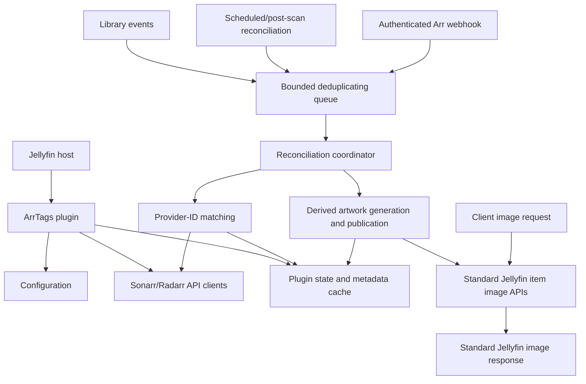

# Architecture

**Status:** Draft v1 (pre-implementation)

**Last reviewed against:**
- Jellyfin 12.x
- Sonarr v4.x
- Radarr v5.x

**Purpose:** Canonical architectural design before implementation begins.

This document is the authoritative design for ArrTags. The companion research
documents contain API details, source evidence, and alternatives; they do not
override the decisions recorded here.

## 1. Scope and principles

ArrTags is a Jellyfin 12 plugin that reads Sonarr and Radarr metadata and
publishes derived badge artwork through Jellyfin's item-image APIs. The plugin
is read-only with respect to Sonarr and Radarr; its only Jellyfin artwork
mutation is the guarded publication of its own derived image.

The architecture follows these principles:

- Preserve the original poster source through plugin-owned provenance and
  restoration state; a validated derived poster may become Jellyfin's active
  artwork through the supported image APIs.
- Deliver badges through Jellyfin's normal image endpoints so all clients can
  receive the same result.
- Keep external I/O, image processing, artwork publication, and cache
  maintenance outside library event handlers and image request paths.
- Prefer stable provider IDs and documented Jellyfin APIs over names, paths,
  database access, or third-party plugin internals.
- Treat missing, stale, ambiguous, or unavailable external metadata as a
  recoverable condition and leave the current usable artwork unchanged when
  necessary.
- Make every derived result fingerprinted, bounded, cancellable, and safe to
  regenerate after a restart.

## 2. Goals and non-goals

### Goals

- Support Jellyfin 12 only for the initial implementation.
- Support independently configured Sonarr and Radarr connections.
- Match Jellyfin movies to Radarr and TV content to Sonarr.
- Display actual file metadata, especially actual quality, rather than treating
  a configured quality profile as the file's quality.
- Update badges after Jellyfin changes, Arr changes, webhooks, and scheduled
  reconciliation.
- Preserve the original source artwork through plugin-owned provenance and
  restoration state; avoid modifying media files or Jellyfin's image cache.
- Remain safe alongside Jellyfin Enhanced.
- Fail without degrading Jellyfin library operations or image serving.

### Non-goals

- Writing to Sonarr or Radarr.
- Modifying media files, media-folder posters, or Jellyfin's image cache.
- Replacing Jellyfin's metadata refresh or image-provider pipeline.
- Depending on Jellyfin Enhanced's DOM, JavaScript, configuration, or private
  endpoints.
- Supporting arbitrary Arr applications or Jellyfin versions before 12.

## 3. System architecture

The plugin has two related but separate paths:

1. **Reconciliation path:** obtains and fingerprints Arr metadata ahead of image
   requests. It is asynchronous, bounded, and restart-safe.
2. **Artwork path:** observes validated metadata and source-artwork state,
   renders derived artwork outside the image request path, and publishes it
   through Jellyfin's supported item-image APIs. Native clients then receive it
   through Jellyfin's standard image routes.

The artwork path is the canonical rendering strategy. ArrTags must retain
enough plugin-owned source and provenance state to avoid repeatedly overlaying
its own output and to restore the original source when appropriate. The active
derived image is delivered by Jellyfin's normal image controller, rather than
by an ArrTags response interceptor.

## 4. Plugin components and boundaries

| Component | Responsibility | Boundary |
| --- | --- | --- |
| `Plugin` | Identity, configuration, data-folder ownership, uninstall hook | Thin `BasePlugin<PluginConfiguration>` entry point |
| Service registrator | Register services, hosted services, controllers, artwork publication, and tasks | Parameterless `IPluginServiceRegistrator` |
| Configuration service | Validate and publish immutable configuration snapshots | Uses plugin configuration persistence; never exposes secrets |
| Sonarr client | Read Sonarr v3 resources and probe connections | `IHttpClientFactory`; no write endpoints |
| Radarr client | Read Radarr v3 resources and probe connections | `IHttpClientFactory`; no write endpoints |
| Matching service | Match a Jellyfin item to one configured Arr record | Provider IDs first; ambiguity is not auto-accepted |
| Metadata cache | Store current Arr snapshot and badge-relevant fingerprint | Versioned plugin-owned state under `DataFolderPath` |
| Reconciliation coordinator | Fetch, match, fingerprint, and enqueue affected items | Runs outside event handlers and image requests where possible |
| Work queue | Coalesce item work and bound memory/concurrency | Hosted service with cancellation-aware workers |
| Artwork publisher | Publish validated derived artwork through Jellyfin's public image APIs | Does not write media files or Jellyfin's image-cache directory directly |
| Badge renderer | Draw configured labels onto retained source artwork | Bounded input/output and render concurrency |
| Render work cache | Avoid repeated generation before publication where useful | Optional, bounded, fingerprint-keyed work state; not the client response path |
| Webhook controller | Accept authenticated low-latency Arr hints | Validates token and payload; never trusts payload as source of truth |
| Scheduled task | Manual and periodic full reconciliation | Cancellable, progress-reporting, retry-safe |

No component accesses Jellyfin database tables, image-cache directories,
`ImageSaver`, or concrete Jellyfin implementation types when a plugin-facing
API is available.

## 5. Plugin lifecycle and registration

### Startup

1. Jellyfin discovers the `BasePlugin<PluginConfiguration>` implementation.
2. Jellyfin constructs the parameterless service registrator before building
   the service provider.
3. The registrator registers configuration, API clients, caches, matching and
   rendering services, the hosted worker, scheduled task, webhook controller,
   and artwork publication services.
4. The hosted service subscribes to library events and starts the bounded queue
   consumer after the host is ready.
5. Startup must not perform unbounded Arr requests or a full-library render
   synchronously.

### Shutdown and uninstall

- Unsubscribe library events during hosted-service shutdown.
- Stop accepting new work, cancel queued work, and await workers within host
  shutdown limits.
- Do not leave unmanaged threads or fire-and-forget tasks running.
- Plugin-owned cache/state and source-artwork provenance may be removed on
  uninstall according to the plugin uninstall policy. Active ArrTags artwork
  must be restored first when it is still identified as ArrTags-owned.

## 6. Configuration and persisted state

### Configuration

`PluginConfiguration` is persisted through Jellyfin's plugin configuration
mechanism. Updates are treated as replacement snapshots, not as mutable objects
shared with background workers.

Configuration includes:

- Independently enabled Sonarr and Radarr connections.
- Base URL, API key, timeout, and explicit TLS exception policy per connection.
- Enabled libraries and eligible image/item types.
- Badge fields, placement, colors, scale, margins, output limits, and renderer
  version settings.
- Refresh interval, queue limits, cache limits, concurrency, and retry policy.
- Webhook token or equivalent secret for inbound Arr notifications.
- Jellyfin Enhanced coexistence and duplicate-badge policy.

API keys and webhook secrets must not appear in logs, status responses, cache
keys, fingerprints, or exception messages. TLS certificate validation is strict
by default; any exception is explicit and scoped to one connection.

### Plugin state

State is stored under `DataFolderPath`, not in Jellyfin's database or image
cache. The format is versioned and written atomically. Corrupt state is ignored
or quarantined so the plugin can rebuild it.

Each item record may contain:

- Jellyfin item ID and provider IDs.
- Arr connection identity and external record IDs.
- Last successful Arr metadata snapshot or normalized badge input.
- Original source-artwork provenance and the currently published derived-artwork
  fingerprint, when ArrTags has published an image.
- Badge-relevant metadata fingerprint.
- Jellyfin image tag/date fingerprint used for published-artwork provenance and
  invalidation.
- Renderer/configuration version.
- Last refresh, error, retry, and reconciliation status.

The metadata record and artwork publication state have different purposes. A
metadata snapshot may be retained as last-known-good state during a temporary
Arr outage. A derived image published through Jellyfin is active artwork and is
not an ephemeral response artifact. The original source and restoration
provenance remain plugin-owned and must not be confused with the active image.

## 7. Sonarr and Radarr integration

### HTTP clients

Use Jellyfin's `IHttpClientFactory` and a dedicated named or typed client per
Arr service. Requests use the configured base URL, `/api/v3`, `Accept:
application/json`, and `X-Api-Key`. The client must support cancellation,
finite timeouts, bounded retries for transient transport failures, redacted
logging, and tolerant JSON deserialization.

The integration is read-only. It must not call write endpoints, access Arr
databases, or infer success from an HTML login page or redirect.

### Matching policy

The initial matching order is:

- **Movie to Radarr:** Jellyfin TMDb ID, then IMDb ID. Use Radarr's local movie
  library endpoints; do not use lookup endpoints for routine refreshes.
- **Series to Sonarr:** Jellyfin TVDB ID, then a cached catalogue comparison of
  other stable provider IDs when available.
- **Episode to Sonarr:** episode TVDB ID, then exact season and episode numbers
  after the series match. Anime, specials, absolute numbering, double episodes,
  and multi-episode files require explicit policy and validation.
- **Path:** only a configured, normalized path mapping may use paths as a
  fallback. Container or host paths must never be assumed equivalent.
- **Title and year:** candidate or manual-disambiguation data only; never an
  automatic badge match when zero or multiple candidates remain.

Missing IDs, ambiguous matches, missing files, virtual items, and remote items
produce no new badge rather than a guessed badge.

### Metadata semantics

Badge inputs come from the current Arr file resource:

- Actual quality comes from the file's quality model.
- Technical values such as codec, dynamic range, audio, language, release
  group, and custom-format score come from the file resource where available.
- `qualityCutoffNotMet` is the authoritative upgrade-pending signal.
- Quality profiles describe requested policy and must not be presented as actual
  file quality.

Radarr's embedded movie file may omit custom-format fields; request the
  dedicated movie-file endpoint when those fields are enabled. Sonarr episode
  files must be joined using `episodeFileId == episodeFile.id`.

## 8. Reconciliation and update flow

Library event handlers are deliberately short:

1. Check whether the event is relevant to an enabled library/item type.
2. Ignore ArrTags-generated internal state changes where applicable.
3. Enqueue the Jellyfin item ID and a reason/version hint.
4. Return without external I/O, rendering, or image writes.

Work is coalesced by item ID and connection. A worker re-reads the item and
current configuration before processing. It then:

1. Resolves the applicable Sonarr/Radarr connection.
2. Matches the item using the policy above.
3. Fetches or reuses the current Arr record and file metadata.
4. Produces a normalized badge input and fingerprint.
5. Atomically publishes the metadata state.
6. Enqueues artwork generation when the publication fingerprint changes.
7. Renders from validated original source-artwork state.
8. Publishes the completed derived image through Jellyfin's supported item-image
   API and records its provenance.

The worker must re-check the item and relevant metadata before publishing a
result if the operation was long-running. A changed fingerprint causes stale
work to be discarded rather than published.

Refresh triggers are:

- Jellyfin `ItemAdded`, relevant `ItemUpdated`, and `ItemRemoved` events.
- Post-scan reconciliation.
- Manual and periodic scheduled reconciliation.
- Authenticated Sonarr/Radarr webhooks as low-latency hints.

Webhooks are accelerators, not the source of truth. Payloads are validated,
bounded, and converted into the same deduplicated work as other triggers. A
periodic reconciliation repairs missed or forged notifications.

## 9. Persisted artwork rendering

### Publication flow

1. The reconciliation worker checks configuration, item type, image type,
   library scope, current source-artwork provenance, and whether current badge
   input exists.
2. It includes all output-affecting values in a publication fingerprint:
   source-artwork identity, metadata fingerprint, render configuration, and
   renderer/schema versions.
3. It renders from retained original source artwork or a newly validated source
   image, never from an ArrTags-generated image without provenance validation.
4. After current item/configuration validation, it publishes the completed image
   through `IProviderManager.SaveImage` and the normal item image update flow.
5. Jellyfin's standard image routes then provide authorization, image tags,
   resizing, and response caching to clients.
6. Any unavailable source, cancellation, decode failure, size violation, or
   render exception leaves the current usable artwork unchanged.

ArrTags must not write media-folder artwork or Jellyfin's `resized-images`
cache directly. It may use the supported item-image APIs to publish a derived
active image. The original source must remain recoverable through plugin-owned
provenance state.

### Rendering constraints

- Cap source bytes, output bytes, decoded dimensions, and concurrent renders.
- Publish only completed, validated images through the supported item-image API;
  do not implement a parallel response validator or image route.
- Verify that the normal Jellyfin image route supplies the published image with
  correct authorization, image tags, conditional requests, and cache headers.
- Do not block library scans or synchronous library event delivery.

## 10. Jellyfin Enhanced coexistence

ArrTags has no source-level dependency on Jellyfin Enhanced. Enhanced's quality
tags are client-side Web overlays; ArrTags' badges are persisted through the
standard server-side image path. Therefore:

- Native clients receive ArrTags badges without requiring the Web UI.
- Jellyfin Web may show both systems and duplicate information.
- ArrTags exposes a policy to disable or limit its server badges where needed.
- Documentation may recommend disabling overlapping Enhanced quality tags, but
  ArrTags does not alter Enhanced configuration.
- Spoiler Guard and hidden/blurred image behavior must be tested through the
  normal image route; ArrTags must not depend on Enhanced filter ordering.

## 11. Failure, consistency, and security policy

Failures are isolated by layer:

- Arr connection failures preserve last-known-good metadata for a bounded
  period, then leave the current usable artwork unchanged when no usable state
  remains.
- Authentication, malformed JSON, unsupported fields, and version drift are
  reported as connection/item status, not Jellyfin failures.
- No match or ambiguous match produces no badge.
- Renderer failures leave the current usable artwork unchanged and record a
  rate-limited error.
- Queue overflow coalesces or drops redundant work; it never blocks a library
  event indefinitely.
- Cancellation prevents publication of partial state or partial image output.
- State writes are atomic and recoverable after crashes.

Inbound webhook endpoints require a configured shared secret or equivalent
boundary authentication, validate content size and payload shape, and rate-limit
or coalesce requests. They must not accept arbitrary item IDs as permission to
perform unbounded work.

## 12. Performance and operational limits

Implementation must define and test concrete defaults for:

- Maximum queue entries and per-item single-flight work.
- Maximum concurrent Sonarr/Radarr requests.
- Maximum concurrent image renders.
- HTTP timeout, retry count, and exponential backoff.
- Maximum input/output image bytes and decoded pixel dimensions.
- Metadata, provenance, and render-work size/TTL/eviction.
- Full-reconciliation page/batch size and cancellation behavior.
- Maximum stale-last-known-good duration.

Metrics or diagnostic status should distinguish queue depth, API health,
matching failures, cache hits/misses, render failures, and stale metadata
without exposing credentials or full external payloads.

## 13. Testing and validation gates

Before implementation is considered complete, validate against the exact
Jellyfin 12.x ABI and supported Arr versions.

### Unit tests

- Configuration validation and secret redaction.
- Tolerant Sonarr/Radarr DTO deserialization.
- Provider-ID matching, ambiguity, missing-file, and path-mapping behavior.
- Actual-versus-requested quality semantics.
- Fingerprint stability and invalidation.
- Queue coalescing, cancellation, retry, and state recovery.
- Badge layout, size limits, output format, and renderer failures.

### Integration tests

- Plugin discovery, DI registration, startup, shutdown, and scheduled task.
- Jellyfin item event delivery without blocking the event publisher.
- All supported image route variants, indexed images, requested sizes/formats,
  conditional requests, ranges, and non-200 pass-through responses.
- Publication through Jellyfin's supported item-image APIs, standard image
  routes, image tags, authorization, and failure behavior.
- Arr authentication, URL bases, timeouts, outages, upgrades, missing files,
  and webhook authentication.
- Jellyfin Enhanced Quality Tags and Spoiler Guard enabled and disabled.
- Restart during reconciliation and rendering, corrupted state, and cache
  eviction.

### Acceptance checks

- Original source artwork is retained according to the provenance/restoration
  policy, and media files remain byte-for-byte untouched.
- Disabling ArrTags restores the original source when the active image is still
  ArrTags-owned.
- A changed Arr file or badge configuration produces a new publication
  fingerprint.
- Repeated unchanged state does not repeatedly render or publish the image;
  Jellyfin handles normal response caching afterward.
- A failed external service or render never produces a broken Jellyfin image.
- Web, mobile, TV, Kodi, and other image-consuming clients receive the same
  server-rendered result where their image request is supported.

## 14. Decisions required before implementation

The following are intentionally not guessed by this architecture:

1. Exact Jellyfin 12 patch, package versions, target framework, and plugin
   manifest `targetAbi`.
2. Initial supported item/image types and whether series/season posters use an
   explicit aggregate policy or remain disabled.
3. Exact badge fields, text truncation, placement, color/contrast rules, output
   format, and requested-size policy.
4. Whether episode matching permits number fallback for all libraries or only
   validated display-order cases.
5. Whether configured path mappings are needed and how they are represented.
6. Default queue, concurrency, image-size, cache, timeout, retry, and stale
   state limits.
7. Webhook endpoint exposure and shared-secret administration flow.
8. Jellyfin Enhanced duplicate-badge defaults and Spoiler Guard behavior.
9. Supported live Sonarr/Radarr release ranges and optional-field compatibility.

These decisions must be recorded in `docs/decisions.md` and reflected in a
future architecture revision before they become implementation assumptions.

## 15. Supporting research

- [Poster rendering strategies](poster-rendering-strategies.md) documents the
  inspected plugin approaches and the persisted-artwork tradeoff.
- [Media metadata mapping](media-metadata-mapping.md) documents Jellyfin item
  identity, provider IDs, file joins, versions, and matching caveats.
- [Sonarr API reference](sonarr-api.md) documents the read-only v3 integration,
  matching endpoints, episode/file joins, and webhook considerations.
- [Radarr API reference](radarr-api.md) documents the read-only v3 integration,
  movie/file endpoints, quality semantics, and webhook considerations.
- [Project goals](../GOALS.md) defines the product requirements and success
  criteria that this architecture must satisfy.
- [Architecture decisions](decisions.md) records the selected artwork delivery
  mechanism and rejected alternatives.

## 1. Architectural Scope

This document describes the V1 architecture of the plugin.

The architecture is designed to support **both Radarr and Sonarr** from the outset. Components, interfaces and data models should be service-agnostic wherever practical so that movies and television share the same processing pipeline.

### V1 Architecture Includes

* Jellyfin 12 compatibility.
* Radarr integration.
* Sonarr integration.
* Metadata retrieval from both Arr applications.
* A unified metadata model.
* A unified badge rendering pipeline.
* Original poster source preservation with guarded derived active publication.
* Compatibility with Jellyfin Enhanced.
* Caching and update infrastructure shared by both integrations.

### V1 Architecture Excludes

The following are intentionally outside the initial architecture:

* Bazarr integration.
* Tdarr integration.
* Music libraries.
* User-specific badges.
* Non-poster artwork (backdrops, banners, thumbnails).
* Additional media managers beyond Sonarr/Radarr.

## 2. Implementation Phases

The architecture supports both Arr applications from day one, but implementation is intentionally incremental.

| Phase   | Deliverable                                                                 |
| ------- | --------------------------------------------------------------------------- |
| Phase 1 | Plugin foundation and configuration infrastructure.                         |
| Phase 2 | Radarr integration and movie badge rendering.                               |
| Phase 3 | Sonarr integration and episode badge rendering using the same architecture. |
| Phase 4 | Shared caching, update coordination and performance improvements.           |
| Phase 5 | Additional badge types and future enhancements.                             |

Each phase should implement additional functionality without requiring architectural redesign.
