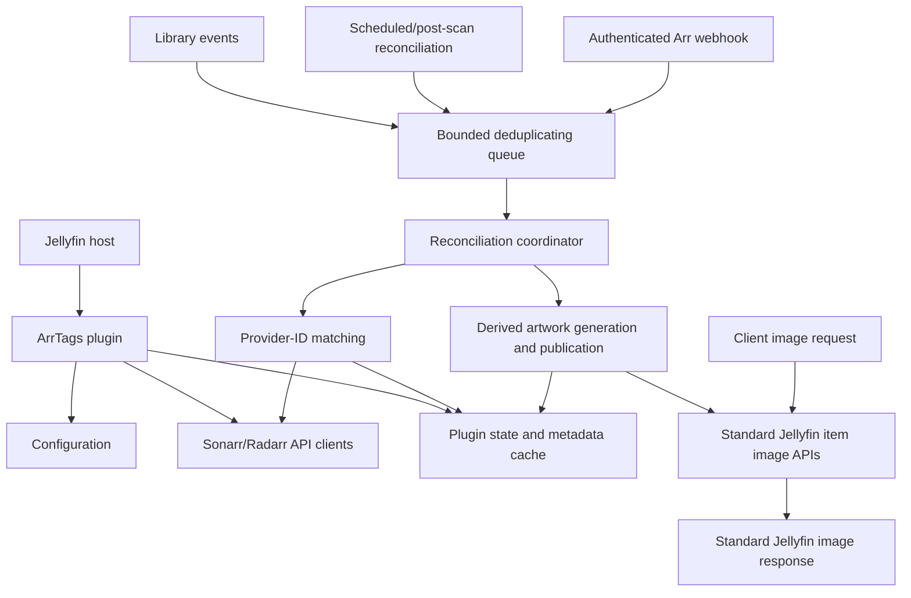

# Architecture

**Status:** Accepted v1 (frozen for V1; Phases 1-8 complete; Phase 7 complete (all five acceptance criteria are met; Gate 7 is met (Phase 7 review approved; tag `v0.1.0-phase7`)). Task 7.2 found that the standard versioned install layout collided with the plugin's Jellyfin-derived data folder `PluginsPath/ArrTags` and deleted the install folder on the next restart; task 7.7 resolves this by relocating the plugin state root to `ProgramDataPath/ArrTags` outside `PluginsPath` (ADR-014) and re-ran the live install/upgrade/reload/uninstall verification on the pinned Jellyfin `12.0.0` host, so Phase 7 acceptance criterion 2 is now met. Gate 6 is met at the integration-test level, tag `v0.1.0-phase6`.) Task 7.8 resolves the task 7.3 release blocker 7.3-F1: the plugin no longer bundles the managed `SkiaSharp.dll` or native `libSkiaSharp.so` and shares the host's SkiaSharp through the default load context (ADR-015, which supersedes the bundling parts of ADR-010). The re-run live end-to-end verification on the pinned Jellyfin `12.0.0` musl host passes for the committed package: it loads with no error, a badge publishes with no `[FTL]`/`InvalidCastException`, `GET /Items/{id}/Images/Primary` serves the published bytes matching the persisted `ActiveImageIdentity`, the original source posters are byte-unchanged, changed metadata republishes and unchanged metadata does not, and a provider outage leaves the host up with current artwork unchanged, so `GOALS.md` criteria 5 and 8 are now met as shipped, with criterion 6 met for render and publication but only partial for provider fetches (`docs/limitations.md` F1). Task 7.6 consolidates the known limitations and deferred decisions in `docs/limitations.md`; all five Phase 7 acceptance criteria are met and no deferred or unverified capability is presented as available. Phase 8 release distribution is complete (tasks 8.1-8.6): the `1.0.1.0` release is prepared with plugin version `1.0.1.0`, the annotated tag `v1.0.1` at `8cba85b`, and the committed repository `manifest.json`; the GitHub release publication, the asset upload, and the manifest push remain the user's manual step with `scripts/publish-release.sh`, so the plugin-catalog install is prepared but not yet live. Phase 9 (v1.1) is in progress: task 9.1 makes `PluginConfiguration.EnabledLibraries` and `RendererConfiguration.Selectors` settable so the elevation-gated configuration round-trip cannot drop them, task 9.2 adds the dashboard settings page (`Plugin` implements `IHasWebPages`; one secret-free embedded `Configuration/config.html` served from the logical name `ArrTags.Configuration.config.html`) and records ADR-016 clause 6's explicit acceptance of the anonymous static page-resource endpoint; task 9.3 overrides `Plugin.UpdateConfiguration` so the elevation-gated save validates the candidate before persistence and, for a valid candidate, activates it as the running snapshot without a host restart (an invalid candidate is rejected before persistence, the last valid snapshot and private secrets are retained, and the rejection writes one bounded, secret-free administrator-visible activity-log entry per ADR-021; the save sequence is serialized so concurrent saves cannot diverge); task 9.4 adds the bounded, non-blocking post-save reconciliation trigger (the plugin-owned `IConfigurationReconciliationTrigger` boundary and the hosted `ConfigurationReconciliationTrigger` over the existing bounded `LibraryReconciliationService`, coalescing redundant requests to at most one bounded rerun), so a successful save re-renders existing posters instead of waiting for the next library event, webhook, post-scan, or scheduled run; the final Goal A documentation and integration verification (task 9.5) remains, so limitation F2 is not yet recorded as resolved.

**Last reviewed against:**
- Jellyfin 12.x
- Sonarr v4.x
- Radarr v5.x

**Purpose:** Canonical architectural design before implementation begins.

This document is the authoritative design for ArrTags. The companion research
documents contain API details, source evidence, and alternatives; they do not
override the decisions recorded here.

## 1. Scope and principles

ArrTags is a Jellyfin 12 plugin that reads Sonarr and Radarr metadata and
publishes derived badge artwork through Jellyfin's item-image APIs. The plugin
is read-only with respect to Sonarr and Radarr; its only Jellyfin artwork
mutation is the guarded publication of its own derived image.

The architecture follows these principles:

- Preserve the original poster source through plugin-owned provenance and
  restoration state; a validated derived poster may become Jellyfin's active
  artwork through the supported image APIs.
- Deliver badges through Jellyfin's normal image endpoints so all clients can
  receive the same result.
- Keep external I/O, image processing, artwork publication, and cache
  maintenance outside library event handlers and image request paths.
- Prefer stable provider IDs and documented Jellyfin APIs over names, paths,
  database access, or third-party plugin internals.
- Treat missing, stale, ambiguous, or unavailable external metadata as a
  recoverable condition and leave the current usable artwork unchanged when
  necessary.
- Make every derived result fingerprinted, bounded, cancellable, and safe to
  regenerate after a restart.

## 2. Goals and non-goals

### Goals

- Support Jellyfin 12 only for the initial implementation.
- Support independently configured Sonarr and Radarr connections.
- Match Jellyfin movies to Radarr and TV content to Sonarr.
- Display actual file metadata, especially actual quality, rather than treating
  a configured quality profile as the file's quality.
- Update badges after Jellyfin changes, Arr changes, webhooks, and scheduled
  reconciliation.
- Preserve the original source artwork through plugin-owned provenance and
  restoration state; avoid modifying media files or Jellyfin's image cache.
- Remain safe alongside Jellyfin Enhanced.
- Fail without degrading Jellyfin library operations or image serving.

### Non-goals

- Writing to Sonarr or Radarr.
- Modifying media files, media-folder posters, or Jellyfin's image cache.
- Replacing Jellyfin's metadata refresh or image-provider pipeline.
- Depending on Jellyfin Enhanced's DOM, JavaScript, configuration, or private
  endpoints.
- Supporting arbitrary Arr applications or Jellyfin versions before 12.

## 3. System architecture



The plugin has two related but separate paths:

1. **Reconciliation path:** obtains and fingerprints Arr metadata ahead of image
   requests. It is asynchronous, bounded, and restart-safe.
2. **Artwork path:** observes validated metadata and source-artwork state,
   renders derived artwork outside the image request path, and publishes it
   through Jellyfin's supported item-image APIs. Native clients then receive it
   through Jellyfin's standard image routes.

The artwork path is the canonical rendering strategy. ArrTags must retain
enough plugin-owned source and provenance state to avoid repeatedly overlaying
its own output and to restore the original source when appropriate. The active
derived image is delivered by Jellyfin's normal image controller, rather than
by an ArrTags response interceptor.

## 4. Plugin components and boundaries

| Component | Responsibility | Boundary |
| --- | --- | --- |
| `Plugin` | Identity, configuration, data-folder ownership, uninstall hook | Thin `BasePlugin<PluginConfiguration>` entry point; state root relocated to `ProgramDataPath/ArrTags` outside `PluginsPath` (ADR-014) |
| Service registrator | Register services, hosted services, controllers, artwork publication, and tasks | Parameterless `IPluginServiceRegistrator` |
| Configuration service | Validate and publish immutable configuration snapshots | Uses plugin configuration persistence; never exposes secrets |
| Credential boundary | Publish the private versioned secret snapshot and issue bounded credential leases | Singleton `IPluginSecretResolver`; never serializes or persists secret values |
| Sonarr client | Read Sonarr v3 resources and probe connections | `IHttpClientFactory`; no write endpoints |
| Radarr client | Read Radarr v3 resources and probe connections | `IHttpClientFactory`; no write endpoints |
| Matching service | Match a Jellyfin item to one configured Arr record | Provider IDs first; ambiguity is not auto-accepted |
| Metadata cache | Store current Arr snapshot and badge-relevant fingerprint | Versioned plugin-owned state under `DataFolderPath` |
| Reconciliation coordinator | Fetch, match, fingerprint, and enqueue affected items | Runs outside event handlers and image requests where possible |
| Work queue | Coalesce item work and bound memory/concurrency | Hosted service with cancellation-aware workers |
| Artwork publisher | Publish validated derived artwork through Jellyfin's public image APIs | Does not write media files or Jellyfin's image-cache directory directly |
| Badge renderer | Draw configured labels onto retained source artwork | Plugin-owned, provider-neutral SkiaSharp service with bundled DejaVu Sans Bold 2.37; bounded input/output and render concurrency |
| Render work cache | Avoid repeated generation before publication where useful | Optional, bounded, fingerprint-keyed work state; not the client response path |
| Webhook controller | Accept authenticated low-latency Arr hints | Anonymous plugin route; validates the shared secret with a constant-time lease comparison and a bounded payload, then submits to a bounded intake; never trusts payload as source of truth (ADR-012) |
| Webhook intake | Resolve accepted hints and feed the bounded work queue off the request path | Bounded, coalescing, non-blocking; resolves only already-known provider-record associations and never publishes, mutates artwork, or calls Arr |
| Scheduled task | Manual and periodic full reconciliation | Cancellable, progress-reporting, retry-safe |
| Post-scan task | Reconciliation after a Jellyfin media-library scan | Jellyfin `ILibraryPostScanTask`; bounded, cancellable, progress-reporting |

No component accesses Jellyfin database tables, image-cache directories,
`ImageSaver`, or concrete Jellyfin implementation types when a plugin-facing
API is available.

## 5. Plugin lifecycle and registration

### Startup

1. Jellyfin discovers the `BasePlugin<PluginConfiguration>` implementation.
2. Jellyfin constructs the parameterless service registrator before building
   the service provider.
3. The registrator registers configuration, API clients, caches, matching and
   rendering services, the hosted worker, scheduled task, webhook controller,
   and artwork publication services. Jellyfin discovers the plugin's exported
   `ControllerBase` webhook controller through its standard plugin controller
   registration; ArrTags does not register a route outside that mechanism.
4. The hosted service subscribes to library events and starts the bounded queue
   consumer after the host is ready.
5. Startup must not perform unbounded Arr requests or a full-library render
   synchronously.

### Shutdown and uninstall

- Unsubscribe library events during hosted-service shutdown.
- Establish a durable disable/uninstall fence, stop accepting new publication
  work, and recover or terminally classify in-flight artwork operations before
  artifact cleanup.
- Cancel queued work and await workers within host shutdown limits, but never
  discard a non-terminal artwork operation or its source/derived artifacts.
- Do not leave unmanaged threads or fire-and-forget tasks running.
- Plugin-owned cache/state and source-artwork provenance may be removed on
  uninstall only after the lifecycle fence and all artwork operations are
  terminal. Active ArrTags artwork must be restored first when it is still
  identified as ArrTags-owned; unresolved or externally changed artwork keeps
  the recovery records and artifacts for later reconciliation.

## 6. Configuration and persisted state

### Configuration

`PluginConfiguration` is persisted through Jellyfin's plugin configuration
mechanism. Updates are treated as replacement snapshots, not as mutable objects
shared with background workers. A candidate configuration is validated before it
becomes active; an invalid replacement is rejected and the last valid snapshot
stays active so invalid configuration cannot bring down Jellyfin.

The persisted configuration includes:

- Independently enabled Sonarr and Radarr connections.
- Base URL, API key, timeout, and explicit TLS exception policy per connection.
- Enabled libraries (collection-folder/library identifiers, not display names),
  eligible image/item types, and V1 badge surfaces. V1 badge-bearing item types
  are Movie and Episode posters; Series and Season are structural only and
  aggregation remains post-V1 (ADR-006).
- Badge fields, placement, colors, scale, margins, output limits, and renderer
  version settings. DG-3 is resolved by ADR-009: V1 uses the bounded,
  provider-neutral Movie/Episode Primary-poster specification in that ADR.
- Operational limits supplied by `OperationalLimits`: queue capacity, provider
  and render concurrency, request timeout, retry count/backoff, provider
  response and artifact sizes, decoded image dimensions, reconciliation batch
  size, cache TTL/quota, provenance retention, and the stale-data window (see
  section 12 and ADR-004).
- V1 does not persist or publish path mappings. Configured path fallback is
  deferred out of V1 by ADR-008.
- Webhook token or equivalent secret for inbound Arr notifications. V1 uses the
  `WebhookSecret` slot as the inbound shared secret; the anonymous
  `POST /ArrTags/Webhook/Sonarr` and `POST /ArrTags/Webhook/Radarr` endpoints
  authenticate it through the versioned secret boundary and never place it in a
  URL (ADR-012).
- No separate Jellyfin Enhanced coexistence field is persisted. The coexistence
  policy (ADR-011) is realized entirely through the existing poster enable flags
  and renderer selector enablement, with no automatic duplicate/overlap
  suppression and no Enhanced-internals dependency.

API keys and webhook secrets must not appear in logs, status responses, cache
keys, fingerprints, or exception messages. TLS certificate validation is strict
by default; any exception is explicit and scoped to one connection.

### Dashboard settings page

`Plugin` implements `MediaBrowser.Model.Plugins.IHasWebPages` and returns one
`PluginPageInfo` (`Name` `ArrTags`, `EnableInMainMenu = false`) whose
`EmbeddedResourcePath` is the embedded `Configuration/config.html` with the
explicit assembly manifest logical name `ArrTags.Configuration.config.html`
(ADR-016 clause 1). The pinned `Jellyfin.Api.Controllers.DashboardController`
serves the page from the plugin's own assembly resource at
`GET web/ConfigurationPage?name=ArrTags`; the server injects nothing into the
page.

The page is read/write for the user-adjustable settings only: the Sonarr and
Radarr connections and their API keys, the webhook secret, the Movie/Episode
poster flags, the enabled-library scope, the renderer selectors/templates and
palette overrides, and the operational limits. It reads and writes them through
the supported elevation-gated `PluginsController` `GET`/`POST
{pluginId}/Configuration` path and adds no custom save route (ADR-016 clause 3).
The three secret inputs are password fields with no embedded value; the page
embeds no secret literal and only ever surfaces a secret value through the same
administrator-gated configuration API that already returns it (ADR-016
clause 2).

The pinned static page-resource action carries no `[Authorize]`, the controller
has no class-level `[Authorize]`, and there is no fallback authorization policy,
so the page resource itself is reachable without authentication. ADR-016
clause 6 explicitly accepts this anonymous static page-resource endpoint as a
non-data surface: the page is static HTML/JS, reflects no data, and every
configuration data endpoint remains administrator-gated. This acceptance is the
task 9.2 confirmation of the page-resource authorization behavior; the
host-guarded tests additionally confirm the pinned route and authorization
attributes where a pinned host directory is available.

### Runtime configuration activation

`Plugin` overrides `BasePlugin<T>.UpdateConfiguration`. The host's
elevation-gated `PluginsController` `POST {pluginId}/Configuration` deserializes
the candidate and calls the override. The override validates the candidate before
the base implementation persists anything (using the same
`PluginConfigurationValidator` the snapshot service uses); a valid candidate is
persisted by `base.UpdateConfiguration(configuration)` and then activated by
`ConfigurationSnapshotService.TryReplace(...)`, so a saved change takes effect
without a host restart (ADR-016 clause 4). The whole validate/persist/activate
sequence is serialized, so concurrent elevation-gated saves cannot leave the
running snapshot, `Plugin.Configuration`, and the persisted file divergent
(security finding SEC-9.3-01).

An invalid candidate is rejected before persistence: the override does not call
`base.UpdateConfiguration`, so a rejected candidate is never written to
`plugins/configurations/ArrTags.xml` and the last valid public snapshot and
private secret map remain active. The rejection is surfaced to the administrator
as exactly one bounded, secret-free activity-log entry written through the
plugin-owned `IConfigurationRejectionNotifier` adapter, whose Jellyfin
implementation resolves the host `IActivityManager` and never throws into the
host (ADR-021); a valid save writes no entry. The bounded, secret-free validation
outcome is also retained on the plugin instance for diagnostics and is never
persisted or returned by the configuration API. The override never throws into
the host (service resolution, validation, and notification failures are
contained) and adds no custom configuration-save route (ADR-016 clause 3).

Services that resolve from the current snapshot on each operation — the work
queue capacity and in-flight bound, provider/render concurrency, metadata
freshness, badge definitions, and the renderer output policy — observe a
replaced snapshot without rebuilding the singletons (ADR-016 clause 5 first
bullet). Some singletons capture the artifact-size/decode limits and the
`StateRepository`-backed render work-cache TTL/quota and terminal-provenance
retention values from `OperationalLimits` at construction, so those particular
values change only after a host restart; this pre-existing state/artwork-layer
behaviour is outside the save-path change.

### Bounded post-save reconciliation

A successful replacement also requests the bounded, non-blocking post-save
reconciliation (ADR-016 clause 5 second bullet). `Plugin.UpdateConfiguration`
calls the plugin-owned `IConfigurationReconciliationTrigger` boundary after the
running snapshot is replaced. The production
`ConfigurationReconciliationTrigger` is a hosted singleton whose loop runs the
existing bounded `LibraryReconciliationService` off the save thread and enqueues
the same provider-neutral `LibraryWorkHint` work as the scheduled, manual, and
post-scan triggers (source `PostSave`). The request slot is bounded: at most one
reconciliation is pending, a redundant request is coalesced, and a request that
arrives while a reconciliation is running schedules exactly one bounded rerun so
the latest replaced snapshot is observed (a run reads the current snapshot once
when it starts). The trigger is never a synchronous full-library scan, never
blocks the save response, and never throws into the host; the save path contains
a trigger-resolution or trigger failure. The trigger is required because a work
item whose `ConfigurationVersion` is older than the current snapshot is skipped
by `ArtworkPublishingWorkItemProcessor`, so without it existing posters would
re-render only on the next library event, webhook, post-scan, or scheduled run.
This closes limitation F2's re-render promptness consequence; task 9.5 performs
the final Goal A integration verification that records F2 as resolved.

### Secret access boundary

Jellyfin's persisted `PluginConfiguration` is the only V1 source of truth for
the Sonarr API key, Radarr API key, and inbound webhook shared secret. ArrTags
does not add a second secret file, state record, database table, environment
variable, or external secret manager. Protection at rest therefore follows the
Jellyfin configuration/data-folder permissions and administrative boundary.

The configuration service creates a safe `SecretReference` for each configured
credential slot and an in-memory private secret snapshot when it creates the
public `PluginConfigurationSnapshot`. The active configuration is one atomic
versioned pair: a public snapshot containing no secret values and a private map
from typed references to secret material. V1 has one stable API-key slot for
each provider and one separate webhook-secret slot. References are generated by
the configuration boundary, contain no secret, and are safe to carry in an
`ArrConnection`, queue hint, or diagnostic status.

The DI boundary is a singleton `IPluginSecretResolver`. Its semantic contract is
`TryAcquire(reference, expectedConfigurationVersion)`, returning a short-lived,
disposable, non-serializable `SecretLease` or no result. The lease has no public
diagnostic/string representation. The provider transport boundary uses an
API-key lease only to add `X-Api-Key` to the current request; a future webhook
boundary uses its distinct lease for constant-time candidate comparison. The
HTTP client factory remains secret-free.

Workers capture the public configuration version before resolving a connection
and acquire the matching lease before sending a request. A version mismatch,
disabled connection, unknown reference, or missing secret produces no lease and
causes the bounded operation to discard or restart against the current snapshot.
Queue items, caches, canonical models, state envelopes, and fingerprints carry
only the safe reference or configuration version, never a lease or secret.
The resolver publishes immutable maps for concurrent workers; each worker gets
an independent lease, no lock is held across external I/O, and a lease is
released when the bounded request or authentication comparison completes,
cancels, or times out.

Configuration replacement validates the candidate first, then creates both
snapshot components and swaps them together. Invalid input leaves both the
public and private active state unchanged. A key rotation retains the same
safe reference and connection identity when the provider and base URL are
unchanged, but increments the configuration version. New work uses the new
lease; an already acquired lease may finish its bounded cancellable request with
the old value. A retry must reacquire against the current version rather than
reuse an old authentication failure. Restart reconstructs the private snapshot
from persisted plugin configuration; no plugin state or metadata cache contains
credentials.

### Plugin state

State is stored under `DataFolderPath`, not in Jellyfin's database or image
cache. `DataFolderPath` is relocated by the `Plugin` constructor to
`ProgramDataPath/ArrTags`, a sibling of the plugins directory and therefore
outside `PluginsPath` (ADR-014); Jellyfin's derived `PluginsPath/<assembly name>`
is never used because it collides with the supported versioned install folder.
Each record is written as a versioned envelope carrying a schema version
and a SHA-256 integrity hash over its payload. Writes go through a flushed
temporary file and an atomic replacement in the same directory, and record kinds
and identifiers are validated as single path segments so state cannot escape its
root. Corrupt non-authoritative cache state may be ignored or rebuilt;
authoritative artwork state and operation records are quarantined and retained
for recovery rather than treated as `NotPublished`. Cache records are bounded by
age and quota, while authoritative records are never pruned as ordinary cache
entries; only explicitly terminal provenance records are eligible for retention
cleanup. Metadata last-known-good records are governed by freshness rather than
by the render work-cache TTL/quota and are explicitly exempt from that policy. A
bounded, scheduled retention pass applies cache/quota retention, terminal
provenance retention, metadata freshness retention, and authoritative artifact
garbage collection, so retention is enforced in production and not only in
tests. Artifact garbage collection deletes an artifact only after proving it is
not the active image, not the retained source of a live ownership session, and
not referenced by a non-terminal or recovery-blocked operation, and it fails
closed when an authoritative record cannot be validated.

Publication and restoration use a durable write-ahead operation journal under
the same plugin data boundary. `ArtworkOperation` records, operation manifests,
and staged artifacts are not evictable render-cache entries. They remain until
the operation is committed, safely aborted, or durably tombstoned as removed.
An invalid or torn operation record is quarantined and causes recovery to fail
closed rather than replaying an unknown mutation.

The retained source artwork is stored as a content-addressed, immutable artifact
under the plugin data folder (the `artifacts/source` area, sharded by hash). The
exact source bytes are accompanied by an authoritative manifest containing the
MIME type, byte length, and SHA-256, persisted through the versioned state
boundary so it is never treated as ordinary cache and a corrupt manifest is
quarantined. Promotion is atomic and bounded: the bytes pass size, MIME/magic
byte, and hash validation before an identical artifact is reused (content
addressing makes promotion idempotent). When the authoritative artifact storage
quota would be exceeded, new derived work is rejected and the current artwork is
preserved rather than evicting provenance. `PublishedArtworkState` is persisted
as authoritative state under the same boundary; a valid envelope whose payload
violates the documented ownership invariants is quarantined and never replayed.

Each item record may contain:

- Jellyfin item ID and provider IDs.
- Arr connection identity and the typed Arr record/file identity.
- Last successful Arr metadata snapshot or normalized badge input.
- `PublishedArtworkState`, including the retained source artifact, expected
  active-image identity, ownership/publication tokens, and restoration state,
  when ArrTags has published an image.
- Badge-relevant metadata fingerprint.
- Jellyfin image tag/date observations used as supporting published-artwork
  evidence and invalidation; these are not ownership proof by themselves.
- Renderer/configuration version.
- Last refresh, error, retry, and reconciliation status.
- Non-terminal artwork operations and lifecycle fences, when publication,
  restoration, disable, uninstall, or removal is in progress.

The metadata record and artwork publication state have different purposes. A
metadata snapshot may be retained as last-known-good state during a temporary
Arr outage. A derived image published through Jellyfin is active artwork and is
not an ephemeral response artifact. The original source and restoration
provenance remain plugin-owned and must not be confused with the active image.
The operation journal is the recovery authority until a final artwork state is
durably committed; cache entries never serve that role.

## 7. Sonarr and Radarr integration

### HTTP clients

Use Jellyfin's `IHttpClientFactory` and a dedicated named or typed client per
Arr service. Requests use the configured base URL, `/api/v3`, `Accept:
application/json`, and `X-Api-Key`. The connection-scoped provider client
acquires the current version-matched API-key lease immediately before creating
the authenticated request; the key is never put in a URL or query string. The
client must support cancellation,
finite timeouts, bounded retries for transient transport failures, redacted
logging, and tolerant JSON deserialization.

The integration is read-only. It must not call write endpoints, access Arr
databases, or infer success from an HTML login page or redirect.

### Matching policy

The initial matching order is:

- **Movie to Radarr:** Jellyfin TMDb ID, then IMDb ID. Use Radarr's local movie
  library endpoints; do not use lookup endpoints for routine refreshes.
- **Series to Sonarr:** Jellyfin TVDB ID, then a cached catalogue comparison of
  other stable provider IDs when available.
- **Episode to Sonarr:** episode TVDB ID, then exact season and episode numbers
  after the series match, under the explicit V1 numbering policy (ADR-007).
  Number fallback applies only to regular, single episodes: season zero
  specials and multi-episode spans are excluded, and absolute/scene numbering is
  never an identity key. Specials, spans, and absolute-numbered anime match by
  the episode TVDB id only when number fallback is ineligible.
- **Path:** path matching is not an automatic V1 rule. Raw Jellyfin and Arr
  paths are location context only; V1 never normalizes or compares them and must
  not assume container and host paths are equivalent. Configured path fallback
  is deferred out of V1 by ADR-008.
- **Title and year:** candidate or manual-disambiguation data only; never an
  automatic badge match when zero or multiple candidates remain.

Missing IDs, ambiguous matches, missing files, virtual items, and remote items
produce no new badge rather than a guessed badge.

### Metadata semantics

Badge inputs come from the current Arr file resource:

- Actual quality comes from the file's quality model.
- Technical values such as codec, dynamic range, audio, language, release
  group, and custom-format score come from the file resource where available.
- Unreported technical values remain explicitly unknown rather than being
  presented as `false` or as an empty confirmed value; provider custom values
  are bounded before they enter canonical metadata.
- `qualityCutoffNotMet` is the authoritative upgrade-pending signal.
- Quality profiles describe requested policy and must not be presented as actual
  file quality.

Radarr's embedded movie file may omit custom-format fields; request the
  dedicated movie-file endpoint when those fields are enabled. Sonarr episode
  files must be joined using `episodeFileId == episodeFile.id`.

## 8. Reconciliation and update flow

Library event handlers are deliberately short:

1. Check whether the event is relevant to an enabled library/item type.
2. Ignore ArrTags-generated internal state changes where applicable.
3. Enqueue the Jellyfin item ID and a reason/version hint.
4. Return without external I/O, rendering, or image writes.

Work is coalesced by item ID and connection. A worker re-reads the item and
current configuration before processing. It then:

1. Resolves the applicable Sonarr/Radarr connection.
2. Matches the item using the policy above.
3. Fetches or reuses the current Arr record and file metadata.
4. Produces a normalized badge input and fingerprint.
5. Atomically publishes the metadata state.
6. Re-observes the configured image surface and evaluates the persisted
   `PublishedArtworkState` ownership contract.
7. Enqueues artwork generation when the publication fingerprint changes or when
   a new recoverable source baseline is required.
8. Creates or resumes the durable `ArtworkOperation`; source capture and
   rendering produce durable staged artifacts before any Jellyfin image API is
   called.
9. Delegates publication, item persistence, postcondition verification, and
   final `PublishedArtworkState` commit to the crash-recoverable operation
   protocol in section 9.

The worker must re-check the item and relevant metadata before publishing a
result if the operation was long-running. A changed fingerprint causes stale
work to be discarded rather than published. A non-terminal artwork operation
also fences new work for its item/image surface until recovery reaches a
terminal outcome.

Work items contain only item, connection, reason, and safe configuration-version
hints. They never capture API keys or secret leases. A worker must resolve the
current public snapshot and acquire a matching lease at the external-I/O
boundary; configuration rotation or disablement therefore fences new provider
requests without requiring queue contents to be scrubbed for credentials.

The installed implementation (`src/ArrTags/Updates`) realizes this boundary as a
bounded in-memory work queue with a fixed, bounded pool of cancellation-aware
hosted workers. Work is single-flight per item and image surface; the pending
bound and the per-item in-flight bound are resolved from the current
configuration snapshot. A worker classifies each outcome with the provider retry
vocabulary (`ArrErrorRetryability`) and retries only a transient (`Later`)
outcome, within `TransientRetryCount` and the bounded exponential backoff; a
terminal or unclassified failure is not retried. A redundant hint for work that
is already pending or in flight is coalesced, and overflow coalesces or drops
without ever blocking or throwing into the library-event publisher. On shutdown
the worker stops accepting, cancels queued and in-flight work, and awaits the
workers within a bounded host-shutdown timeout. The reconciliation work
dispatched by the worker is installed in `src/ArrTags/Reconciliation`
(`MetadataReconciliationProcessor`): it re-reads the current item and
configuration, resolves the applicable connection, matches and maps the current
provider metadata through the provider readers, revalidates the work's basis
immediately before publishing, and atomically publishes the metadata state
through the versioned cache boundary; a changed basis (advanced configuration
version, disabled or changed connection, removed/changed/ineligible item) or a
provider read failure discards the work rather than publishing partial or stale
state. A published metadata state carries computed freshness boundaries derived
from the configured last-known-good window. A transient provider outage within
that window keeps the last-known-good snapshot as explicit stale state without
extending the bounded window; after the window the snapshot is expired and is
not usable as current, so new artwork publication must stop or retain the
current usable artwork.

The artwork stage of step 7 is installed in `src/ArrTags/Updates`
(`ArtworkPublishingWorkItemProcessor`) behind the pure
`src/ArrTags/Artwork/ArtworkRegenerationPlanner`. For a published metadata state
it compares the logical publication fingerprint against the persisted
`PublishedArtworkState` and drives the coordinator only when the fingerprint or
the renderer/schema identity changed or a new recoverable source baseline is
required; metadata that is not usable as current under the freshness policy is
never rendered or published, and artwork generation is best-effort after the
successful metadata publication so a render or publication failure preserves the
current usable artwork. The task 6.4 recovery gate still runs before any new work
for a subject, and every generation enters the publisher through its normal
durable write-ahead protocol and per-subject serialization.

Refresh triggers are:

- Jellyfin `ItemAdded`, relevant `ItemUpdated`, and `ItemRemoved` events.
- Post-scan reconciliation.
- Manual and periodic scheduled reconciliation.
- Authenticated Sonarr/Radarr webhooks as low-latency hints.

Webhooks are accelerators, not the source of truth. Payloads are validated,
bounded, and converted into the same deduplicated work as other triggers. A
periodic reconciliation repairs missed or forged notifications.

All reconciliation triggers (events, webhooks, post-scan, and manual/periodic
scheduled) enqueue the same bounded work hints through the bounded, coalescing
queue, so reconciliation is bounded by `QueueCapacity` (ADR-004). The scheduled
and post-scan scopes are enumerated from the start of a deterministic order and
the queue drops overflow, so a single run over a scope larger than
`QueueCapacity` covers a bounded prefix; successive runs overlap rather than
advancing. Making successive runs cover the whole scope (a persisted enumeration
cursor, stale/unknown-only enqueue, or direct pipeline drive) is not implemented
and is documented as an open limitation in `docs/limitations.md` rather than
presented as solved.

The installed webhook boundary (`src/ArrTags/Webhooks`, ADR-012) realizes this
contract. `ArrTagsWebhookController` is an anonymous plugin route
(`POST /ArrTags/Webhook/Sonarr` and `POST /ArrTags/Webhook/Radarr`) discovered
by Jellyfin's plugin controller registration. A pre-binding authorization filter
authenticates the `X-ArrTags-Webhook-Secret` header through the ADR-005 webhook
lease with a constant-time comparison before MVC model binding can read the
request body, so the uniform fail-closed `401` holds for every content type; the
filter also rejects a non-JSON content type with a bounded `400` before the read,
so the configured payload bound rather than the framework form limits governs
the route. The action then enforces the configured bounded payload size, parses
only the event type, upgrade flag, and provider record/file hints with a bounded
tolerant parser, and performs a non-blocking submit; it returns only bounded
safe status codes and never logs, returns, or retains the secret or body. A
bounded, coalescing `WebhookIntake` plus the hosted `WebhookIntakeService`
resolve an accepted event off the request path through
`WebhookReconciliationResolver`, which looks up only the Jellyfin items ArrTags
has already associated with the advertised provider record in its persisted
metadata-state mapping, bounded by the configured reconciliation batch size. The
resolved items are enqueued through `IWorkHintSink` as the same bounded
`LibraryWorkHint` work as every other trigger, so the worker re-reads current
Jellyfin and Arr state and discards a changed or ineligible basis. Duplicate,
out-of-order, and replayed deliveries coalesce in the short intake window and in
the work queue; an unmatched event is a bounded no-op that periodic
reconciliation repairs.

The installed scheduled and post-scan triggers (`src/ArrTags/Reconciliation` and
`src/ArrTags/PluginLifecycle`) realize the remaining refresh-trigger set. The
provider-neutral `LibraryReconciliationService` enumerates the candidate movie
and episode items in pages bounded by `OperationalLimits.ReconciliationBatchSize`
through the `IMediaLibraryEnumerator` boundary, filters each page through the
existing `MediaIdentityFactory` and `MediaEligibility` boundaries against the
current configuration snapshot, checks cancellation between and inside pages,
yields between batches, and enqueues only the same bounded `LibraryWorkHint` work
through `IWorkHintSink`; it never calls a provider, renderer, publisher, or image
API. It stops as soon as the durable lifecycle fence refuses new publication
work, so a disable or uninstall fence is never crossed. `ArrTagsReconciliationTask`
is the Jellyfin 12 `IScheduledTask` with a default periodic interval trigger and
manual execution through Jellyfin's scheduled-task surface;
`ArrTagsPostScanTask` is the Jellyfin 12 `ILibraryPostScanTask` invoked by
`LibraryManager` after a media-library scan. Both are public concrete plugin
types discovered by Jellyfin's assembly scanning and are also registered in DI,
and neither performs provider, rendering, or library work during registration or
construction. The ADR-004 provider and render concurrency limits are enforced at
their boundaries: a `ProviderConcurrencyLimiter` acquires the global and
per-connection permits around each reconciliation read, and a
`ConcurrencyLimitedRenderer` acquires the render permit around each render; both
resolve the current limit from the configuration snapshot on every acquisition
through the bounded, cancellation-aware `DynamicConcurrencyLimiter`, so a
replaced snapshot takes effect without rebuilding a singleton.

## 9. Persisted artwork rendering

### Publication flow

1. The reconciliation worker checks configuration, item type, image type,
   library scope, current `PublishedArtworkState`, and whether current badge
   input exists.
2. It observes the current Jellyfin image surface. If no ArrTags ownership
   session exists, it captures the exact current image bytes into an immutable
   plugin-owned source artifact, or records that the surface was absent. If the
   persisted session is still owned, it reuses that artifact instead.
3. It includes all output-affecting values in a publication fingerprint:
   source-artwork identity, metadata fingerprint, render configuration, and
   renderer/schema versions.
4. It renders from the retained original source artifact, never from an
   ArrTags-generated image without a successful ownership comparison.
5. It promotes the validated render output to a durable operation artifact. An
   evictable `ArtworkCacheEntry` is never the only copy needed for recovery.
6. It creates a durable `Prepared` operation containing the before identity,
   candidate after content identity, artifact references, generation, and
   ownership/publication tokens.
7. It re-observes the before identity immediately before mutation. A changed or
   unverifiable identity aborts the operation and leaves the active image
   unchanged.
8. It durably records `MutationStarted`, calls `SaveImage`, durably records the
   repository-update phase, calls the normal item update flow, and then reads
   back the effective image identity.
9. Only a verified after identity permits the durable `PublishedArtworkState`
   commit. The operation is marked `Committed` only after that final state is
   durable; source and derived artifacts remain until then.
10. Jellyfin's standard image routes then provide authorization, image tags,
   resizing, and response caching to clients.
11. Any unavailable source, cancellation, decode failure, size violation, or
   render exception leaves the current usable artwork unchanged.

ArrTags must not write media-folder artwork or Jellyfin's `resized-images`
cache directly. It may use the supported item-image APIs to publish a derived
active image. The original source must remain recoverable through plugin-owned
provenance state.

Task 5.5 implements this flow as a provider-neutral `ArtworkPublisher` driving a
host-neutral `IArtworkImageWriter` whose single Jellyfin implementation uses the
supported stream `SaveImage` overload with the durable derived bytes and then
`UpdateToRepositoryAsync(ItemUpdateType.ImageUpdate, ...)`. ArrTags selects the
overload and supplies plugin-owned bytes; it does not choose or write the
destination path itself. Jellyfin's own `ImageSaver` decides where the bytes are
stored (its internal metadata path, or the media folder when the library's
`SaveLocalMetadata` option is enabled), which is Jellyfin's supported API
behavior rather than a direct ArrTags write. The filesystem-path overload is
never used because it deletes its source file, and URL overloads are never used
for derived bytes.

The exact Jellyfin `12.0.0` publication/read ABI, the standard item-image route
variants, the read/write authorization split, and the confirmed cache/resize
ownership are pinned in
[`docs/research/jellyfin-12-architecture.md`](research/jellyfin-12-architecture.md)
section 4.4 (task 5.1) and asserted by
`tests/ArrTags.Tests/JellyfinImageAbiTests.cs` and
`tests/ArrTags.Tests/JellyfinImageRouteTests.cs`. That section confirms the ABI;
it does not change the publication semantics defined here.

Task 6.6 implements steps 3 and 4 as production behavior.
`ArtworkGenerationCoordinator` selects the render source before rendering: for an
owned `Published` (or captured `NotPublished`) session it reads and
integrity-validates the retained original source artifact from the task 5.2 store
and renders from it, never from the observed active surface, so a repeat
publication can never stack a badge onto a previous ArrTags output. A missing,
corrupt, or dimension-less retained baseline fails closed with no mutation rather
than re-capturing the derived image as a new original. The exact retained-source
read is supplied to the publisher's session path, and the publisher still
revalidates the before identity before any mutation. The per-subject
serialization gate (`ArtworkSubjectGate`) is a process-local, lazy
`ConcurrentDictionary` keyed by item and surface whose entries are retained for
the process lifetime; the bound is the number of subjects ever processed and is
documented here as accepted for V1 rather than periodically pruned, because
pruning cannot be done safely without reference-counting an in-flight gate and
the entry is small and bounded by the processed-subject count.

### Provenance and ownership contract

Jellyfin 12's supported persisted-image surface does not include an artwork
owner, plugin token, or restoration pointer. `IProviderManager.SaveImage` accepts
image bytes and a type/index, and the normal item-image update flow persists the
result. Jellyfin's `ImageInfo` can expose an image tag, path, dimensions, and
size, but the image tag is a Jellyfin representation/cache validator, not an
actor identity or content digest. ArrTags therefore owns the following evidence
in `PublishedArtworkState`:

- An immutable retained source artifact containing the exact original bytes and
  integrity hash, or an explicit record that no source image existed.
- A source-capture identity for the image surface before the first publication.
- A stable random ownership token for one original-to-derived session.
- A new random publication token for each derived publication in that session.
- The expected active-image identity, including the image surface, content hash,
  and available Jellyfin image metadata.

The ownership token is a plugin correlation value, not something Jellyfin reads
or returns. Ownership is proven only when a fresh active-image observation
matches the persisted expected identity. The content hash is required; a path,
date, size, or Jellyfin image tag alone is insufficient. When a required
observation is unavailable, ownership is unknown and ArrTags must not mutate the
active image.

When ArrTags publishes v2 after v1, it must first prove that v1 is still active,
then render v2 from the retained original artifact. It updates the publication
token and expected active identity but keeps the original source artifact and
ownership token. An ArrTags output is never eligible to become a new original.

Any active-image mismatch is recorded as `OwnershipLost` without attempting to
identify the actor. A mismatch may be caused by a user, Jellyfin, a provider, or
another plugin; all are external for restoration purposes. `OwnershipLost` and
`OwnershipUnknown` both block automatic publication, restoration, and removal.

On disable or uninstall, ArrTags enters `RestorePending` and revalidates the
expected active identity immediately before mutation. If it still matches and
the source artifact passes integrity validation, ArrTags restores the retained
source through the supported item-image API. If the baseline was absent, it
removes the ArrTags image through the supported item-image API instead. It marks
the state `Restored` only after the resulting surface is verified. A changed,
unverifiable, missing, or corrupt baseline leaves the active image untouched and
results in `OwnershipLost`, `OwnershipUnknown`, or `RestoreBlocked`. If an
attempted restoration has an uncertain result, ArrTags does not perform another
automatic mutation; the associated operation enters `RecoveryBlocked` until the
postcondition can be reconciled.

The persisted artifact, expected identity, and tokens are sufficient to
re-evaluate ownership after a normal Jellyfin or plugin restart. This section
does not define a distributed transaction with Jellyfin; the operation protocol
below provides durable intent, postcondition reconciliation, and fail-closed
recovery instead.

### Crash-consistent publication and recovery

Jellyfin's `SaveImage`, item repository update, and ArrTags state persistence do
not share a transaction. ArrTags therefore uses a write-ahead operation protocol
rather than claiming atomicity it cannot obtain.

#### Durable publication protocol

1. Serialize work by Jellyfin item and image surface and assign a monotonically
   increasing generation. A stale generation cannot publish or finalize.
2. Capture the Blocker 1 source artifact, if needed, into a bounded temporary
   artifact. Validate its format, size, and hash, flush it to stable storage,
   and promote it to its immutable artifact ID before publication work proceeds.
   An absent baseline is recorded explicitly.
3. Render the derived image into a temporary artifact. Validate and hash it,
   flush it to stable storage, and promote it to the operation's durable
   `derivedArtifactId`. A crash before this promotion has no Jellyfin side
   effect and only requires temporary-artifact cleanup.
4. Write and durably replace an `ArtworkOperation` in `Prepared` phase. The
   record includes the exact `expectedBeforeIdentity`, candidate after content
   hash, source/derived artifact IDs, ownership token, publication token,
   generation, and target final state. This intent is the write-ahead record for
   all later external mutations.
5. Re-read the item and active image. If the before identity no longer matches,
   commit `OwnershipLost` or `OwnershipUnknown` and abort without calling a
   Jellyfin image mutation API.
6. Durably advance the operation to `MutationStarted`, then call the supported
   `SaveImage` API with the durable derived artifact. The phase is written before
   the call because a crash can occur before the call, during it, or after it.
7. Durably advance to `RepositoryUpdateStarted`, then call the normal Jellyfin
   item update flow. This call is replayable for the same item state, but its
   completion is considered uncertain until readback.
8. Durably advance to `VerificationPending` and re-read the item image through
   the supported item-image information and image representation paths. Record
   the observed after identity only after the effective active image is known.
9. If the after identity matches the durable candidate and image surface, write
   the final `PublishedArtworkState` with its new state revision and operation
   ID. Flush that state before marking the operation `Committed`.
10. Cleanup is a separate, replayable step after commit. It may remove only
    temporary or staged artifacts proven not to be the active image. Source
    artifacts referenced by the committed ownership state remain retained.

The candidate content hash is not treated as proof that Jellyfin stored the
same representation. The selected Jellyfin ABI and host configuration must be
validated so the active representation can be read back and compared. If it
cannot, the operation enters `RecoveryBlocked` rather than guessing.

#### Restart reconciliation

At startup, before new artwork work is accepted for an item/surface, ArrTags
loads its valid final state and any non-terminal operation record, validates
artifact integrity, and obtains the current item and active-image identity.

- If the item is absent, ArrTags writes an `ItemRemoved` tombstone and performs
  no image mutation. It does not replay an old operation if the item later
  reappears; that item requires a new baseline and operation.
- If the current identity matches the recorded after identity, or matches the
  validated candidate after representation, ArrTags ensures the normal item
  update is persisted, commits the intended final plugin state, and marks the
  operation `Committed`.
- If the current identity matches the expected before identity, ArrTags
  revalidates the generation and lifecycle fence and may retry the same
  deterministic operation only when that fence permits it. A disable or
  uninstall fence aborts a prepared publication; a mutation already in flight
  is reconciled before the guarded restoration operation is created. ArrTags
  never captures the current image as a new source.
- If the current identity matches neither before nor after, ArrTags records
  `OwnershipLost` when the image is observable or `OwnershipUnknown` when it is
  not. It aborts the operation and never restores, removes, or overwrites that
  image automatically.
- If state, the operation record, or an artifact cannot pass integrity checks,
  ArrTags quarantines the invalid record, enters `RecoveryBlocked`, and performs
  no automatic image mutation.

If the final state was durably written but the journal was not marked committed,
the final state and verified active identity take precedence; startup completes
the journal and performs safe cleanup. If the journal was durably committed but
the final state is absent or invalid, ArrTags reconstructs it only from the
operation's verified postcondition and artifacts; otherwise it remains blocked.

Task 5.7 implements this reconciliation as the provider-neutral
`ArtworkReconciler` entry point backed by the pure `ArtworkRecoveryDecisions`
table. The reconciler serializes with normal publication through the same
per-item/image-surface gate, re-observes the item and active image, and delegates
the deterministic mutation, readback, and final-state commit to the
`ArtworkPublisher`'s recoverable execution path so that execution is never
reimplemented. A resume or retry is permitted only when the generation and
lifecycle fence allow it and the operation can be re-executed from its retained
artifacts without recapturing the active image; a lifecycle fence aborts a
prepared publication. Reconciliation performs no artifact deletion, so an
artifact that is not proven non-active is retained or quarantined. Invocation is
an explicit boundary: the guarded restoration mutation remains the lifecycle
task 5.9, and the event/webhook/scheduled/post-scan wiring that feeds the work
queue is provided by tasks 6.1, 6.7, and 6.9.

Task 6.4 drives this recovery entry point from the Phase 6 pipeline as the
provider-neutral `ArtworkRecoveryGate` (`IArtworkRecoveryGate`). Before a queued
item is processed, the gate reads the durable `ArtworkOperation` record and, when
a non-terminal operation exists, reconciles it through the `ArtworkReconciler`
under the current durable lifecycle fence and re-reads the record as a
postcondition. New work proceeds only when the record is absent, already
terminal, or has reached a terminal outcome; a corrupt record, a recovery that
does not reach a terminal outcome, or an older durable generation fails closed.
The gate serializes through the same `ArtworkSubjectGate`, exposes the
authoritative durable generation so accepted work can only supersede it through
the store's monotonic generation fence, and never recaptures the current image as
a new source, mutates a changed or unverifiable image, or deletes an artifact
that is not proven non-active. `ArtworkRecoveringWorkItemProcessor` composes the
gate ahead of the artwork-free metadata reconciliation processor, and
`ArtworkStartupRecoveryService` runs one bounded, cancellation-aware startup scan
over the persisted operation records limited by
`OperationalLimits.ReconciliationBatchSize`. The scan is best-effort and never
blocks host startup; any record beyond the batch is recovered lazily by the
per-subject gate before that subject's next work item, so a non-terminal
operation is always reconciled before new work for its item/image surface.

The publication protocol additionally re-reads and enforces the durable lifecycle
fence at two checkpoints inside `ArtworkPublisher`: immediately before the first
image mutation (the operation is aborted without an external effect) and again
before the final `PublishedArtworkState` commit (the verified postcondition is
recorded but the final commit is left to reconciliation). An in-flight
publication therefore cannot cross a disable or uninstall drain that was raised
after the operation was prepared; the drain reconciles the operation before
creating its guarded restoration, so no untracked non-terminal publication
survives the fence.

Task 5.8 implements the generation step as the provider-neutral
`ArtworkGenerationCoordinator`, which composes the host source adapter, the
renderer, and the publisher for one item and V1 surface. It observes the current
source, builds the renderer input, and publishes only a `Rendered` result; an
absent source, a failed source read, a render pass-through (including missing
metadata or an ineligible match), and a failed render all leave the current
usable artwork unchanged and perform no image mutation. Missing metadata and an
ineligible match use the existing ADR-009 renderer pass-through convention rather
than a new badge policy. The coordinator never calls Jellyfin directly. For
source consistency, the exact source observation used for the render is supplied
to the publisher's new-session capture, so the retained provenance baseline and
the derived artifact describe the same bounded observation; the publisher's
before-mutation revalidation is unchanged, so a source that changes after that
observation still prevents the mutation. Selecting the retained original artifact
as the render source for a repeat publication while an ArrTags session is already
owned (publication-flow step 4) was an explicit boundary of task 5.8, which
observed the current surface only; task 6.6 implements the retained-source
selection in the coordinator (see the publication-flow note above) and the
Phase 6 pipeline that invokes it.

#### Disable, uninstall, and item removal

- Disable and uninstall first write a durable lifecycle fence that prevents new
  publication operations. Existing operations are reconciled to a terminal
  result before restoration or cleanup begins.
- A still-owned `Published` state then creates a separate `Restoration`
  operation with the derived image as its before identity and the retained
  source or explicit absence as its after target. It uses the same durable
  phases, readback, and postcondition commit rules.
- If restoration is blocked, externally changed, or uncertain, ArrTags leaves
  the active image and recovery records in place. Uninstall must not delete the
  source artifact or journal needed to recover that state; cleanup is deferred
  and the incomplete lifecycle result is reported.
- An `ItemRemoved` event is a hint until the item is re-read. Once absence is
  confirmed, ArrTags tombstones in-flight operations, performs no Jellyfin image
  calls, and cleans only plugin-owned artifacts under the retention policy.

Task 5.9 implements this lifecycle handling as the provider-neutral
`ArtworkLifecycleCoordinator` (`IArtworkLifecycleCoordinator`) backed by the
authoritative `ArtworkLifecycleFenceStore`, the `ArtworkReconciler`, and the
`ArtworkPublisher`. The publisher refuses new publication unless the durable
fence is a valid `Normal`; a disable or uninstall drain records the fence,
reconciles every non-terminal operation to a terminal result, and then creates
and executes one guarded `Restoration` operation per still-owned `Published`
surface through the same durable phases, readback, and postcondition commit as
publication. A present retained source is written through the supported stream
`SaveImage` API and an absent baseline is removed through the supported
`BaseItem.DeleteImageAsync` flow exposed as
`IArtworkImageWriter.RemoveImageAsync`; a blocked, externally changed, or
uncertain restoration leaves the active image and all recovery records in place
and reports an incomplete result, and no source artifact or journal record is
deleted eagerly. The drain classifies each reconciled operation by its durable
phase rather than by the transient reconciliation outcome, so an operation that
becomes `RecoveryBlocked` (including through a non-throwing source-read failure)
is never counted as resolved and the lifecycle result stays `Incomplete`. An
invalid or corrupt durable fence is preserved as fail-closed and is never
quarantined away or overwritten with `Normal`, so the publication read path
stays closed until an explicit recovery decision. A confirmed item removal
claims a tombstone only after the reconciler actually aborted the in-flight operation; when
the reconciler cannot reach the `ItemRemoved` decision the result is `Blocked`
and no tombstone is claimed.

The host trigger mapping is explicit because Jellyfin 12 exposes no plugin
disable hook:

- **Uninstall** is raised by the supported `Plugin.OnUninstalling()` hook. The
  hook records the durable `Uninstall` fence and performs a bounded synchronous
  drain (with cancellation) before returning; a blocked or uncertain restoration
  is left untouched and the host still completes the uninstall. The hook never
  throws into the host. The pinned host's uninstall removes only the versioned
  install folder, not the plugin's relocated `DataFolderPath`, so once the drain
  completes the plugin removes its own state root to preserve the previous
  cleanup semantics; an incomplete or cancelled drain retains the recovery
  records for later reconciliation (ADR-014).
- **Disable** is detected from the persisted plugin manifest status through the
  supported `IPluginManager` when the hosted `ArrTagsLifecycleService.StopAsync`
  runs. Disabling a plugin writes the manifest status and takes effect on the
  next restart; the still-loaded instance observes the `Disabled` status during
  its graceful shutdown and drains a `Disable` fence. A plain server shutdown
  leaves the status active and resolves `Normal`, so it never triggers
  restoration. The hosted lifecycle service also clears a stale fence on
  `StartAsync` when the host has loaded the plugin active, and per-subject state
  and operation records continue to guard unsafe work.
- **Item removal** is the `ILibraryEventSource.ItemRemoved` hint. It is acted on
  only after the item absence is confirmed by a fresh read; the handler runs on
  a tracked, bounded background task so synchronous library event delivery is
  never blocked. A confirmed removal tombstones the in-flight operation and
  marks the state `Removed` with no Jellyfin image call; a not-confirmed hint
  changes nothing.

A disable that is only observed after the plugin has already been unloaded
(for example a disable followed by a hard kill without a graceful shutdown)
cannot be detected from inside the plugin; that boundary is a documented host
limitation, and the durable fence still prevents new publication work while it
is present.

### Rendering constraints

- Cap source bytes, output bytes, decoded dimensions, and concurrent renders.
- Publish only completed, validated images through the supported item-image API;
  do not implement a parallel response validator or image route.
- Verify that the normal Jellyfin image route supplies the published image with
  correct authorization, image tags, conditional requests, and cache headers.
- Do not block library scans or synchronous library event delivery.

V1 source capture reads only the unindexed `Primary` surface and accepts only
PNG and JPEG source containers, failing closed for every other container so a
malformed color profile in an uninspected container can never be treated as
sRGB. Jellyfin reports the pre-orientation encoded dimensions, so the host source
adapter derives the post-orientation display dimensions from the exact bytes with
the pinned raster stack before building the `SourceImageInput` and the
`ActiveImageIdentity`; item-type eligibility remains a caller concern.

### V1 rendering contract

ADR-009 is authoritative for the complete V1 visual contract. The architectural
boundary is summarized here so implementation does not infer a second policy:

- Only the `Primary` poster surface without an image index is rendered, and only
  for Movie and Episode items. Series and Season remain structural entities.
- The renderer consumes `RenderRequest`, `BadgeMetadata`, and ordered
  provider-neutral `BadgeDefinition` values. It never branches on Sonarr,
  Radarr, provider DTOs, provider record IDs, or quality profiles.
- The default priority is actual quality, resolution, dynamic range/Dolby
  Vision, source, video codec, one composite audio value, then custom values.
  An explicitly true upgrade-pending value is a separate `UPGRADE` status pill.
- Technical pills use a bottom-left, two-row rail; the status pill is top-right.
  The rail has no more than three pills per row. Reference geometry is based on
  a 1000 pixel width and scales by `clamp(width / 1000, 0.5, 4.0)`.
- Labels are single-line, bounded to 24 Unicode scalar values after
  normalization, and end-truncated with `...`. Unknown values are omitted, not
  rendered as claims or placeholders.
- Output is an 8-bit lossless PNG at the source dimensions. Opaque inputs remain
  RGB; meaningful source alpha is preserved as RGBA. Badge backing and text are
  opaque and use the ADR-009 contrast-validated palette.
- The renderer ignores client size and device pixel ratio. Decode, output,
  cancellation, and artifact limits use the accepted operational bounds. Any
  failure returns pass-through and leaves current artwork unchanged.

All output-affecting source, metadata, definition, style, font, geometry,
format, limit, schema, and renderer values belong in the render/publication
fingerprint. Timestamps and request correlation IDs do not. Publication,
provenance, caching, stale-artwork lifecycle, and Enhanced coexistence remain
separate concerns and are not redefined by this rendering contract.

### Renderer implementation contract

ADR-010 is authoritative for the V1 renderer implementation except where ADR-015
supersedes it. The renderer is a plugin-owned direct SkiaSharp service with an
exact compile-time SkiaSharp pin and no use of Jellyfin's global image services.
It loads the bundled DejaVu Sans Bold 2.37 font by resource bytes and has no
host-font fallback.

ADR-015 fixes the renderer runtime packaging. The plugin compiles against the
pinned `SkiaSharp` and `SkiaSharp.NativeAssets.Linux` `3.119.4` references with
their runtime assets excluded, so the package carries only `ArrTags.dll`,
`ArrTags.deps.json`, `build.yaml`, `THIRD-PARTY-NOTICES.md`, and the font/Skia
license notices. At runtime the plugin resolves the host's managed SkiaSharp
through the default load context and uses the host's own native `libSkiaSharp.so`
and its `libfontconfig.so.1` dependency. V1 is validated on the pinned Jellyfin
`12.0.0` `linux-musl-x64` host. Shipping a second managed or native SkiaSharp copy
causes a fatal host/plugin type-identity conflict (task 7.3 finding 7.3-F1),
which is why the renderer runtime is no longer bundled.

> **Resolved by ADR-015 (task 7.8, live-verified).** Task 7.3 found the
> previously bundled `SkiaSharp.dll`/`libSkiaSharp.so` fatal: Jellyfin's own
> `ProviderManager.SaveImage` image processing aborted the process with
> `System.InvalidCastException: [A]SkiaSharp.UserDataDelegate cannot be cast to
> [B]SkiaSharp.UserDataDelegate` because the host and the plugin loaded two
> managed SkiaSharp assemblies. ADR-015 removes the duplicate, and the task 7.8
> live re-verification on the pinned musl host confirms the package loads, a
> badge publishes and is served by `GET /Items/{id}/Images/Primary`, the source
> posters are preserved, and a provider outage does not affect Jellyfin.

The host boundary supplies a bounded, read-only `SourceImageInput` containing
the exact source bytes or artifact handle, content type, dimensions, and source
hash. It does not pass paths, Jellyfin entities, provider DTOs, credentials, or
mutable image objects into the renderer. The conceptual service contract is:

```text
RenderAsync(RenderRequest request, CancellationToken cancellationToken)
    -> RenderResult
```

The renderer has no external side effects. Successful output is bounded,
non-interlaced 8-bit sRGB PNG with RGB or RGBA channels, fixed encoder settings,
stripped nondeterministic metadata, and canonical transparent-pixel values.
Invalid input, missing runtime/font assets, cancellation, decode/layout/encode
errors, and resource-limit violations return a safe bounded result without
mutating source bytes. An input without an embedded color profile is treated as
sRGB, a supported embedded profile is converted to sRGB, and a malformed or
unsupported embedded profile fails closed with a bounded reason instead of being
guessed as sRGB.

Renderer configuration is part of the immutable versioned plugin configuration
snapshot and contains only enabled V1 selectors, bounded templates, and
contrast-validated style overrides. Format, alpha/color policy, geometry/text
limits, font identity, and renderer version remain code-owned and fingerprinted
inputs. Renderer validation uses synthetic fixtures, decoded-pixel goldens,
same-runtime byte determinism, and explicit cross-runtime anti-aliasing
tolerances as defined by ADR-010.

## 10. Jellyfin Enhanced coexistence

ArrTags has no source-level dependency on Jellyfin Enhanced. Enhanced's quality
tags are client-side Web overlays; ArrTags' badges are persisted through the
standard server-side image path. DG-8 is resolved by
[ADR-011](decisions.md), and the coexistence policy is:

- ArrTags does not implement automatic duplicate-badge detection, overlap
  suppression, or any dependency on Enhanced internals. Jellyfin Enhanced can
  choose where it draws its own overlays, so overlap handling is deferred to the
  user.
- ArrTags badge output is controlled only by the existing ArrTags configuration:
  the `BadgeMoviePosters`/`BadgeEpisodePosters` poster enable flags and the
  renderer selector enablement. No duplicate/overlap suppression knob or new
  coexistence field is introduced. A user who does not want overlapping
  presentation disables the relevant ArrTags poster surface or selector, or
  configures Enhanced.
- Enhanced's Spoiler Guard has no material effect on ArrTags badge display.
  ArrTags renders its derived badge normally and adds no special handling for a
  spoiler or hidden state; it never reads or reproduces Enhanced filter ordering.
- Native clients receive ArrTags badges without requiring the Web UI, and
  Jellyfin Web may show both systems and duplicate information. That duplicate
  presentation is a documented, user-managed outcome rather than an ArrTags
  detection problem.
- Documentation may recommend disabling overlapping Enhanced quality tags, but
  ArrTags does not alter Enhanced configuration.

## 11. Failure, consistency, and security policy

Failures are isolated by layer:

- Arr connection failures preserve last-known-good metadata for a bounded
  period, then leave the current usable artwork unchanged when no usable state
  remains.
- Authentication, malformed JSON, unsupported fields, and version drift are
  reported as connection/item status, not Jellyfin failures.
- No match or ambiguous match produces no badge.
- Renderer failures leave the current usable artwork unchanged and record a
  rate-limited error.
- A provenance mismatch or unverifiable active-image identity leaves the current
  artwork unchanged and disables automatic publication/restoration for that
  item.
- A missing or corrupt retained source artifact blocks restoration rather than
  permitting a guessed source or an unsafe replacement.
- Queue overflow coalesces or drops redundant work; it never blocks a library
  event indefinitely.
- Cancellation prevents publication of partial state or partial image output.
- Non-publication state is versioned and persisted for normal restart
  re-evaluation; non-terminal artwork operations are recovered before new work
  is accepted.
- Corrupt, torn, or ambiguous operation records fail closed and never trigger a
  blind image replay or cleanup.

Inbound webhook endpoints require a configured shared secret, validate content
size and payload shape, and rate-limit or coalesce requests. They must not
accept arbitrary item IDs as permission to perform unbounded work. ADR-012 fixes
the V1 contract: an anonymous plugin route authenticated by the
`X-ArrTags-Webhook-Secret` header through the versioned webhook lease and a
constant-time comparison before MVC model binding can read the request body (so
no body is read before the secret is verified for any content type, and a
non-JSON content type is rejected with a bounded `400`); a bounded request
payload rejected with a safe status before allocation; a bounded tolerant parser
that rejects malformed, wrong-shaped, or oversized payloads; a bounded intake
that coalesces duplicate, out-of-order, and replayed deliveries and drops
overflow without blocking; and a bounded provider-record-to-Jellyfin resolution
that enqueues only the same deduplicated work hints as every other trigger. A
webhook never publishes metadata, mutates artwork, calls an Arr endpoint, or
widens work beyond items ArrTags already tracks.

API-key and webhook-secret values are available only through the versioned
private secret boundary described in section 6 and ADR-005. Authentication
failures expose only bounded safe status codes; request headers, bodies, URLs,
and secret-bearing exceptions are never retained in diagnostics. ADR-012
resolves the route exposure, authentication transport, payload policy, replay
handling, rate policy, and administration flow that ADR-005 left open.

## 12. Performance and operational limits

The decision that accepts these foundation defaults and its rationale are
recorded in [ADR-004](decisions.md); the inbound webhook payload bound is
recorded in [ADR-012](decisions.md). The accepted values, units, validation
ranges, and safe failure behavior are listed below. Limits are validated at
configuration load time; a value outside its documented range, or a non-finite
value where a finite value is required, rejects the new configuration and
retains the last valid snapshot rather than partially applying it.

| Limit | Default | Unit | Validation range | Safe failure behavior |
| --- | --- | --- | --- | --- |
| Update queue capacity | 512 | entries | integer `1`–`100000` | Overflow coalesces or drops redundant work; library events never block. |
| Per-item/surface in-flight work | 1 | operations | integer `1`–`1` | Additional hints coalesce into one pending work item. |
| Provider concurrency per connection | 4 | requests | integer `1`–`16` | Excess requests wait; no request is dropped silently. |
| Provider concurrency, all connections | 8 | requests | integer `1`–`32` | Bounds total concurrent Sonarr/Radarr requests. |
| Render concurrency | 2 | renders | integer `1`–`8` | Excess render work remains queued under the queue cap. |
| HTTP request timeout | 15 | seconds | `1`–`120` | Request is cancelled and classified as transient. |
| Transient retries | 2 | attempts | integer `0`–`5` | After exhaustion the connection is unhealthy and bounded last-known-good state applies. |
| Retry backoff | 1 initial, factor 2, 15 cap | seconds | base `1`–`60`, cap at least base and at most `120` | Retries are bounded; no unbounded retry loop. |
| Provider JSON response size | 8 | MiB | `64 KiB`–`64 MiB` | Response is rejected, classified invalid, and produces no badge. |
| Inbound webhook payload size | 256 | KiB | `4 KiB`–`4 MiB` | Request is rejected with `413` before the body is buffered and produces no work. |
| Source artifact size | 32 | MiB | `64 KiB`–`128 MiB` | Capture is rejected and the current artwork is preserved. |
| Derived artifact size | 32 | MiB | `64 KiB`–`128 MiB` | Render output is discarded and the current artwork is preserved. |
| Decoded image dimensions | 8192 per side | pixels | `512`–`16384` per side | Oversized input is rejected before decode. |
| Full-reconciliation batch size | 100 | records | integer `1`–`1000` | Cancellation is checked between pages and work yields between batches. |
| Metadata last-known-good window | 24 | hours | `5 min`–`7 days` | After expiry, stale metadata is not used and the current artwork is left unchanged. |
| Render work-cache TTL | 24 | hours | `1 min`–`30 days` | Expired entries are evicted. |
| Render work-cache quota | 1 | GiB | `64 MiB`–`64 GiB` | LRU eviction bounded by the quota; never evicts authoritative state. |
| Authoritative artifact/provenance storage quota | 4 | GiB | `256 MiB`–`256 GiB` | On exhaustion, reject new derived work and preserve the current artwork. |
| Terminal provenance retention | 30 | days | `1`–`365 days` | Cleanup only after the operation is terminal and cleanup is proven safe. |

Active provenance and any non-terminal artwork operation are never evicted as
ordinary cache entries. They remain until the operation is committed, safely
aborted, or tombstoned, regardless of cache or quota pressure. The render
work cache is bounded independently from authoritative provenance. When the
authoritative storage quota is exhausted, ArrTags rejects new derived work and
preserves the current artwork instead of evicting recovery state.

The configured metadata last-known-good window is the total bound on
last-known-good use. A metadata state record is fresh for the first half of the
window (`expiresAt = fetchedAt + window / 2`) and may be retained as explicit
bounded stale last-known-good for the remaining half until the end of the
configured window (`staleUntil = fetchedAt + window`); at or after `staleUntil`
it is expired and unusable as current, consistent with the section-12 safe
failure above. A transient provider outage within the window keeps the snapshot
as explicit stale state; it never extends the bounded window. Bounded artifact
retention reclaims superseded derived render output (proven non-active,
non-source, and not referenced by a non-terminal or recovery-blocked operation)
so the authoritative quota can be reused, while the retained source baseline of
a live session and the active image are never reclaimed.

Metrics or diagnostic status should distinguish queue depth, API health,
matching failures, cache hits/misses, render failures, and stale metadata
without exposing credentials or full external payloads. A bounded, secret-free
status/diagnostic surface is not yet implemented and is documented as an open
limitation in `docs/limitations.md`.

The provider concurrency (per connection and global) and render concurrency
limits are enforced at their boundaries, not merely validated. Each provider
reconciliation read acquires the global then the per-connection permit, and each
render acquires a render permit; both limits are read from the current
configuration snapshot on every acquisition, so a replaced snapshot takes effect
without rebuilding a singleton. The bounded, cancellation-aware limiter suspends
waiters without blocking a thread, is cancelled by the operation's token, and
does not grow an unbounded queue of its own. Excess provider requests wait rather
than being dropped silently, and excess render work remains queued under the
work-queue cap.

## 13. Testing and validation gates

Before implementation is considered complete, validate against the exact
Jellyfin 12.x ABI and supported Arr versions.

### Unit tests

- Configuration validation and secret redaction.
- Secret-boundary startup hydration, invalid replacement, rotation, version
  mismatch, disablement, restart hydration, lease disposal, and secret
  exclusion from diagnostics and serialization.
- Tolerant Sonarr/Radarr DTO deserialization.
- Provider-ID matching, ambiguity, missing-file, and rejection of path-only
  matches.
- Actual-versus-requested quality semantics.
- Fingerprint stability and invalidation.
- Queue coalescing, cancellation, retry, and state recovery.
- Badge layout, size limits, output format, and renderer failures.

### Integration tests

- Plugin discovery, DI registration, startup, shutdown, the scheduled
  reconciliation task (periodic and manual), the post-scan reconciliation hook,
  and the provider/render concurrency limits.
- Jellyfin item event delivery without blocking the event publisher.
- All supported image route variants, indexed images, requested sizes/formats,
  conditional requests, ranges, and non-200 pass-through responses.
- Publication through Jellyfin's supported item-image APIs, standard image
  routes, image tags, authorization, and failure behavior.
- Crash interruption before, during, and after source capture, rendering,
  `SaveImage`, item persistence, final state persistence, and cleanup; journal
  corruption; restart reconciliation; lifecycle fences; and item tombstones.
- Arr authentication, URL bases, timeouts, outages, upgrades, missing files,
  and webhook authentication.
- Jellyfin Enhanced coexistence: ArrTags output and eligibility are independent
  of Enhanced Quality Tags and Spoiler Guard state, and no Enhanced internals are
  referenced (ADR-011).
- Restart during reconciliation and rendering, corrupted state, and cache
  eviction.

### Acceptance checks

- Original source artwork is retained according to the provenance/restoration
  policy, and media files remain byte-for-byte untouched.
- Disabling ArrTags restores the original source only when the persisted active
  identity still matches; it never overwrites an externally changed image.
- Repeated ArrTags publications preserve the first retained source and do not
  treat an earlier ArrTags image as a new original.
- A clean restart can reload the ownership state and make the same guarded
  decision without relying on Jellyfin ownership metadata.
- A changed Arr file or badge configuration produces a new publication
  fingerprint.
- Repeated unchanged state does not repeatedly render or publish the image;
  Jellyfin handles normal response caching afterward.
- A failed external service or render never produces a broken Jellyfin image.
- Web, mobile, TV, Kodi, and other image-consuming clients receive the same
  server-rendered result where their image request is supported.

## 14. Decisions required before implementation

The following are intentionally not guessed by this architecture:

1. Exact Jellyfin 12 patch, package versions, target framework, and plugin
   manifest `targetAbi`.
2. Initial supported item/image types and whether series/season posters use an
   explicit aggregate policy or remain disabled. Resolved by ADR-006: V1 badge
   surfaces are Movie and Episode posters; Series/Season are structural only and
   aggregation remains post-V1.
3. Exact badge fields, text truncation, placement, color/contrast rules, output
   format, and requested-size policy. Resolved by ADR-009: V1 renders bounded
   provider-neutral badges on Movie and Episode Primary posters, emits PNG at
   source dimensions, and passes through on unknown or failed input.
4. Whether episode matching permits number fallback for all libraries or only
   validated display-order cases. Resolved by ADR-007: number fallback is limited
   to regular single episodes after the series match; season zero specials,
   multi-episode spans, and absolute/scene numbering are excluded.
5. Whether configured path mappings are needed and how they are represented.
   Resolved by ADR-008: path fallback is deferred out of V1, so V1 has no path
   mapping configuration or path matching rule.
6. Default queue, concurrency, image-size, cache, timeout, retry, and stale
   state limits. Resolved for the foundation by ADR-004; the accepted values are
   in section 12.
7. Webhook endpoint exposure, replay policy, and shared-secret administration
   flow. Resolved by ADR-012: an anonymous plugin route authenticated by the
   `X-ArrTags-Webhook-Secret` header through the constant-time versioned webhook
   lease, bounded payload and tolerant parsing, bounded coalescing intake,
   idempotent replay handling, bounded provider-record-to-Jellyfin resolution
   into the existing work-hint path, and an administrator flow that reuses the
   ADR-005 `WebhookSecret` slot. Secret persistence and versioned access remain
   resolved by ADR-005.
8. Jellyfin Enhanced duplicate-badge defaults and Spoiler Guard behavior.
   Resolved by ADR-011: ArrTags adds no automatic duplicate/overlap suppression,
   no Enhanced-internals dependency, and no special spoiler/hidden handling; the
   existing poster and selector enable flags are the user's control surface.
9. Supported live Sonarr/Radarr release ranges and optional-field compatibility.
   Resolved by ADR-013: supported ranges are Sonarr 3.x-4.x and Radarr 3.x-6.x on
   `/api/v3`, absent optional fields map to explicit unknown values, and a
   malformed or missing required field fails closed as `ProviderIncompatible`
   with no version-number gate.

These decisions must be recorded in `docs/decisions.md` or
`docs/implementation-readiness.md` and reflected in a future architecture
revision before they become implementation assumptions. Item 1 (the pinned
Jellyfin `12.0.0` / `net10.0` / `targetAbi: 12.0.0.0` compatibility target) is
resolved in `docs/implementation-readiness.md`. Item 2 (V1 badge surfaces and
the library scope identifier) is resolved by ADR-006. Item 4 (episode numbering)
is resolved by ADR-007. Item 5 (path fallback) is resolved by ADR-008. Item 6
(foundation operational limits) is resolved by ADR-004, with the accepted values
recorded in section 12. Item 8 (Jellyfin Enhanced coexistence) is resolved by
ADR-011. Item 9 (supported provider release ranges and optional-field
compatibility) is resolved by ADR-013. The credential persistence and access boundary is resolved by ADR-005.
Item 7 (webhook exposure, authentication, payload limits, replay handling, rate
policy, and administration flow) is resolved by ADR-012, with the accepted
payload bound recorded in section 12.
The remaining items stay open and are tracked by the decision gates in
`PLANS.md`.

## 15. Supporting research

- [Poster rendering strategies](research/poster-rendering-strategies.md)
  documents the inspected plugin approaches and the persisted-artwork tradeoff.
- [Media metadata mapping](research/media-metadata-mapping.md) documents Jellyfin
  item identity, provider IDs, file joins, versions, and matching caveats.
- [Jellyfin 12 extension-point findings](research/jellyfin-12-architecture.md)
  documents the supported, unstable, internal, and unsupported mechanisms.
- [Sonarr API reference](research/sonarr-api.md) documents the read-only v3
  integration, matching endpoints, episode/file joins, and webhook
  considerations.
- [Radarr API reference](research/radarr-api.md) documents the read-only v3
  integration, movie/file endpoints, quality semantics, and webhook
  considerations.
- [Project goals](../GOALS.md) defines the product requirements and success
  criteria that this architecture must satisfy.
- [Architecture decisions](decisions.md) records the selected artwork delivery
  mechanism, rendering specification, and rejected alternatives.

These documents are evidence and reference material. They do not define the
ArrTags architecture or a competing phase sequence.

## 16. Implementation sequencing

Implementation phases, milestones, and task ordering are maintained in
[`PLANS.md`](../PLANS.md). This document records the accepted V1 architecture
only and does not define a competing phase or milestone sequence. Where a plan
task needs architectural detail, it references this document (and
`docs/data-model.md`) rather than restating it.
