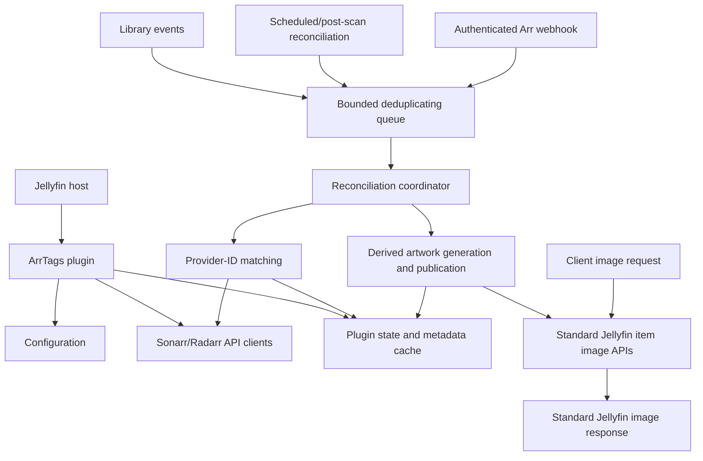

# 3. System architecture

The plugin has two related but separate paths:

1. **Reconciliation path:** obtains and fingerprints Arr metadata ahead of image
   requests. It is asynchronous, bounded, and restart-safe.
2. **Artwork path:** observes validated metadata and source-artwork state,
   renders derived artwork outside the image request path, and publishes it
   through Jellyfin's supported item-image APIs. Native clients then receive it
   through Jellyfin's standard image routes.

The artwork path is the canonical rendering strategy. ArrTags must retain
enough plugin-owned source and provenance state to avoid repeatedly overlaying
its own output and to restore the original source when appropriate. The active
derived image is delivered by Jellyfin's normal image controller, rather than
by an ArrTags response interceptor.
