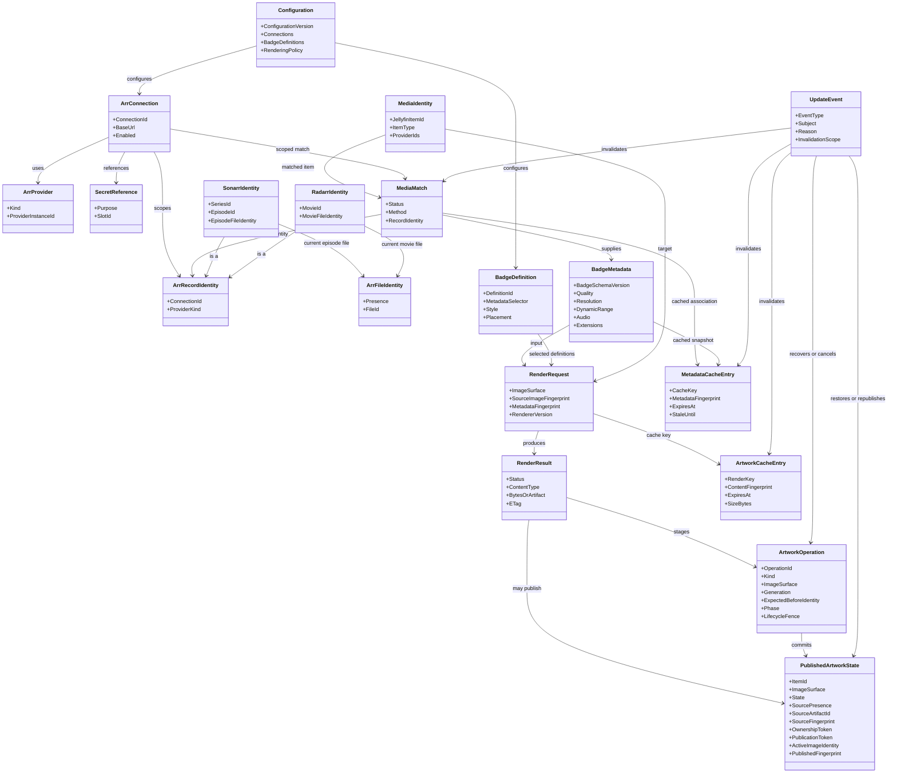
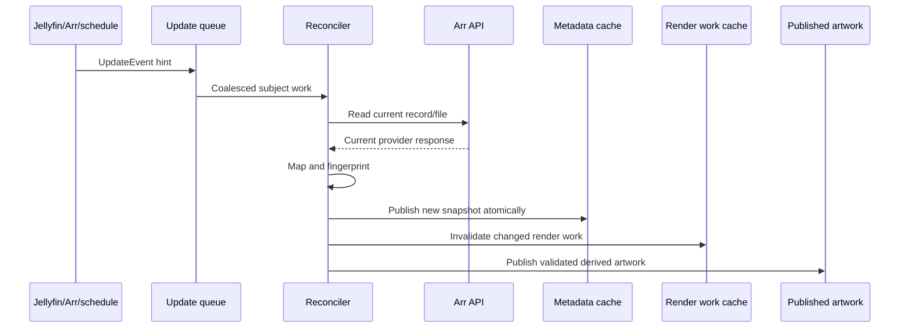

# Canonical Data Model

**Status:** Draft V1 domain model

**Scope:** Internal domain objects exchanged between Jellyfin, Sonarr, Radarr,
the cache, and the badge-rendering pipeline.

This document defines conceptual models, not C# classes, API DTOs, or a storage
schema. Provider responses are translated into these models at the integration
boundary. The rest of ArrTags should not need to know whether a value came from
Sonarr or Radarr.

The model is intentionally compatible with the V1 architecture: ArrTags is
read-only against external services, original source artwork remains recoverable
through plugin-owned provenance, and a derived image may be published as
Jellyfin's active artwork through the supported item-image APIs.

## 1. Design Principles

### Provider-agnostic core

The matching, metadata, badge, render, and cache models use common concepts for
movies and television. Provider-specific identifiers and facts remain available
through typed provider references and extensions, but the renderer consumes
`BadgeMetadata`, not Sonarr or Radarr response objects.

### External models stop at the integration boundary

Sonarr and Radarr API resources, webhook payloads, and Jellyfin entities are
external models. They are parsed defensively and mapped to canonical models.
External field names, local database IDs, enum values, and optional response
shapes must not leak through the rest of the pipeline.

### Actual observations are separate from policy

Actual file quality comes from the current Arr file record. A quality profile is
requested policy and must not be represented as the actual quality badge.
`qualityCutoffNotMet` may be represented separately as an upgrade-pending
signal.

### Identity is explicit and scoped

Jellyfin IDs, provider IDs, Arr instance identity, and Arr local record IDs have
different scopes. A cache or match must retain enough scope to prevent a local
ID from being mistaken for an ID from another Arr connection.

### Immutable/value-style data

Canonical objects are conceptually immutable snapshots. A changed provider
response produces a new snapshot and fingerprint instead of mutating a snapshot
already being rendered. Small values such as quality, dimensions, fingerprints,
and colors should have value semantics.

### Missing is not false

Unavailable or unreported technical metadata is distinct from a confirmed
negative value. For example, absent media information means HDR is unknown, not
that the file is confirmed to be SDR.

### Deterministic rendering

All output-affecting inputs are represented in `RenderRequest` or its
fingerprints. The same source image, metadata, badge definition, renderer
version, and request parameters produce the same logical render result.

### Versioned evolution

Domain model, cache, and badge schema versions are explicit. Unknown future
metadata can be ignored by an older renderer, while a cache entry with an
incompatible schema can be discarded and rebuilt.

## 2. Model Relationships



`MediaIdentity` is the Jellyfin-side subject. `MediaMatch` connects it to one
scoped Arr record through a typed `ArrRecordIdentity` that distinguishes Sonarr
series/episode/file identity from Radarr movie/file identity.
`MetadataCacheEntry` retains the provider-derived snapshot;
`ArtworkCacheEntry` retains only bounded render work state. `PublishedArtworkState`
tracks the active derived image and the plugin-owned source-artwork provenance.
Jellyfin does not provide an artwork-owner field, so ownership is proven by the
combination of retained source bytes, a persisted expected active-image identity,
and ArrTags-generated publication/session tokens. A cache hit must never be
treated as a new source of truth when it is expired or incompatible.

## 3. Canonical Domain Models

### 3.1 MediaIdentity

**Purpose:** The canonical identity and minimal media context for one Jellyfin
item. It is used for matching and cache scoping, not as a copy of the complete
Jellyfin entity.

| Field | Type | Required | Field Ownership | Notes |
| --- | --- | --- | --- | --- |
| `jellyfinItemId` | Jellyfin item identifier | Yes | Jellyfin | Stable only within the Jellyfin server; use as the local subject key. |
| `itemType` | `Movie`, `Series`, `Season`, `Episode`, or supported video type | Yes | Jellyfin | Determines which provider and matching policy applies. |
| `libraryId` | Jellyfin collection-folder/library identifier | Optional | Jellyfin | The owning collection-folder (library) identifier, not its display name; used for library eligibility and configuration scope (ADR-006). |
| `providerIds` | Map of provider name to external identifier | Optional | Jellyfin | Prefer normalized TMDb, IMDb, and TVDB IDs; absence is valid. |
| `title` | Display title | Optional | Jellyfin | Candidate or diagnostic data only; not sufficient identity. |
| `productionYear` | Integer year | Optional | Jellyfin | Tie-breaker or diagnostics; never sole proof of a match. |
| `seriesIdentity` | Parent series identity reference | Optional | Jellyfin | Used for seasons and episodes. |
| `seasonNumber` | Integer | Optional | Jellyfin | Relevant to seasons and episodes; season zero represents specials where applicable. |
| `episodeNumber` | Integer | Optional | Jellyfin | Primary episode number after Jellyfin numbering policy is applied. |
| `episodeNumberEnd` | Integer | Optional | Jellyfin | End of a multi-episode span. |
| `mediaLocation` | File/remote/virtual location summary | Optional | Jellyfin | Helps reject virtual or unsupported remote items without becoming an Arr match key. |
| `sourceFingerprint` | Opaque image/media identity fingerprint | Optional | Generated from Jellyfin | Changes when relevant Jellyfin source identity changes; not the provider metadata fingerprint. |

### 3.2 ArrProvider

**Purpose:** A provider type and provider-instance identity that can supply
metadata without exposing provider-specific API response types.

| Field | Type | Required | Field Ownership | Notes |
| --- | --- | --- | --- | --- |
| `kind` | `Sonarr` or `Radarr` | Yes | Plugin | The supported provider family. |
| `providerInstanceId` | Opaque instance identifier | Yes | Plugin/configuration | Identifies one configured server, not an Arr local record. Must not contain an API key. |
| `displayName` | String | Optional | Configuration | Human-readable administrative name. |
| `applicationVersion` | Version string | Optional | Provider, cached | Observed during connection probing; informational and feature-gating only. |
| `apiContract` | Contract identifier, such as `v3` | Yes | Provider/configuration | Both initial integrations use the Arr v3 API contract. |
| `capabilities` | Set of supported capability names | Optional | Derived from provider/version | Allows optional metadata fields without changing the core model. |

### 3.3 ArrConnection

**Purpose:** The configuration and identity of one Sonarr or Radarr server.
Secrets are configuration inputs but are deliberately not copied into match,
metadata, event, or cache identity values.

| Field | Type | Required | Field Ownership | Notes |
| --- | --- | --- | --- | --- |
| `connectionId` | Opaque stable identifier | Yes | Plugin/configuration | Used to scope provider records and cache keys. |
| `provider` | ArrProvider | Yes | Plugin/configuration | Identifies Sonarr versus Radarr and the configured instance. |
| `baseUrl` | Absolute URL | Yes when enabled | Configuration | Normalized URL base without an API path; safe to show only according to admin policy. |
| `enabled` | Boolean | Yes | Configuration | Disabled connections are not queried. |
| `requestTimeout` | Duration | Yes | Configuration | Finite request limit. |
| `tlsPolicy` | TLS validation policy | Yes | Configuration | Strict by default; exceptions are explicit and connection-scoped. |
| `secretReference` | Opaque, typed secret-slot reference | Yes | Configuration | References the protected API-key slot; it is safe metadata, remains stable during key rotation, and never contains the secret value. The value may be absent while the reference still exists. |
| `configurationVersion` | Monotonic integer | Yes | Configuration | The configuration generation this connection was derived from; scopes credential leases to the generation that produced the connection. |
| `health` | Connection health state | Optional | Generated/cached | `Healthy`, `Unavailable`, `AuthenticationFailed`, `Incompatible`, or `Unknown`. |
| `lastProbedAt` | Timestamp | Optional | Generated/cached | Time of the latest connection/version probe. |

`SecretReference` is generated at the configuration boundary, not entered as a
provider URL or looked up in a general-purpose vault. V1 has one slot for the
Sonarr API key and one for the Radarr API key because V1 has at most one
connection of each provider kind. The webhook shared secret has a separate
typed slot and must never be interchangeable with an Arr API-key reference.
ADR-012 uses that slot only for constant-time inbound webhook authentication.
Future multi-connection support must add connection-scoped slots before it is
enabled.

The actual secret remains in Jellyfin's persisted `PluginConfiguration` and in
the private in-memory secret snapshot owned by the configuration boundary. It
is not a canonical domain value. `ArrConnection` and its containing snapshots
may carry the safe reference and a `hasApiKey` diagnostic flag, but never the
referenced string.

Conceptually, a `SecretReference` contains only a purpose (`ArrApiKey` or
`WebhookAuthentication`) and a stable opaque slot identifier. It contains no
provider URL, API key, webhook value, or external vault address.

### 3.4 MediaMatch

**Purpose:** The validated relationship between a Jellyfin item and an Arr
record. A match is scoped to a connection and may be unresolved, ambiguous, or
invalid rather than silently guessed.

| Field | Type | Required | Field Ownership | Notes |
| --- | --- | --- | --- | --- |
| `mediaIdentity` | MediaIdentity reference | Yes | Jellyfin/plugin | The Jellyfin subject being matched. |
| `provider` | ArrProvider reference | Yes | Plugin | Provider family and instance scope. |
| `connectionId` | Opaque connection identifier | Yes | Plugin/configuration | Prevents cross-instance local-ID collisions. |
| `status` | `Matched`, `NotFound`, `Ambiguous`, `Unsupported`, or `Stale` | Yes | Generated | Only `Matched` permits provider metadata to be used for a badge. |
| `matchMethod` | Provider ID, number, configured path (post-V1), manual, or none | Yes | Generated | Records how the result was established; V1 never emits `ConfiguredPath` (ADR-008). |
| `recordIdentity` | Typed, connection-scoped Arr record/file identity | Required when `Matched` | Sonarr/Radarr, cached | Provider-neutral envelope holding one concrete `SonarrIdentity` or `RadarrIdentity`; see section 3.4.1. |
| `matchedProviderIds` | Map of IDs used for validation | Optional | Jellyfin + provider | Records the stable IDs that agreed; useful for diagnostics and invalidation. |
| `pathValidation` | Path comparison result | Optional | Generated | Reserved for a future path-mapping decision; V1 never produces a path match or path validation result. |
| `matchedAt` | Timestamp | Optional | Generated | Last successful validation time. |
| `matchFingerprint` | Opaque fingerprint | Yes | Generated | Changes when the association or any scoped identity component (record ID, episode ID, or file identity presence/value) changes. |
| `ambiguityReason` | String/code | Optional | Generated | Safe explanation for skipped matches; never contains credentials. |

#### 3.4.1 Arr record and file identity

**Purpose:** A typed, connection-scoped representation of the Arr record and
current file a match resolves to. It replaces the former singular opaque record
identifier so a Sonarr episode carries its series, episode, and current-file
identity without ambiguity. These are canonical model types, never provider
DTOs.

Every `ArrRecordIdentity` is scoped to exactly one `ArrConnection`
(`connectionId`) and one provider kind. The same local record/file ID value on
two connections is never the same identity.

| Field | Type | Required | Field Ownership | Notes |
| --- | --- | --- | --- | --- |
| `connectionId` | Opaque connection identifier | Yes | Plugin/configuration | Scope for every contained local ID. |
| `providerKind` | `Sonarr` or `Radarr` | Yes | Plugin | Selects exactly one concrete identity shape. |

Concrete identity shapes are never mixed or substituted across providers.

**SonarrIdentity**

| Field | Type | Required | Field Ownership | Notes |
| --- | --- | --- | --- | --- |
| `seriesId` | Sonarr series local ID | Yes for a matched series or episode | Sonarr, cached | The series record the episode belongs to; distinct from an episode TVDB ID. |
| `episodeId` | Sonarr episode local ID | Yes for a matched episode | Sonarr, cached | The matched episode; distinct from the series ID and from the episode TVDB ID. |
| `episodeFileIdentity` | `ArrFileIdentity` | Yes for a matched episode | Sonarr, cached | Current file from the `episode.episodeFileId == episodeFile.id` join; explicit `Absent` when the episode has no current file. |

A series match carries `seriesId` only. An episode match always distinguishes
the series from the episode and from the current file; an episode cannot be
represented with only a series ID or only a file ID.

**RadarrIdentity**

| Field | Type | Required | Field Ownership | Notes |
| --- | --- | --- | --- | --- |
| `movieId` | Radarr movie local ID | Yes | Radarr, cached | The matched movie record. |
| `movieFileIdentity` | `ArrFileIdentity` | Yes | Radarr, cached | Current `movieFileId`; explicit `Absent` when the movie has no imported file. |

This preserves the existing Radarr movie/file identity shape: at most one
current file per movie.

**ArrFileIdentity**

| Field | Type | Required | Field Ownership | Notes |
| --- | --- | --- | --- | --- |
| `presence` | `Present` or `Absent` | Yes | Sonarr/Radarr, cached | Missing file identity is explicit; never encoded as `0`, `-1`, `null`, or an empty string. |
| `fileId` | Arr file local ID | Required when `presence` is `Present` | Sonarr/Radarr, cached | Sonarr `episodeFile.id` or Radarr `movieFile.id`; absent (never zero) when `presence` is `Absent`. |

**Shared Sonarr episode files.** A Sonarr episode-file identity is not owned by
one episode. Multiple episode identities may reference the same `fileId`, and a
`SonarrIdentity` must not imply a one-to-one episode-to-file relationship. Code
that reads `episodeFileIdentity` resolves the file by ID and must not assume the
file belongs exclusively to the matched episode.

**Fingerprints.** `matchFingerprint` and `metadataFingerprint` include the
connection ID, provider kind, every present identity component (`seriesId`,
`episodeId`, `RadarrIdentity.movieId`, and each `ArrFileIdentity.fileId`), and
each explicit `presence` value. A changed file ID, an `Absent`-to-`Present`
transition, or a matching change on another connection changes the dependent
fingerprint; no identity component is omitted.

**DTO boundary.** These are canonical identity values. Sonarr `SeriesResource`,
`EpisodeResource`, and `EpisodeFileResource` and Radarr `MovieResource` and
`MovieFileResource` remain integration-boundary DTOs and never appear in, or
replace, these types.

### 3.5 BadgeMetadata

**Purpose:** Provider-agnostic, badge-relevant observations for the current
matched media file. It is the renderer's metadata input. Each optional technical
value supports an explicit unknown state.

| Field | Type | Required | Field Ownership | Notes |
| --- | --- | --- | --- | --- |
| `badgeSchemaVersion` | Version identifier | Yes | Plugin | Version of the normalized metadata shape. |
| `provider` | ArrProvider reference | Yes | Plugin/provider | Identifies the source without exposing its DTO. |
| `recordIdentity` | Typed Arr record/file identity reference | Yes | Sonarr/Radarr + generated | Carries the connection-scoped `SonarrIdentity` or `RadarrIdentity`, including explicit file-identity presence; see section 3.4.1. |
| `observedAt` | Timestamp | Yes | Provider/generated | When the source observation was obtained. |
| `quality` | Quality descriptor | Optional | Sonarr/Radarr | Actual file quality label and structured source/resolution/modifier; never the quality profile target. |
| `resolution` | Resolution descriptor | Optional | Sonarr/Radarr or Derived | Prefer inspected media dimensions; retain whether the value is reported or derived. |
| `dynamicRange` | Dynamic-range descriptor | Optional | Sonarr/Radarr | HDR, HDR10, HDR10+, HLG, PQ, or unknown. |
| `dolbyVision` | Tri-state flag or descriptor | Optional | Sonarr/Radarr | Dolby Vision is distinct from generic HDR; unknown is not false. |
| `videoCodec` | String | Optional | Sonarr/Radarr | Normalized codec where the provider reports it. |
| `audioCodec` | String | Optional | Sonarr/Radarr | Normalized codec, such as TrueHD, DTS-HD MA, EAC3, AAC, or unknown. |
| `audioChannels` | Decimal number | Optional | Sonarr/Radarr | Channel count; do not infer Atmos solely from channel count. |
| `audioFeatures` | Set of `Atmos`, `DTS`, `DTS-HD`, `DTS-X`, or future feature names | Optional | Sonarr/Radarr or Derived | Feature detection must retain unknown when source data is incomplete; an absent set is unknown and an empty set is a reported codec with no known feature. |
| `source` | Source descriptor | Optional | Sonarr/Radarr | Release source such as web, WEB-DL, WEBRip, HDTV, Blu-ray, or remux. |
| `upgradePending` | Tri-state flag | Optional | Sonarr/Radarr | Maps to `qualityCutoffNotMet`; it describes policy state, not observed quality. |
| `customBadges` | Ordered set of custom metadata values | Optional | Provider/configuration | Custom-format names or configured provider values. Bounded to 32 values of at most 128 characters; blank values and control characters are removed. |
| `extensions` | Namespaced extension map | Optional | Additional providers/generated | Future metadata that an older renderer may ignore. |
| `metadataFingerprint` | Opaque fingerprint | Yes | Generated | Includes every record/file identity component, badge-affecting values, and their schema version. |

#### Value conventions

`Quality descriptor` contains a display label, source classification, numeric
resolution when known, modifier/revision when relevant, and an optional provider
local quality identifier. The provider local ID is for equality within one
connection only.

`Resolution descriptor` contains width, height, display label, and an origin
such as provider quality, provider media info, Jellyfin media stream, or
derived. A quality parser's resolution and stream dimensions are related but
not interchangeable.

`Dynamic-range descriptor` contains a normalized family, optional profile name,
and a confidence/origin state. Missing media information is `Unknown`.

`Custom badges` are data values, not arbitrary executable markup. The renderer
decides whether a configured value is displayable.

#### V1 renderable selector vocabulary

ADR-009 defines the V1 selector vocabulary consumed by the renderer. Selectors
are canonical field selectors, never provider DTO paths:

| Selector | Value rule | V1 display behavior |
| --- | --- | --- |
| `Quality` | Confirmed actual quality display label | First technical pill; quality profile is never eligible. |
| `Resolution` | Confirmed normalized resolution display label | Second technical pill. |
| `DynamicRange` | Confirmed dynamic range or Dolby Vision state | Dolby Vision replaces the generic range label. |
| `Source` | Confirmed source display label | Technical pill after range. |
| `VideoCodec` | Confirmed normalized video codec | Technical pill after source. |
| `Audio` | Confirmed feature, codec, and channel values | One composite pill with feature before codec before channels. |
| `CustomBadge` | One bounded `customBadges` value | One candidate per value, in canonical order, after standard fields. |
| `UpgradePending` | Explicitly true tri-state value | Separate `UPGRADE` status pill; false and unknown are omitted. |

`Extensions`, provider identity, Arr record/file IDs, quality profiles, custom-
format scores, titles, and episode numbering are not V1 selectors. An older
renderer may ignore future selectors without treating them as unknown negative
claims.

### 3.6 BadgeDefinition

**Purpose:** Visual and selection rules for one badge, independent of the
metadata source. Definitions are configuration snapshots and do not contain
the current item's metadata.

| Field | Type | Required | Field Ownership | Notes |
| --- | --- | --- | --- | --- |
| `definitionId` | Opaque identifier | Yes | Configuration | Stable identity within configuration. |
| `definitionVersion` | Version identifier | Yes | Configuration | Changes when selection or visual behavior changes. |
| `enabled` | Boolean | Yes | Configuration | Disabled definitions produce no badge. |
| `metadataSelector` | Provider-neutral selector | Yes | Configuration | Selects one ADR-009 V1 field: quality, resolution, dynamic range, audio, source, video codec, custom value, or upgrade-pending. |
| `fallbackPolicy` | Hide in V1 | Yes | Configuration | Unknown and unavailable values are omitted; no placeholder or alternate selector is used in V1. |
| `textTemplate` | Bounded display template | Optional | Configuration | Formatting rule after values are normalized; no provider DTO paths. |
| `allowedValues` | Bounded string list | Optional | Configuration | Per-selector value allowlist (ADR-017); empty means no restriction. At most 32 entries, each at most 64 characters; entries are trimmed, blank entries and control characters are rejected, and case-insensitive duplicates are rejected. Matching is a case-insensitive ordinal exact match against the resolved pre-template value; no substring, wildcard, prefix, or regular-expression matching. |
| `style` | Badge style value | Yes | Configuration | Opaque palette, text, font, and contrast policy; V1 geometry is defined by ADR-009. |
| `placement` | Placement value | Yes | Configuration | V1 poster anchor, bounded rail packing, margins, and scale. The global position and size (ADR-019) are configurable; packing and the safe area remain bounded and code-owned. |
| `visibilityPolicy` | Image/item/client surface policy | Yes | Configuration | V1 is poster-oriented and not user-specific. |
| `customValueRules` | Optional bounded rules | Optional | Configuration | Maps approved custom metadata to a visual value. |

For V1, `metadataSelector` uses the selector vocabulary in section 3.5. A
definition may disable a selector, provide one bounded provider-neutral
`{value}` template, and carry a bounded per-selector value allowlist. Definition
order cannot override the ADR-009 priority; configuration controls visibility
and bounded presentation, not semantic precedence. An empty `allowedValues` list
means no restriction; a non-empty list restricts rendering to the confirmed
values it matches and never widens an unknown/absent omission (the filter itself
is applied by the renderer per ADR-017 clause 3). V1 definitions target the
unindexed `Primary` poster surface of Movie and Episode items only.

The V1 style and placement values are bounded domain values rather than
arbitrary markup:

- Technical pills use `#111827` with `#FFFFFF` text; the upgrade status pill
  uses `#B45309` with `#FFFFFF` text.
- Text is a single bold or semibold sans-serif line at a 28 pixel reference
  size. Geometry uses the 1000 pixel reference values and
  `clamp(width / 1000, 0.5, 4.0)` scale in ADR-009.
- Technical pills use a configurable global anchor (ADR-019: four corners plus
  center, default bottom-left) with at most two rows and three pills per row;
  rows stack away from the anchored edge and align to the anchored side. Upgrade
  status is an independent pill that is top-right except when the anchor is
  top-right, then top-left. The global preset size (Small/Medium/Large, default
  Medium) multiplies the reference geometry.
- The final label is limited to 24 Unicode scalar values after whitespace and
  control-character normalization; end truncation uses `...`.
- A configured color must pass the 4.5:1 text/background contrast check. Badge
  backing is opaque, and source alpha is preserved only in the output image
  outside the badge pixels.

### 3.7 RenderRequest

**Purpose:** Complete logical input for generating one derived poster image for
publication through Jellyfin's item-image APIs. It represents the selected
source artwork plus all output-affecting metadata and configuration.

| Field | Type | Required | Field Ownership | Notes |
| --- | --- | --- | --- | --- |
| `requestId` | Opaque correlation identifier | Yes | Generated | Diagnostic only; not part of the output identity. |
| `mediaIdentity` | MediaIdentity reference | Yes | Jellyfin/plugin | Target item. |
| `imageSurface` | Image type and optional index | Yes | Jellyfin/request | V1 supports only the unindexed `Primary` poster surface for Movie and Episode items. |
| `sourceImage` | Original source image handle/bytes | Yes at render time | Jellyfin/plugin | Source used to create derived artwork; the source is not overwritten by the renderer. |
| `sourceImageFingerprint` | Source image identity fingerprint | Yes | Jellyfin/generated | Changes when the retained or newly validated source artwork changes. |
| `renderParameters` | Format, quality, dimensions, and relevant output values | Yes | Configuration/generated | V1 is lossless 8-bit PNG at source dimensions; client-requested size and device pixel ratio are not render inputs. |
| `match` | MediaMatch | Yes | Generated/cache | Only a valid matched state supplies metadata. |
| `metadata` | BadgeMetadata | Optional | Sonarr/Radarr/cache | Absent metadata means no new publication or configured no-badge behavior. |
| `badgeDefinitions` | Ordered definitions | Yes | Configuration | Snapshot used for this render. |
| `configurationFingerprint` | Opaque fingerprint | Yes | Generated from configuration | Includes output-affecting settings, not secrets. |
| `rendererVersion` | Version identifier | Yes | Plugin | Changes when rendering behavior changes. |
| `outputPolicy` | Format, size, and limit policy | Yes | Configuration/generated | Includes PNG/RGB-or-RGBA output, source-dimension preservation, 24-scalar text, two-row/three-pill layout, operational bounds, and cancellation constraints. |

### 3.8 RenderResult

**Purpose:** The result of rendering or the safe decision to leave the current
active artwork unchanged.

| Field | Type | Required | Field Ownership | Notes |
| --- | --- | --- | --- | --- |
| `status` | `Rendered`, `PassThrough`, `NotEligible`, `CacheHit`, or `Failed` | Yes | Generated | Failure and ineligibility are normal domain outcomes, not Jellyfin failures. |
| `outputArtifact` | Image bytes or bounded artifact reference | Optional | Generated/cache | Present for completed render work; may be published as Jellyfin active artwork through the supported image API. |
| `contentType` | MIME type | Optional | Generated/Jellyfin | Must describe the returned artifact. |
| `width` / `height` | Integer dimensions | Optional | Generated/Jellyfin | Actual output dimensions. |
| `outputFingerprint` | Opaque fingerprint | Yes | Generated | Covers source, metadata, definitions, render values, and renderer version. |
| `etag` | Internal artifact identity, if useful | Optional | Generated | Jellyfin owns the validator for the published item image. |
| `createdAt` | Timestamp | Yes | Generated | Creation time of this result/artifact. |
| `passThroughReason` | Safe reason code | Optional | Generated | Used for diagnostics and metrics without exposing provider secrets. |
| `expiresAt` | Timestamp | Optional | Cache policy/generated | Applies when the result is cacheable. |

**Phase 4 implementation note:** The provider-neutral renderer service (task
4.9, ADR-010) implements the 3.6-3.8 contract in `src/ArrTags/Rendering`. The V1
`BadgeDefinition` snapshot is deliberately minimal (selector, enabled flag, and
one bounded `{value}` template); task 4.10 persists exactly those two
user-adjustable dimensions per selector, plus contrast-validated palette
overrides, into `RendererConfiguration` and maps them back through
`RendererConfigurationResolver`. The remaining definition, style, placement, and
visibility fields above stay code-owned per ADR-009/ADR-010: V1 does not expose
user-selectable format, color space, alpha, font, geometry, text-limit, or
version values, so they are not part of the persisted configuration.
`BadgeDefinitionResolver` applies the bounded templates on top of the existing
`BadgeSelectorResolver`, so semantic priority remains code-owned. `RenderResult`
has three bounded variants: `Rendered` (complete PNG artifact plus content type,
oriented dimensions, output hash, and output fingerprint), `PassThrough`, and
`Failed` with exactly one safe reason code; `NotEligible` and `CacheHit` remain
conceptual policy states handled outside the renderer. `SourceImageInput` is
the bounded, read-only bytes descriptor defined by ADR-010; the Jellyfin host
adapter that supplies it remains Phase 5 work. `PluginConfigurationSnapshot`
exposes the validated definitions, the effective `RenderOutputPolicy`, and the
secret-free renderer configuration fingerprint that feeds
`RenderRequest.configurationFingerprint`.

**v1.1 task 12.1 implementation note:** `BadgeSelectorConfiguration` and the
resolved `BadgeDefinition` carry the bounded `AllowedValues` allowlist (ADR-017).
`RendererConfigurationResolver.ResolveDefinitions` maps the persisted
`BadgeSelectorConfiguration.AllowedValues` into `BadgeDefinition.AllowedValues`,
which is an immutable, trimmed copy. The value is bounded and validated in
`RendererConfiguration.Validate` with secret-free messages. A non-empty resolved
allowlist is included in `RendererConfigurationFingerprint`, which normalizes
case and entry order so that case-only or order-only allowlist changes are
identity-neutral; an empty allowlist means no restriction and adds nothing to
the fingerprint (identity-neutral relative to a non-empty allowlist), though the
coordinated v1.1 schema advance still changes the default configuration
fingerprint. Task 12.1 does not yet apply the filter to rendering; the renderer
filtering order is task 12.2.

**v1.1 task 12.3 implementation note:** `RendererConfiguration` gains the global
`Position` (`BadgePosition`: `BottomLeft` default, `TopLeft`, `TopRight`,
`BottomRight`, `Center`) and `Size` (`BadgeSize`: `Medium` default, `Small`,
`Large`) settings (ADR-019 clauses 1-5 and 7). `RendererConfiguration.Validate`
rejects an undefined enum value with a bounded, secret-free message, and
`RendererConfigurationResolver.ResolveOutputPolicy` carries both onto the
resolved `RenderOutputPolicy` (falling back to the code-owned default for a
tolerantly read undefined value). `BadgeGeometry.ComputeEffectiveScale` computes
`clamp(width / 1000, 0.5, 4.0) * sizeFactor` (`Small` 0.75, `Medium` 1.0,
`Large` 1.5), clamped so the scaled outer inset leaves a positive safe area; the
layout engine then shortens or omits rather than overflowing. `BadgeLayoutEngine`
positions the rail per anchor (rows stack away from the anchored edge and align
to the anchored side; `Center` centers both axes) and places the status pill
top-right except when the anchor is `TopRight`, then top-left. The 24-pixel
scaled inset and all ADR-009 safe-area, text-limit, contrast, opacity, and
determinism guarantees are unchanged. A non-default position or size is included
in both `RendererConfigurationFingerprint` and
`RenderFingerprint.ComputeOutputFingerprint`; the default position and size are
identity-neutral relative to other placement values (the default reproduces the
V1 output, so the default PNG bytes are unchanged), but the coordinated v1.1
version advance changes the default configuration and output fingerprints.
Placement and size are global only; there is no per-selector placement. The v1.1
allowlist and placement changes share one
coordinated advance: `RendererConfiguration.CurrentSchemaVersion` advanced from 1
to 2 and `RenderVersion.CurrentRendererVersion` advanced from 2 to 3, and the
committed goldens were regenerated with no writer or auto-approval path (the nine
default-configuration PNGs are byte-unchanged while their output fingerprints
advance with the renderer version, and anchor/size goldens were added).

**Phase 5 implementation note:** The task 5.8
`ArtworkGenerationCoordinator` composes the 3.7-3.8 request/result with the
source adapter and publisher. It maps the renderer's bounded outcome into an
`ArtworkGenerationOutcome` that distinguishes published, absent source,
source-unavailable, render pass-through, render failure, publication not
completed, blocked, and cancelled; only a published outcome changes the active
artwork. Missing metadata and an ineligible match remain renderer pass-through
states and produce no badge and no mutation. The coordinator supplies the exact
observed source to the publisher so the retained provenance baseline matches the
render source.

### 3.9 MetadataCacheEntry

**Purpose:** A versioned, restart-safe logical cache record for a match and its
last-known-good provider metadata. It is not a storage schema.

| Field | Type | Required | Field Ownership | Notes |
| --- | --- | --- | --- | --- |
| `cacheVersion` | Version identifier | Yes | Plugin | Incompatible entries can be rebuilt. |
| `cacheKey` | Opaque key | Yes | Generated | Includes Jellyfin item, connection, provider, and every typed record/file identity component; excludes secrets. |
| `mediaIdentity` | MediaIdentity reference | Yes | Cached from Jellyfin | The local subject. |
| `match` | MediaMatch | Yes | Cached/generated | Includes the scoped typed Arr record/file identity from section 3.4.1. |
| `metadata` | BadgeMetadata | Optional | Cached from Sonarr/Radarr | Last successful normalized snapshot. |
| `metadataFingerprint` | Opaque fingerprint | Optional | Generated | Determines whether artwork invalidation is required. |
| `providerVersion` | Version string | Optional | Cached from provider | Helps diagnose version drift and optional field availability. |
| `providerVersionToken` | ETag or provider revision token | Optional | Provider, cached | Use only when observed and validated; absence is normal. |
| `fetchedAt` | Timestamp | Optional | Generated | Last successful source fetch. |
| `expiresAt` | Timestamp | Optional | Cache policy/generated | Freshness boundary. |
| `staleUntil` | Timestamp | Optional | Cache policy/generated | Last-known-good may be used until this bounded time during outages. |
| `state` | Fresh, stale, unmatched, unavailable, or invalid | Yes | Generated | State is explicit so stale data is not mistaken for current data. |
| `lastError` | Domain error summary | Optional | Generated | Redacted, bounded, and non-secret. |

### 3.10 ArtworkCacheEntry

**Purpose:** A bounded, evictable work record for one rendered image before or
around publication. It has no authority over metadata or publication state.

| Field | Type | Required | Field Ownership | Notes |
| --- | --- | --- | --- | --- |
| `cacheVersion` | Version identifier | Yes | Plugin | Allows cache format changes without migration assumptions. |
| `renderKey` | Opaque key | Yes | Generated | Includes item, surface, source image fingerprint, metadata/config fingerprints, and renderer version. |
| `outputFingerprint` | Opaque fingerprint | Yes | Generated | Fingerprint of the output-affecting inputs. |
| `artifact` | Image bytes or artifact reference | Yes | Generated/cache | Bounded and evictable; storage mechanism is intentionally unspecified. |
| `contentType` | MIME type | Yes | Generated | Content type of the artifact. |
| `width` / `height` | Integer dimensions | Yes | Generated | Dimensions of the cached representation. |
| `sizeBytes` | Integer | Yes | Generated | Used for resource limits and eviction. |
| `etag` | Internal artifact identity, if useful | Optional | Generated | Jellyfin owns the validator for the published item image. |
| `createdAt` | Timestamp | Yes | Generated | Creation time. |
| `lastAccessedAt` | Timestamp | Optional | Generated | Eviction accounting. |
| `expiresAt` | Timestamp | Yes | Cache policy/generated | Expired entries are not served. |

### 3.10.1 PublishedArtworkState

**Purpose:** The conceptual state connecting plugin-owned source-artwork
provenance to a derived image currently published as Jellyfin item artwork. It
is not a Jellyfin storage schema and does not require the original source to be
held in the canonical metadata snapshot. It is the authority for publication
ownership and guarded restoration; Jellyfin image metadata alone is not enough.

| Field | Type | Required | Field Ownership | Notes |
| --- | --- | --- | --- | --- |
| `modelVersion` | Version identifier | Yes | Plugin | Changes to ownership semantics invalidate or migrate the record. |
| `jellyfinItemId` | Jellyfin item identifier | Yes | Jellyfin/plugin | Local subject whose active image may be derived. |
| `imageSurface` | Image type and optional index | Yes | Jellyfin/configuration | V1 surface selected by the image policy. |
| `state` | `NotPublished`, `Published`, `OwnershipLost`, `OwnershipUnknown`, `RestorePending`, `Restored`, `RestoreBlocked`, or `Removed` | Yes | Generated | Controls whether ArrTags may publish, restore, or remove the active image. |
| `sourcePresence` | `Present` or `Absent` | Yes when a publication session exists | Generated | `Absent` means the surface had no image before the session. |
| `sourceArtifactId` | Opaque retained-artifact identifier | Required when source is present | Generated | Content-addressed plugin-owned artifact; never a Jellyfin cache path or media path. |
| `sourceFingerprint` | SHA-256 of retained source bytes | Required when source is present | Generated | Hashes the exact bounded bytes used for rendering and restoration. |
| `sourceCaptureIdentity` | ActiveImageIdentity | Required for a publication session | Generated | Identity observed immediately before the first ArrTags publication, including an explicit absent baseline. |
| `ownershipToken` | Opaque random token | Required for an active session | Generated | Stable for one original-to-derived session; not a Jellyfin token. |
| `publicationToken` | Opaque random token | Required when published | Generated | New for each successful ArrTags-derived publication. |
| `activeImageIdentity` | ActiveImageIdentity | Required when published | Jellyfin/plugin | Expected identity of the currently active ArrTags image; re-observe before mutation. |
| `publishedFingerprint` | Opaque logical publication fingerprint | Required when published | Generated | Includes source, metadata, configuration, renderer, and schema inputs; not ownership proof alone. |
| `rendererVersion` | Version identifier | Yes when published | Plugin | Changes require regeneration. |
| `lastOwnershipObservation` | ActiveImageIdentity plus result | Yes | Generated | Latest `Owned`, `Changed`, or `Unknown` comparison for diagnostics and restart revalidation. |
| `stateRevision` | Monotonic integer | Yes | Generated | Increments for each committed state transition on the item/surface. |
| `lastOperationId` | Opaque operation identifier | Optional | Generated | Links the committed state to the durable artwork operation that produced it. |
| `updatedAt` | Timestamp | Yes | Generated | Last publication or restoration-state change. |

`sourceArtifactId` identifies an immutable artifact stored under the ArrTags data
folder. The artifact contains the exact source bytes, MIME type, byte length, and
integrity metadata. Its path is an implementation detail and is not an ownership
signal. The artifact remains retained while the session is `Published` or
`RestorePending`; after `OwnershipLost`, it may only be removed by bounded
retention cleanup and must never be used for automatic restoration.

`ActiveImageIdentity` is the observable identity of one Jellyfin image surface:

| Field | Type | Semantics |
| --- | --- | --- |
| `imageSurface` | Image type and index | Prevents an image on another surface or index from satisfying the comparison. |
| `presence` | `Present` or `Absent` | Absence is an identity value, not an error. |
| `contentSha256` | SHA-256 | Required for a `Present` ownership proof; hashes the bounded active representation used for comparison. |
| `byteLength` | Integer | Supporting evidence and integrity check for the content hash. |
| `width` / `height` | Integer | Supporting Jellyfin image metadata. |
| `dateModifiedUtc` | Timestamp | Supporting Jellyfin image metadata; not sufficient by itself. |
| `jellyfinImageTag` | Opaque string | Supporting Jellyfin cache/representation validator when available; not an ArrTags ownership token. |

The comparison is fail-closed. The surface and presence must match, the active
content hash must match, and every Jellyfin identity value recorded at
publication must still match when observable. A missing required hash or an
otherwise unavailable observation produces `OwnershipUnknown`, not ownership. A
path is never sufficient evidence because Jellyfin may reuse a path for a
different image. The Jellyfin image tag is useful for detecting replacement but
is not content- or actor-specific and cannot prove ownership on its own.

### 3.10.2 PublishedArtworkState transitions

These are ownership transitions. Crash-consistent ordering and restart
reconciliation are defined separately by `ArtworkOperation` in section 3.10.3.

| Current state | Condition | Next state | Required behavior |
| --- | --- | --- | --- |
| `NotPublished` or `Restored` | A new publication is eligible | `Published` | Observe the surface, retain its exact source or record `Absent`, create a new ownership token, and publish only if the baseline is recoverable. |
| `Published` | Current identity exactly matches `activeImageIdentity` | `Published` | Reuse the original source artifact; do not capture the ArrTags image as a new source. A changed publication gets a new publication token and active identity while retaining the same ownership token and source artifact. |
| `Published` | Current identity differs from the expected identity | `OwnershipLost` | Treat the change as external, regardless of whether it was a user, Jellyfin, provider, or another plugin. Do not publish, restore, or remove automatically. |
| `Published` | Current identity cannot be completely observed or compared | `OwnershipUnknown` | Leave the active image unchanged and perform no guarded mutation. |
| `Published` | Disable or uninstall requests restoration | `RestorePending` | Re-observe the active image immediately before any restoration mutation. |
| `RestorePending` | Expected identity matches and source artifact passes integrity validation | `Restored` | Restore the retained source, or remove the ArrTags image when `sourcePresence` is `Absent`, then verify the resulting surface. |
| `RestorePending` | Identity differs or cannot be proven | `OwnershipLost` or `OwnershipUnknown` | Do not mutate the active image. Retain the diagnostic state and artifact subject to bounded cleanup. |
| `RestorePending` | Source artifact is missing or corrupt | `RestoreBlocked` | Leave the active image unchanged and do not claim restoration completed. |
| `RestorePending` | The restoration result cannot be verified | `RestoreBlocked` | Do not claim completion or perform another automatic mutation; the associated operation enters `RecoveryBlocked` until reconciled. |
| Any state | Jellyfin item is removed | `Removed` | Perform no image operation against the missing item; clean plugin-owned records/artifacts only under the retention policy. |

An `OwnershipLost`, `OwnershipUnknown`, or `RestoreBlocked` record is never
automatically re-baselined. A future explicit administrative re-baseline, if
supported, starts a new ownership session and captures the then-current image;
it does not silently reclaim a later image.

### 3.10.3 ArtworkOperation

**Purpose:** A durable write-ahead operation record for one publication or
restoration attempt. It bridges the non-transactional Jellyfin image APIs and
the plugin-owned `PublishedArtworkState`. It is not an evictable render-cache
entry and must remain available until the operation reaches a terminal state and
its artifacts are safe to clean up.

Only one non-terminal operation may exist for an item/image surface at a time.
The operation generation fences stale queued work from publishing or finalizing
after a newer operation or lifecycle fence has been accepted.

| Field | Type | Required | Field Ownership | Notes |
| --- | --- | --- | --- | --- |
| `modelVersion` | Version identifier | Yes | Plugin | Invalid operation records are quarantined and never replayed blindly. |
| `operationId` | Opaque random identifier | Yes | Generated | Correlates the journal, staged artifacts, diagnostics, and final state. |
| `kind` | `Publication` or `Restoration` | Yes | Generated | Selects the target state and artifact use. |
| `jellyfinItemId` | Jellyfin item identifier | Yes | Jellyfin/plugin | Operation subject. |
| `imageSurface` | Image type and optional index | Yes | Jellyfin/configuration | Operation scope; must match both image identities. |
| `generation` | Monotonic per-item/surface value | Yes | Generated | Prevents stale work from becoming authoritative. |
| `ownershipToken` | Opaque token | Yes for an owned session | Generated | Carries the Blocker 1 ownership session through recovery. |
| `priorPublicationToken` | Opaque token | Optional | Generated | Expected prior ArrTags publication when replacing an owned image. |
| `publicationToken` | Opaque token | Required for publication | Generated | Candidate publication identity to commit if the postcondition matches. |
| `expectedBeforeIdentity` | ActiveImageIdentity | Yes | Generated/Jellyfin observation | Exact precondition observed before the external image mutation. |
| `candidateAfterPresence` | `Present` or `Absent` | Yes | Generated | Explicit candidate after-target presence; `Absent` removes the ArrTags image rather than writing a new one. |
| `candidateAfterContentSha256` | SHA-256 | Required when the after target is present | Generated | Hash of the durable artifact intended to become active; an absent after target records `presence = Absent`; the complete after identity is learned by readback. |
| `observedAfterIdentity` | ActiveImageIdentity | Optional | Jellyfin observation | Recorded only after the effective active image is re-observed. |
| `sourcePresence` | `Present` or `Absent` | Yes | Generated | Explicit presence of the retained source baseline; `Absent` is an explicit baseline with no artifact. |
| `sourceArtifactId` | Opaque artifact identifier | Required when source is present | Generated | Retained original used by publication or restoration. |
| `derivedArtifactId` | Opaque artifact identifier | Required for publication | Generated | Durable, validated render output; never only an evictable cache entry. |
| `candidatePublicationFingerprint` | Opaque logical publication fingerprint | Required for publication | Generated | The target `publishedFingerprint` to commit when the after postcondition is recovered; recorded so recovery never has to re-render or re-derive it. |
| `rendererVersion` | Version identifier | Required for publication | Plugin | The renderer version that produced the candidate derived artifact; recorded so a recovered commit does not misattribute the active image to a later renderer version. |
| `phase` | ArtworkOperationPhase | Yes | Generated | Durable lower-bound marker for external side effects. |
| `lifecycleFence` | Normal, Disable, Uninstall, or ItemRemoved | Yes | Generated | Prevents new publication work during lifecycle transitions. |
| `attempt` | Non-negative integer | Yes | Generated | Bounded recovery/retry accounting. |
| `lastError` | Redacted error summary | Optional | Generated | Diagnostics only; never a provider secret or raw payload. |
| `createdAt` / `updatedAt` | Timestamp | Yes | Generated | Journal lifecycle timestamps. |

`ArtworkOperationPhase` has these values:

| Phase | Meaning |
| --- | --- |
| `Prepared` | Source/derived artifacts and the complete operation intent are durable; no external image mutation has been started by this operation. |
| `MutationStarted` | The operation has durably recorded that `SaveImage` or the supported image-removal operation may have started. A crash before or during the call is treated as uncertain. |
| `RepositoryUpdateStarted` | The image mutation may have completed and the durable item update may have started. Both effects are re-observed during recovery. |
| `VerificationPending` | The supported item-image state and effective image representation must be read again before finalization. |
| `FinalizationPending` | The intended postcondition was observed; the final `PublishedArtworkState` or `Restored` state must be durably committed. |
| `Committed` | Final plugin state is durable and references the operation; cleanup may proceed under the artifact rules. |
| `Aborted` | The operation was safely stopped without adopting its candidate result, usually because the before identity no longer matched or the item was removed. |
| `RecoveryBlocked` | The operation or required observation is corrupt, unavailable, or ambiguous; no further automatic image mutation is permitted. |

The phase is deliberately a lower-bound marker. Recovery must assume that an
external call may have happened whenever the phase is `MutationStarted` or
later, even if the corresponding acknowledgment was not persisted. A durable
operation record is written before the first external image mutation. Operation
records, state records, and artifact manifests use versioned integrity metadata,
stable-storage flushing, and atomic replacement; a torn or invalid record is
quarantined rather than guessed.

Staged artifacts are promoted from temporary files only after bounded size,
format, and hash validation. They are retained until the operation is committed,
aborted, or tombstoned as removed, and cleanup must first prove that the
artifact is not the current active image. If that proof is unavailable, the
artifact is retained or quarantined.

### 3.10.4 ArtworkOperation transitions and recovery

| Phase or observation | Recovery action |
| --- | --- |
| `Prepared` and current identity equals `expectedBeforeIdentity` | Revalidate the generation and lifecycle fence, then resume the deterministic operation. |
| Any mutation-started phase and current identity equals `expectedBeforeIdentity` | The mutation did not become observable or the image was restored to the exact expected identity. Revalidate immediately and retry the same operation only under the current generation; never recapture a new source. |
| Any phase and current identity matches `observedAfterIdentity` or a validated candidate after identity | Ensure the normal Jellyfin item update is persisted, commit the target plugin state, then mark the operation `Committed`. |
| Any phase and current identity differs from both before and after identities | Mark the ownership state `OwnershipLost` when the image is observable, abort the operation, and never restore or remove the external image. |
| Any phase and the current identity cannot be observed or compared | Mark `OwnershipUnknown` or `RecoveryBlocked`, leave the image untouched, and require later reconciliation or explicit administration. |
| Any phase and the Jellyfin item is absent | Write an `ItemRemoved` tombstone, perform no image mutation, and retain cleanup records until the removal decision is durable. |
| Final state is durable but journal is non-terminal | Treat the final state and verified active identity as authoritative, mark the operation `Committed`, and perform only safe cleanup. |

Recovery runs under the same per-item/image-surface serialization as normal
publication and completes before new work for that subject is accepted. It is
postcondition-based rather than a distributed transaction: Jellyfin and the
plugin cannot be committed atomically, so uncertainty always resolves toward
preserving the currently observable artwork.

### 3.11 UpdateEvent

**Purpose:** A bounded invalidation or reconciliation hint that enters the
deduplicated update pipeline. Events carry enough subject information to enqueue
work but are not trusted as the provider source of truth.

| Field | Type | Required | Field Ownership | Notes |
| --- | --- | --- | --- | --- |
| `eventId` | Opaque identifier | Yes | Generated/external | Used for correlation and duplicate handling where available. |
| `eventType` | Metadata changed, artwork publication requested, artwork published, item removed, configuration changed, or cache invalidated | Yes | Generated | Canonical event vocabulary; external event names are mapped into it. |
| `source` | Jellyfin, Sonarr, Radarr, plugin, or scheduled task | Yes | Generated/external | Identifies the triggering boundary. |
| `occurredAt` | Timestamp | Yes | External/generated | Provider event time when trustworthy, otherwise receipt time. |
| `jellyfinItemId` | Jellyfin item identifier | Optional | Jellyfin/generated | Preferred local target when known. |
| `connectionId` | Arr connection identifier | Optional | Configuration/generated | Scopes provider events and invalidation. |
| `providerRecordId` | Arr record identifier | Optional | Sonarr/Radarr/generated | Hint only; re-read current state before publishing metadata. |
| `providerFileIds` | Arr file identifier set | Optional | Sonarr/Radarr/generated | Useful for file-change hints. |
| `reason` | Bounded reason code | Yes | Generated/external | Examples: import, upgrade, delete, library update, manual refresh. |
| `invalidationScope` | Match, metadata, artwork, all, or configuration | Yes | Generated | Determines the minimum cache state to invalidate. |
| `versionHint` | Optional provider/configuration/image token | Optional | External/generated | A hint, not proof of current state. |
| `correlationId` | Opaque identifier | Optional | Generated | Links webhook, reconciliation, cache, and render diagnostics. |

### 3.12 Configuration

**Purpose:** An immutable configuration snapshot controlling enabled providers,
badge selection, rendering, cache policy, and update behavior.

| Field | Type | Required | Field Ownership | Notes |
| --- | --- | --- | --- | --- |
| `configurationVersion` | Version identifier | Yes | Configuration/plugin | Increments when the effective configuration changes. |
| `connections` | ArrConnection set | Yes | Configuration | Sonarr and Radarr can be independently enabled. |
| `libraryScope` | Set of Jellyfin collection-folder/library identifiers and eligible item types | Yes | Configuration | Entries are collection-folder/library identifiers, not display names; limits matching and rendering eligibility. V1 badge surfaces are Movie and Episode posters; Series/Season are structural only (ADR-006). An empty set means no library restriction. |
| `badgeDefinitions` | Ordered BadgeDefinition set | Yes | Configuration | Defines what metadata is displayed and how. |
| `renderingPolicy` | Render size, format, placement, and limits | Yes | Configuration | Output-affecting values belong in the configuration fingerprint. The global badge `Position` (four corners plus center, default bottom-left) and `Size` (Small/Medium/Large, default medium) are user-adjustable (ADR-019); format, reference geometry, text limits, and the renderer version remain code-owned. |
| `cachePolicy` | TTL, stale window, size, and eviction limits | Yes | Configuration | Separate metadata freshness from artwork retention. |
| `updatePolicy` | Schedule, webhook, retry, and queue policy | Yes | Configuration | Webhooks accelerate reconciliation; they do not replace it. |
| `enhancedCoexistencePolicy` | Existing poster and selector enable flags | Yes | Configuration | Realized by the existing `BadgeMoviePosters`/`BadgeEpisodePosters` flags and renderer selector enablement; ADR-011 adds no automatic duplicate/overlap suppression and no Enhanced-internals dependency. |
| `pathMappings` | Optional connection-scoped mappings | Optional | Configuration | Reserved post-V1; ADR-008 defers path fallback and V1 snapshots do not carry this field. |
| `secretReferences` | Protected, typed secret-slot references | Optional | Configuration | API keys and webhook secrets are represented only by safe references; values are excluded from fingerprints, logs, canonical snapshots, and state. |
| `logVerbosity` | Bounded level enum | Yes | Configuration | Per-plugin log verbosity: `Off`/`Error`/`Warning`/`Information`/`Debug`/`Trace`, default `Warning`. Validated at load and exposed through the settings page and the XML configuration. Not output-affecting: excluded from the renderer/configuration fingerprints and never changes `RenderVersion`. |

The conceptual `renderingPolicy`, `cachePolicy`, and `updatePolicy` objects above
are realized incrementally. At the foundation boundary, the persisted
`PluginConfiguration` holds the independently enabled Sonarr and Radarr
connections, library and image scope, and webhook secret, while an
`OperationalLimits` instance carries the queue, concurrency, timeout, retry,
artifact-size, decode, cache, quota, retention, and stale-window limits accepted
by ADR-004 and recorded in `docs/architecture.md` section 12.

**Collection persistence shape (task 9.1).** The two persisted collection
properties, `PluginConfiguration.EnabledLibraries` and
`RendererConfiguration.Selectors`, are **settable** (`get`/`set`) with a
null-coalescing setter that treats a null value as an empty collection. The
pinned Jellyfin 12.0.0 elevation-gated `PluginsController` POST deserializes the
request body with `Jellyfin.Extensions.Json.JsonDefaults.Options`, whose default
`System.Text.Json` object-creation handling (`Replace`) does not populate a
get-only collection property; a get-only shape silently dropped both collections
on a dashboard save. Making the properties settable lets the POST round-trip
populate them, and the setter preserves the non-null invariant the validator and
snapshot rely on. The persisted XML shape is unchanged
(`<EnabledLibraries><string>…</string></EnabledLibraries>` and
`<Renderer><Selectors><BadgeSelectorConfiguration>…`), so existing
`plugins/configurations/ArrTags.xml` files remain loadable.

`PluginConfigurationSnapshot` is the immutable, secret-free view validated by
`PluginConfigurationValidator` and supplied to workers; API keys and webhook
secrets remain only in the persisted configuration and appear in canonical state
as `secretReferences`, never as values. The configuration boundary publishes
that public snapshot together with a private, version-matched in-memory secret
snapshot. The private snapshot is not a canonical model, cache record, state
envelope, or serialization format. Workers acquire a short-lived secret lease
by reference and configuration version immediately before external
authentication. Badge definition persistence and rendering-style configuration
remain implementation work, but their V1 selector, layout, output, and failure
semantics are fixed by ADR-009. Path mappings are explicitly post-V1 under
ADR-008 and are not part of the V1 snapshot. The Jellyfin Enhanced coexistence
policy (ADR-011) is realized by the existing poster and renderer selector enable
flags; it adds no snapshot field and no automatic duplicate/overlap suppression.

**Logging verbosity (tasks 10.1-10.2).** `PluginConfiguration.LogVerbosity` is the
bounded per-plugin log verbosity (`Off`/`Error`/`Warning`/`Information`/`Debug`/
`Trace`, default `Warning`). It is validated at configuration load by
`PluginConfigurationValidator` (an undefined level rejects the candidate and the
last valid snapshot stays active), persisted in the XML configuration, exposed
through the settings page, and carried on the immutable
`PluginConfigurationSnapshot` as `LogVerbosity`. A plugin-owned
`ILogVerbosityGate` reads the snapshot's verbosity on every call and decides
whether a `Microsoft.Extensions.Logging.LogLevel` is enabled, so a replaced
configuration applies without a host restart; ArrTags registers no custom
`ILoggerProvider`/sink and does not replace the host `ILoggerFactory`. The value
is not output-affecting: it is excluded from the renderer/configuration
fingerprint and never changes `RenderVersion`. Task 10.2 instruments the
provider, matching, metadata, artwork, queue, reconciliation, webhook, and
lifecycle boundaries through the plugin-owned `IArrTagsLog<T>` facade, which
emits only bounded, already-redacted values under the ADR-020 clause 4 redaction
contract and bounds volume with the code-owned `LogThrottle`; no API key, webhook
secret, `SecretLease` value, secret header, raw request/response body, provider
payload, or mutable `PluginConfiguration` is logged (see
`docs/limitations.md` SEC-5).

**Badge value allowlist (v1.1 task 12.1).** Each `BadgeSelectorConfiguration`
entry gains a bounded `AllowedValues` string list (ADR-017). It is persisted in
the XML configuration as
`<Renderer><Selectors><BadgeSelectorConfiguration><AllowedValues><string>…` and
is exposed through the settings page per selector as comma-separated text. An
empty list means no restriction. `RendererConfiguration.Validate` rejects more
than 32 entries per selector, an entry longer than 64 characters, a blank entry,
a control-character entry, or a duplicate after case-insensitive comparison, with
bounded secret-free messages; the validator never includes a configured allowlist
value. The resolved `BadgeDefinition` carries the allowlist, and a non-empty
resolved allowlist is included in the renderer configuration fingerprint
(case- and order-normalized); an empty allowlist adds nothing to the fingerprint
(identity-neutral relative to a non-empty allowlist), though the coordinated v1.1
schema advance still changes the default configuration fingerprint. The value is
provider-neutral and never references a provider DTO path, record identifier,
quality profile, credential, or extension value.

**Badge position and size (v1.1 task 12.3).** `RendererConfiguration` gains the
global `Position` and `Size` enums (ADR-019). They are persisted in the XML
configuration as `<Renderer><Position>…</Position><Size>…</Size>` and exposed on
the settings page as two selects (anchor and preset size). `Position` is
`BottomLeft` (default), `TopLeft`, `TopRight`, `BottomRight`, or `Center`; `Size`
is `Medium` (default), `Small`, or `Large`. `RendererConfiguration.Validate`
rejects an undefined enum value with a bounded, secret-free message, and the
resolver carries the value onto the resolved `RenderOutputPolicy` (defaulting a
tolerantly read undefined value). The value is output-affecting: a non-default
position or size is included in both the renderer configuration fingerprint and
the render fingerprint, while the default position and size are identity-neutral
relative to other placement values (the default reproduces the V1 output, so its
PNG bytes are unchanged), but the coordinated v1.1 version advance changes the
default configuration and output fingerprints. Placement and size are global
renderer policy only; they are not per selector. The v1.1 allowlist and placement
changes share one coordinated advance: `RendererConfiguration.CurrentSchemaVersion`
advanced from 1 to 2 and `RenderVersion.CurrentRendererVersion` advanced from 2 to
3, and the committed goldens were regenerated with no writer or auto-approval
path (the nine default-configuration PNGs are byte-unchanged while their output
fingerprints advance with the renderer version, and anchor/size goldens were
added).

**Runtime activation (task 9.3).** The persisted `PluginConfiguration` is the
candidate supplied to `Plugin.UpdateConfiguration`. The override validates the
candidate before the base implementation persists anything (using the same
`PluginConfigurationValidator` the snapshot service uses); a valid candidate is
persisted by the host base implementation and then activated through
`ConfigurationSnapshotService.TryReplace` (ADR-016 clause 4), so a saved change is
observed without a host restart for the values resolved per operation (some
construction-captured limits still require a host restart; see
`docs/limitations.md` F2 and the ADR-016 implementation note in
`docs/decisions.md`). An invalid candidate is rejected before
persistence: the override does not call the base implementation, so a rejected
candidate is never written to `plugins/configurations/ArrTags.xml` and neither the
public snapshot nor the private secret map changes. The whole
validate/persist/activate sequence is serialized, so concurrent saves cannot leave
the running snapshot, the in-memory configuration, and the persisted file
divergent (security finding SEC-9.3-01). The validation messages are bounded and
secret-free; the validator never includes a secret value. The rejection is
surfaced to the administrator as exactly one bounded, secret-free activity-log
entry through the plugin-owned `IConfigurationRejectionNotifier` adapter
(ADR-021); the entry is not canonical configuration or state and carries no
secret or candidate value. Services that resolve
from the current snapshot per operation (work queue capacity and in-flight
bound, provider/render concurrency, metadata freshness, badge definitions, and
the renderer output policy) observe the replaced snapshot by subsequent work. A
successful activation also requests the bounded, non-blocking post-save
reconciliation (task 9.4, ADR-016 clause 5 second bullet), which enqueues the
same provider-neutral `LibraryWorkHint` work as every other trigger at the new
configuration version, so an existing poster re-renders promptly instead of
waiting for the next scheduled run; the trigger adds no configuration or state
field. Task 9.5's Goal A integration verification exercises the full save ->
activate -> bounded-reconcile flow without a live host, and limitation F2 is
recorded as resolved.

#### 3.12.1 Secret resolution semantics

The provider-neutral credential contract is a versioned resolver equivalent to:

```text
TryAcquire(secretReference, expectedConfigurationVersion) -> SecretLease or no result
```

`SecretLease` is short-lived, disposable, and non-serializable. It has no public
diagnostic/string representation. The provider transport boundary uses it only
to apply `X-Api-Key` to an authenticated request; a future webhook boundary uses
the distinct webhook lease for constant-time candidate comparison. A queue item
may carry a safe reference and configuration version, but never a lease or
secret.

The public snapshot and private secret snapshot are replaced as one active
configuration generation. Invalid replacement input changes neither. A rotated
key keeps its safe reference and connection identity when the provider and base
URL are unchanged, while new work receives a new configuration version and new
lease. An already acquired lease may finish its bounded request; retries must
acquire against the current version. On restart, the private snapshot is
reconstructed from persisted plugin configuration and no secret is recovered
from canonical state or cache.

## 4. Provider Mapping

The tables below describe conceptual mapping into canonical fields. They do not
repeat the complete Sonarr or Radarr API schemas. API endpoint and response
details remain in `sonarr-api.md`, `radarr-api.md`, and
`media-metadata-mapping.md`.

Mapping labels:

- **Direct:** copied after type and validity checks.
- **Derived:** calculated or normalized from one or more source values.
- **Generated:** created by ArrTags.
- **Cached:** retained from a prior successful observation.
- **Not applicable:** the provider does not supply this field.

### 4.1 MediaIdentity

| Canonical field | Jellyfin | Sonarr | Radarr | Mapping |
| --- | --- | --- | --- | --- |
| `jellyfinItemId` | `BaseItem.Id` | Not applicable | Not applicable | Direct from Jellyfin. |
| `itemType` | Jellyfin item type | Not applicable | Not applicable | Direct; controls provider selection. |
| `libraryId` | Collection-folder/library context | Not applicable | Not applicable | Direct from Jellyfin. |
| `providerIds` | `ProviderIds` such as `Tvdb`, `Tmdb`, `Imdb` | `series.tvdbId`, `series.tmdbId`, `series.imdbId`, `episode.tvdbId` | `movie.tmdbId`, `movie.imdbId` | Direct on each side, retained as normalized identity candidates. |
| `title` | `Name`/`OriginalTitle` | `series.title`/movie title or episode context | `movie.title`/`originalTitle` | Direct display/candidate data; never sole identity. |
| `productionYear` | `ProductionYear` | `series.year` | `movie.year` | Direct candidate/tie-breaker data. |
| `seriesIdentity` | Episode/season parent series | `series.id` | Not applicable | Derived after Sonarr series match. |
| `seasonNumber` | `ParentIndexNumber`/season `IndexNumber` | `episode.seasonNumber` | Not applicable | Direct values compared under the V1 numbering policy; season zero specials are excluded from number fallback (ADR-007). |
| `episodeNumber` | `IndexNumber` | `episode.episodeNumber` | Not applicable | Direct values compared after series match. |
| `episodeNumberEnd` | `IndexNumberEnd` | Multiple episode records may share one file | Not applicable | Derived multi-episode span; a span greater than the start is excluded from number fallback (ADR-007). |
| `mediaLocation` | `LocationType`, protocol, media source | `episodeFile.path`/`series.path` | `movieFile.path`/`movie.path` | Direct source facts; paths are only fallback/validation with configured mapping. |
| `sourceFingerprint` | Image/media source tag, date, or source facts | Not applicable | Not applicable | Generated from Jellyfin source state. |

### 4.2 ArrProvider

| Canonical field | Jellyfin | Sonarr | Radarr | Mapping |
| --- | --- | --- | --- | --- |
| `kind` | Not applicable | Application identity/status reports Sonarr | Application identity/status reports Radarr | Derived from the validated connection probe. |
| `providerInstanceId` | Not applicable | Not exposed as a stable ArrTags identity | Not exposed as a stable ArrTags identity | Generated per configured connection. |
| `displayName` | Not applicable | `instanceName` when available | `instanceName` when available | Direct/provider-assisted, then configuration may override. |
| `applicationVersion` | Not applicable | System status version | System status version | Direct and cached for diagnostics/capabilities. |
| `apiContract` | Not applicable | `/api/v3` | `/api/v3` | Configuration/provider contract. |
| `capabilities` | Not applicable | Derived from version/observed fields | Derived from version/observed fields | Generated capability set; unknown capabilities remain absent. |

### 4.3 ArrConnection

| Canonical field | Jellyfin | Sonarr | Radarr | Mapping |
| --- | --- | --- | --- | --- |
| `connectionId` | Not applicable | Not applicable | Not applicable | Generated by ArrTags configuration. |
| `provider` | Not applicable | Validated `appName`/status | Validated `appName`/status | Direct probe result mapped to ArrProvider. |
| `baseUrl` | Not applicable | Configured URL base and reported `urlBase` | Configured URL base and reported `urlBase` | Configuration is authoritative; provider status is validation/diagnostic data. |
| `enabled` | Not applicable | Not applicable | Not applicable | Direct from configuration. |
| `requestTimeout` | Not applicable | Not applicable | Not applicable | Plugin configuration, not provider metadata. |
| `tlsPolicy` | Not applicable | Not applicable | Not applicable | Plugin configuration. |
| `secretReference` | Not applicable | API key credential | API key credential | Stored as a protected reference; the key is never mapped into canonical metadata. |
| `health` | Not applicable | Status/health and request outcomes | Status/health and request outcomes | Derived and cached by ArrTags. |
| `lastProbedAt` | Not applicable | Not applicable | Not applicable | Generated by ArrTags. |

### 4.4 MediaMatch

| Canonical field | Jellyfin | Sonarr | Radarr | Mapping |
| --- | --- | --- | --- | --- |
| `mediaIdentity` | Current item identity | Candidate series/episode identity | Candidate movie identity | Direct Jellyfin subject plus provider comparison. |
| `provider` / `connectionId` | Applicable library configuration | Configured Sonarr instance | Configured Radarr instance | Generated/configuration scope. |
| `status` | Item eligibility/location | Zero, one, or multiple candidate records | Zero, one, or multiple candidate records | Derived; ambiguity and no match are valid results. |
| `matchMethod` | Provider IDs, numbers, post-V1 path candidate | TVDB, other IDs, season/episode, post-V1 mapped path | TMDb, IMDb, post-V1 mapped path | Derived from the accepted matching strategy; V1 does not use path matching (ADR-008). |
| `recordIdentity` | Media source context only | `SonarrIdentity`: `series.id`, `episode.id`, and `episode.episodeFileId` | `RadarrIdentity`: `movie.id` and `movie.movieFileId` | Direct after validation and the current-file join; always connection-scoped; file identity records explicit present/absent. |
| `matchedProviderIds` | Provider IDs used | `tvdbId`/other matching IDs | `tmdbId`/`imdbId` | Direct evidence retained for diagnostics. |
| `pathValidation` | Item/media source path | Series/episode file path | Movie/movie file path | Reserved post-V1; V1 never compares these paths or produces path validation. |
| `matchedAt` | Not applicable | Not applicable | Not applicable | Generated/cached. |
| `matchFingerprint` | Item identity inputs | Series/episode/file identity inputs | Movie/file identity inputs | Generated from the Jellyfin subject and every scoped identity component. |
| `ambiguityReason` | Missing or conflicting identity | Candidate conflict | Candidate conflict | Generated safe reason. |

### 4.5 BadgeMetadata

| Canonical field | Jellyfin | Sonarr | Radarr | Mapping |
| --- | --- | --- | --- | --- |
| `badgeSchemaVersion` | Not applicable | Not applicable | Not applicable | Generated from plugin schema. |
| `provider` / `recordIdentity` | Matched Jellyfin subject | Typed `SonarrIdentity`: series, episode, and file identity | Typed `RadarrIdentity`: movie and file identity | Generated from the validated match and provider records; never a provider DTO. |
| `observedAt` | Not applicable | Response receipt/source observation time | Response receipt/source observation time | Generated, with provider time only when meaningful. |
| `quality` | No Arr quality concept | Current `episodeFile.quality` | Current `movieFile.quality` | Direct normalized actual file quality, not profile name. |
| `resolution` | Stream dimensions can be corroborating data | Quality resolution/media info | Quality resolution/media info | Derived normalized value with origin retained. |
| `dynamicRange` | Jellyfin stream analysis may corroborate | File `mediaInfo` where available | File `mediaInfo` where available | Direct/derived; unknown remains unknown. |
| `dolbyVision` | Stream analysis may indicate it | Media info dynamic-range fields | Media info dynamic-range fields | Derived from supported provider values; never inferred from absent data. |
| `videoCodec` | Jellyfin media streams | File media info | File media info | Direct normalized value, with Jellyfin only as optional corroboration. |
| `audioCodec` | Jellyfin media streams | File media info | File media info | Direct normalized value. |
| `audioChannels` | Jellyfin media streams | File media info | File media info | Direct normalized value. |
| `audioFeatures` | May provide technical hints | Media info/audio codec strings | Media info/audio codec strings | Derived feature set such as Atmos/DTS where supported. |
| `source` | Not applicable | `quality.quality.source` and quality name | `quality.quality.source` and quality name | Direct normalized release/source classification. |
| `upgradePending` | Not applicable | `qualityCutoffNotMet` | `qualityCutoffNotMet` | Direct policy signal; not actual quality. |
| `customBadges` | Not applicable | Custom formats/score and configured values | Custom formats/score and configured values | Direct provider values, bounded and normalized. |
| `extensions` | Optional stream extensions | Provider-specific future values | Provider-specific future values | Namespaced optional mappings. |
| `metadataFingerprint` | Jellyfin source may affect selected values | File ID and badge fields | File ID and badge fields | Generated over badge-affecting normalized state. |

### 4.6 BadgeDefinition

| Canonical field | Jellyfin | Sonarr | Radarr | Mapping |
| --- | --- | --- | --- | --- |
| `definitionId` | Not applicable | Not applicable | Not applicable | Generated/configured by the plugin. |
| `definitionVersion` | Not applicable | Not applicable | Not applicable | Configuration versioning. |
| `enabled` | Image/item scope may constrain it | Not applicable | Not applicable | Configuration with Jellyfin eligibility applied later. |
| `metadataSelector` | Not applicable | Provides candidate fields | Provides candidate fields | Provider-neutral selector resolves against BadgeMetadata. |
| `fallbackPolicy` | Not applicable | Missing fields remain unknown | Missing fields remain unknown | V1 hides unknown and unavailable values; no placeholder or alternate selector is used. |
| `textTemplate` | Not applicable | Not applicable | Not applicable | Plugin configuration. |
| `style` | Image dimensions can constrain layout | Not applicable | Not applicable | Plugin configuration, evaluated against the request. |
| `placement` | Image surface and dimensions | Not applicable | Not applicable | Configuration plus Jellyfin request context. |
| `visibilityPolicy` | Item/image/library scope | Not applicable | Not applicable | Configuration and Jellyfin request eligibility. |
| `customValueRules` | Not applicable | Custom-format values may be input | Custom-format values may be input | Configuration maps approved values to badges. |

### 4.7 RenderRequest

| Canonical field | Jellyfin | Sonarr | Radarr | Mapping |
| --- | --- | --- | --- | --- |
| `requestId` | Request correlation context | Not applicable | Not applicable | Generated for one render attempt. |
| `mediaIdentity` | Item resolved by Jellyfin | Not applicable | Not applicable | Direct Jellyfin context. |
| `imageSurface` | Image route type/index | Not applicable | Not applicable | Direct request context and eligibility policy. |
| `sourceImage` | Retained source artwork | Not applicable | Not applicable | Direct source-artwork input. |
| `sourceImageFingerprint` | Source image identity | Not applicable | Not applicable | Derived from source-artwork state. |
| `renderParameters` | Persisted output parameters | Not applicable | Not applicable | Configuration/generated publication context. |
| `match` / `metadata` | Matched item context | Current normalized file observation | Current normalized file observation | Generated from provider mapping/cache. |
| `badgeDefinitions` | Surface eligibility | Not applicable | Not applicable | Configuration snapshot selected for the request. |
| `configurationFingerprint` | Not applicable | Not applicable | Not applicable | Generated from output-affecting configuration. |
| `rendererVersion` | Not applicable | Not applicable | Not applicable | Plugin-generated version. |
| `outputPolicy` | Request and image limits | Not applicable | Not applicable | Configuration and operational limits; client-requested size and device pixel ratio are not V1 render inputs. |

### 4.8 RenderResult

| Canonical field | Jellyfin | Sonarr | Radarr | Mapping |
| --- | --- | --- | --- | --- |
| `status` | Publication eligibility/result | Not applicable | Not applicable | Generated from render/publication outcome. |
| `outputArtifact` | Source/derived image bytes or representation | Not applicable | Not applicable | Generated render work that may be published through Jellyfin's item-image API. |
| `contentType` | Published PNG image content type | Not applicable | Not applicable | V1 is lossless `image/png`, with RGB or RGBA channels according to source alpha. |
| `width` / `height` | Source dimensions | Not applicable | Not applicable | V1 preserves source dimensions and does not upscale. |
| `outputFingerprint` | Source image fingerprint | Metadata fingerprint input | Metadata fingerprint input | Generated composite fingerprint. |
| `etag` | Not applicable to native delivery | Not applicable | Not applicable | Native Jellyfin image validators are generated after publication. |
| `createdAt` | Not applicable | Not applicable | Not applicable | Generated. |
| `passThroughReason` | Publication constraints | Provider unavailable may contribute | Provider unavailable may contribute | Generated safe reason for leaving current artwork unchanged. |
| `expiresAt` | Not applicable | Metadata freshness may constrain | Metadata freshness may constrain | Generated by cache policy. |

### 4.9 MetadataCacheEntry

| Canonical field | Jellyfin | Sonarr | Radarr | Mapping |
| --- | --- | --- | --- | --- |
| `cacheVersion` | Not applicable | Not applicable | Not applicable | Generated plugin cache version. |
| `cacheKey` | Item ID/source scope | Connection/record/file scope | Connection/record/file scope | Generated composite key; never includes a secret. |
| `mediaIdentity` | Item snapshot | Not applicable | Not applicable | Cached Jellyfin identity. |
| `match` | Item and provider scope | Match evidence/current IDs | Match evidence/current IDs | Cached normalized match. |
| `metadata` | Optional Jellyfin corroboration | Normalized episode/file metadata | Normalized movie/file metadata | Cached last-known-good canonical snapshot. |
| `metadataFingerprint` | Source values that affect badge | Quality/file/media info fields | Quality/file/media info fields | Generated normalized fingerprint. |
| `providerVersion` | Not applicable | System status version | System status version | Cached probe observation. |
| `providerVersionToken` | Not applicable | Optional response validator | Optional response validator | Cached only if provider contract supports it. |
| `fetchedAt` / `expiresAt` / `staleUntil` | Not applicable | Request/cache policy | Request/cache policy | Generated cache lifecycle fields. |
| `state` / `lastError` | Jellyfin eligibility may affect state | HTTP/auth/parse/match outcome | HTTP/auth/parse/match outcome | Generated operational state, not provider DTO data. |

### 4.10 ArtworkCacheEntry

| Canonical field | Jellyfin | Sonarr | Radarr | Mapping |
| --- | --- | --- | --- | --- |
| `cacheVersion` | Not applicable | Not applicable | Not applicable | Generated plugin cache version. |
| `renderKey` | Item/image/source fingerprint | Metadata fingerprint | Metadata fingerprint | Generated composite render key. |
| `outputFingerprint` | Source image and publication values | Badge metadata input | Badge metadata input | Generated output identity. |
| `artifact` / `contentType` / dimensions | Source and image processing result | Not applicable | Not applicable | Generated render work before supported item-image publication. |
| `sizeBytes` / timestamps / `expiresAt` | Not applicable | Not applicable | Not applicable | Generated and controlled by cache policy. |
| `etag` | Not applicable to native delivery | Not applicable | Not applicable | Jellyfin generates validators after publication. |

### 4.11 UpdateEvent

| Canonical field | Jellyfin | Sonarr | Radarr | Mapping |
| --- | --- | --- | --- | --- |
| `eventType` | Item added/updated/removed or artwork publication | Webhook event | Webhook event | Mapped to the common event vocabulary. |
| `source` | Jellyfin event/task | Sonarr webhook/task | Radarr webhook/task | Direct source classification. |
| `occurredAt` | Event/receipt time | Webhook event time when present | Webhook event time when present | Direct where trustworthy, otherwise generated receipt time. |
| `jellyfinItemId` | Event item ID | Not normally supplied | Not normally supplied | Direct Jellyfin or resolved from provider identity. |
| `connectionId` | Configuration scope | Configured Sonarr connection | Configured Radarr connection | Generated from receiving endpoint/connection. |
| `providerRecordId` | Not applicable | Series/episode ID in webhook | Movie ID in webhook | Direct hint; used only to resolve already-known Jellyfin associations within the bounded reconciliation batch size, then revalidated through reads (ADR-012). |
| `providerFileIds` | Not applicable | Episode file ID/current file hints | Movie file ID/deleted-file hints | Direct hint where supplied. |
| `reason` | Library update/removal | Import, rename, file delete, health | Download/upgrade, rename, delete, health | Normalized event reason. |
| `invalidationScope` | Item/match/metadata/artwork | Provider record/file impact | Provider record/file impact | Generated from reason and policy. |
| `versionHint` | Image tag/date | Webhook/provider revision hints | Webhook/provider revision hints | Optional hint only. |
| `correlationId` | Task/request context | Webhook request context | Webhook request context | Generated or mapped for diagnostics. |

### 4.12 Configuration

| Canonical field | Jellyfin | Sonarr | Radarr | Mapping |
| --- | --- | --- | --- | --- |
| `configurationVersion` | Plugin configuration revision | Not applicable | Not applicable | Generated by plugin configuration updates. |
| `connections` | Jellyfin plugin configuration | Base URL/API key/timeout/TLS inputs | Base URL/API key/timeout/TLS inputs | Configuration maps to ArrConnection; credentials remain protected. |
| `libraryScope` | Libraries/item/image types | Not applicable | Not applicable | Jellyfin-side eligibility policy. |
| `badgeDefinitions` | Image surface/configuration | Provider fields selected by selector | Provider fields selected by selector | Plugin definitions consume normalized metadata from either provider. |
| `renderingPolicy` | Published image format, placement, and limits | Not applicable | Not applicable | Plugin configuration plus Jellyfin image context. |
| `cachePolicy` | Not applicable | Provider freshness/capability inputs | Provider freshness/capability inputs | Configuration controls retention; provider does not define plugin TTL. |
| `updatePolicy` | Library events/schedules | Webhook connection hints | Webhook connection hints | Common reconciliation policy. |
| `enhancedCoexistencePolicy` | Existing poster/selector enable flags | Not applicable | Not applicable | Configuration only; no Enhanced model is imported and ADR-011 adds no new field. |
| `pathMappings` | Jellyfin path namespace | Sonarr path namespace | Radarr path namespace | Reserved post-V1; V1 does not persist mappings or perform path fallback (ADR-008). |
| `secretReferences` | Protected plugin settings | API key/webhook secret | API key/webhook secret | References only; values are not domain data. |

## 5. Badge Metadata Specification

### V1 fields

V1 includes the following fields when the canonical metadata confirms them:

| Field | V1 behavior | Semantics |
| --- | --- | --- |
| Quality | Included | Actual Arr file quality label and structured descriptor. Never use the configured profile as actual quality. |
| Resolution | Included | Normalized resolution from quality/media info, with origin retained. |
| Dynamic range and Dolby Vision | Included when confirmed | Dolby Vision is one prioritized range label; unknown range is omitted. |
| Video codec | Included when confirmed | Normalized codec value. |
| Audio | Included when any component is confirmed | One composite value ordered as audio feature, codec, then channel count. Unknown features are not inferred. |
| Source | Included when confirmed | Provider quality source such as web, WEB-DL, Blu-ray, or remux. |
| Upgrade pending | Included only when explicitly true | `qualityCutoffNotMet`, rendered as the separate `UPGRADE` status state. |
| Custom badges | Limited V1 | Bounded custom values, in canonical order, subject to the 24-scalar display limit and available rail space. |

### Future fields

Future schema versions may add bit depth, frame rate, scan type, language,
subtitles, release group, edition, custom-format score, media certification,
stream count, and provider-specific extension values. These fields should be
added as optional normalized values or namespaced extensions rather than by
making existing fields provider-specific.

### Three-state technical values

Technical flags use `true`, `false`, or `unknown` where source absence is
meaningful. A provider may explicitly report that a feature is absent, but a
missing `mediaInfo` object must result in `unknown`. The optional audio feature
set follows the same rule: an absent (`null`) set is unknown, while an empty set
means the provider reported a codec with no known feature. Under ADR-009, the
renderer hides unknown, absent, and unreported values; it does not use a
placeholder or select a fallback value and must not display a negative
assertion based only on missing data.

### Quality profile separation

Quality profile name, cutoff, allowed qualities, and upgrade policy are not part
of the `quality` field. If a future badge exposes requested quality, it should be
a separately named policy field and should not share the actual-quality label.

## 6. Cache Model

### Metadata cache

`MetadataCacheEntry` is a last-known-good normalized snapshot. It may outlive a
temporary Arr outage, but only until its configured `staleUntil`. After that,
new artwork publication must stop or retain the current usable artwork according
to policy; it must not claim that stale metadata is current. The entry's
`expiresAt`/`staleUntil` boundaries are derived from the single configured
last-known-good window, which is the total bounded last-known-good lifetime: an
observation is `Fresh` for the first half of the window and may be retained as
bounded `Stale` for the remaining half, so the total never exceeds the
configured window. A transient outage within the window keeps the snapshot as
explicit `Stale` without extending the window. The entry's usability and
retention are governed by freshness, not by the artwork render-cache or
provenance eviction policy.

### Artwork cache

`ArtworkCacheEntry` is bounded, evictable render work. It is not the native
client response cache and has no authority to publish or restore artwork.
`PublishedArtworkState` is the source of truth for whether the active image is
an ArrTags publication and whether guarded restoration is possible.

### Inventory cache

The provider inventory cache (ADR-018) is the bounded, in-memory,
per-connection observation set that lets one provider library read serve a
reconciliation window. It holds the provider library list (Sonarr `/series`,
Radarr `/movie`) and the per-record file observations needed for badge metadata
as canonical, secret-free observations, and it is **distinct from
`MetadataCacheEntry` (3.9)**: the inventory cache holds raw canonical provider
observations for reuse, while `MetadataCacheEntry` remains the per-item match
and metadata freshness record.

It is non-authoritative: it is never persisted as authoritative state, it is
rebuilt empty on restart, and it never contains a credential, secret lease, or
provider DTO. One `ArrInventoryCacheEntry` per connection carries
`ArrInventoryRecordObservation` values (a canonical `MatchCandidate` plus the
canonical `BadgeMetadata` mapped from the record's current file). The configured
inventory TTL (`OperationalLimits.InventoryCacheTtlMinutes`) is the total bounded
lifetime of one observation set: the set is fresh for the first half and may be
served as explicit bounded last-known-good for the remaining half, and the TTL is
never extended; a library read failure during a population caches nothing and
returns the bounded failure, while the existing per-item bounded last-known-good
metadata state retains last-known-good metadata. The per-connection record and
byte bounds
(`OperationalLimits.InventoryCacheMaxRecords` and
`InventoryCacheMaxBytes`) reject an over-bound observation set and the caller
keeps the direct provider read unchanged. The entry's only free-text field is a
bounded `ArrProviderError` failure summary; value-level redaction of that message
is the producer contract (`ArrProviderError` is documented as bounded and
redacted, ADR-020 clause 4), consistent with the per-item metadata record's
last-error summary, and the cache itself stores no credential. The cache assumes
no provider `ETag` or revision token; such a token remains an optional
observation only (see "ETags and provider versions").

The cache is populated and consumed at the provider-client boundary (task 11.2).
Concurrent cold readers for one connection serialize through the provider's
per-connection single-flight gate, so one library read (`/movie` or `/series`)
plus the bulk file reads populates the cache for all of them. On a miss the
reader reads the per-record file resources through the provider's bulk selection
endpoints — Radarr `moviefile?movieId=` with a repeatable `movieId` and Sonarr
`episodeFile?episodeFileIds=` with a repeatable `episodeFileId` (the embedded
per-series episode file is preferred) — in bounded chunks, then maps them to
canonical observations and stores them. Every work item in the cache window is
served from the retained observations without another library read; an absent or
expired set is re-read, an over-bound set or a failed bulk/sub-read keeps the
existing direct read unchanged, and a library read failure during a population
caches nothing and returns the bounded failure (the per-item bounded
last-known-good metadata state is what retains last-known-good metadata).

The observation set's `ObservedAt` is the population time, so on a cache hit the
canonical file observation's `ObservedAt` is the population time rather than the
work item's time. This does not change per-item freshness: the published
`MetadataStateEntry` freshness is derived from the publish time
(`DateTimeOffset.UtcNow`), `MetadataSnapshot` does not carry the canonical
observation timestamp, and the metadata fingerprint excludes it, so the published
per-item state exposes only publish-time freshness. The bound that prevents a
cached read from being presented as current beyond its lifetime is the cache
entry's bounded reuse window (`ExpiresAt`/`StaleUntil`), not the fingerprint.

The inventory cache is invalidated ArrTags-side (ADR-018 clause 3, task 11.3): an
accepted provider webhook invalidates the event's provider/connection, and a
reconciliation (Jellyfin library refresh/post-scan, scheduled, manual, or
post-save) invalidates the retained sets so its work begins a fresh provider-read
window; the inventory TTL remains the bounded fallback. The invalidation surface
(`ArrInventoryCache.Invalidate`/`InvalidateAll` and the `ArrInventoryCacheProvider`
equivalents) is bounded, thread-safe, and secret-free, removes only retained sets
under the cache gate, and never holds a lock across provider I/O. A population
already in flight when an invalidation runs may still store the read it took
before it, which is bounded by the configured TTL and repaired by the next
invalidation source. No provider `ETag`/`If-None-Match`, revision token,
`history/since` watermark, or SignalR channel participates.

### Cache keys and fingerprints

| Cache/object | Key or fingerprint inputs |
| --- | --- |
| Metadata entry | Jellyfin item ID, connection ID, provider kind, every typed record/file identity component, and metadata cache version. |
| Metadata fingerprint | Every typed record/file identity component (including explicit file-identity presence), badge-affecting normalized metadata, the match identity, and badge schema version. |
| Artwork entry | Jellyfin item/image surface/index, source image fingerprint, metadata fingerprint, configuration fingerprint, and renderer version. |
| Inventory entry | Connection ID, provider kind, and inventory cache version. |
| Configuration fingerprint | Output-affecting badge definitions/rendering/coexistence settings; never API keys or webhook secrets. |

### ETags and provider versions

Provider ETags or revision tokens are optional observations, not assumed
correctness contracts. A provider token may reduce requests only after it is
validated for the deployed version. The canonical metadata fingerprint remains
the plugin's comparison value.

### Expiration and invalidation

Metadata expiration triggers refresh; it does not necessarily immediately delete
last-known-good data. Artwork entries are invalidated when any render-key input
changes, when the metadata fingerprint changes, when configuration or renderer
version changes, or when the source image changes. All entries are invalidated
when the relevant cache version changes. The inventory cache is invalidated per
connection by the provider webhook and in full by a reconciliation
(refresh/post-scan, scheduled, manual, or post-save), with the inventory TTL as
the bounded fallback (ADR-018 clause 3); see "Inventory cache".

## 7. Event Model

Events are internal work hints. They are bounded, deduplicated, cancellation-
aware, and safe to replay. Provider webhooks never directly publish metadata.

An authenticated inbound Arr webhook (ADR-012) is mapped into this same hint
path. Only the event kind, upgrade flag, and provider-local record/file
identifiers are read from the bounded payload; those identifiers are hints used
to find the Jellyfin items ArrTags has already associated with the provider
record in its persisted metadata-state mapping. The resolution is bounded by the
configured reconciliation batch size, the resulting bounded work hint is
deduplicated with every other trigger, and the worker re-reads current Jellyfin
and Arr state before publishing. A webhook never publishes metadata, mutates
artwork, calls an Arr endpoint, or widens work beyond already-known items.

| Event | Required data | Effect |
| --- | --- | --- |
| Metadata changed | Subject, provider/connection, record/file hint, reason | Re-match or re-read current provider state, then replace the metadata snapshot if its fingerprint changed. |
| Artwork publication requested | Jellyfin item, image surface/index, source fingerprint, reason | Look up current metadata and construct bounded publication work. |
| Artwork published | Item, image surface, source fingerprint, published fingerprint, publication token, active-image identity, operation ID, state revision, status, correlation ID | Record publication state through the supported item-image flow; never write the image cache directly. |
| Item removed | Jellyfin item ID and optional provider scope | Invalidate metadata and artwork entries for the item; do not call provider write APIs. |
| Configuration changed | New configuration version and affected scopes | Replace the configuration snapshot and invalidate affected metadata/artwork state. |
| Cache invalidated | Scope, key/fingerprint, reason | Remove or mark stale only the affected cache entries. |
| Reconciliation requested | Scope, reason, schedule/manual source | Enqueue bounded work that re-reads current Jellyfin and Arr state. |
| Provider health changed | Connection ID, health state, safe error summary | Adjust retry/reconciliation behavior and preserve bounded last-known-good metadata where allowed. |

The common invalidation flow is:



## 8. Error Model

Failures are represented as status values and safe error summaries, not as
exceptions in the domain model and not as failures of Jellyfin library or image
serving operations.

### Domain error value

| Field | Type | Required | Field Ownership | Notes |
| --- | --- | --- | --- | --- |
| `code` | Stable error code | Yes | Generated | Examples below; consumers branch on code, not provider text. |
| `scope` | Connection, match, metadata, artwork, configuration, or cache | Yes | Generated | Identifies the affected boundary. |
| `retryability` | Never, later, or after configuration | Yes | Generated | Prevents rapid retry loops. |
| `message` | Redacted bounded message | Optional | Generated | Suitable for administrative diagnostics; no keys or sensitive URLs. |
| `providerStatus` | HTTP/status classification | Optional | Provider/generated | Useful for diagnostics, not required for rendering. |
| `occurredAt` | Timestamp | Yes | Generated | Error observation time. |
| `correlationId` | Opaque identifier | Optional | Generated | Links a failure to an event or request. |

### Error codes and behavior

| Error code | Meaning | Canonical behavior |
| --- | --- | --- |
| `MatchNotFound` | No provider record satisfies the matching policy | Keep match unresolved and leave current artwork unchanged. |
| `MatchAmbiguous` | Multiple candidates remain | Do not auto-badge; retain the reason for diagnostics. |
| `ProviderUnavailable` | DNS, connection, timeout, transient 5xx, or equivalent | Bounded retry; use last-known-good metadata only within stale policy. |
| `AuthenticationFailed` | Provider rejected credentials or authorization | Stop rapid retries and require configuration attention. |
| `ProviderIncompatible` | Unexpected version, contract, or required field shape | Mark capability/connection state and degrade without affecting Jellyfin. |
| `MetadataUnavailable` | Current metadata cannot be obtained or is invalid | Use valid bounded stale state or leave current artwork unchanged. |
| `ArtworkUnavailable` | Jellyfin source image is missing or unsupported | Keep the current usable artwork and do not publish a replacement. |
| `ArtworkOwnershipChanged` | The active image no longer matches the persisted ArrTags identity | Enter `OwnershipLost`; leave the active image unchanged and block automatic publication/restoration. |
| `ArtworkOwnershipUnknown` | The active image or required identity evidence cannot be observed or compared | Enter `OwnershipUnknown`; leave the active image unchanged and block automatic mutation. |
| `SourceArtifactInvalid` | The retained source artifact is missing or fails integrity validation | Block publication or enter `RestoreBlocked`; do not guess a source or overwrite the active image. |
| `ArtworkRecoveryBlocked` | A non-terminal artwork operation, artifact, or postcondition is corrupt, unavailable, or ambiguous | Quarantine the operation, preserve the current artwork, and require later reconciliation or explicit administration; never blind-replay or clean up. |
| `RenderingFailed` | Decode, layout, encode, size, or cancellation failure | Leave current artwork unchanged and record a bounded diagnostic. |
| `ConfigurationInvalid` | Configuration cannot produce a valid snapshot | Keep the last valid snapshot where supported; do not start affected work. |
| `CacheCorrupt` | Cache entry cannot be read or fails version/integrity checks | Discard/quarantine and rebuild; never block Jellyfin. |

## 9. Extension Strategy

### New metadata providers

A new source such as Bazarr, Tdarr, Plex, or a custom provider should implement
the integration boundary that maps its external identity and observations into
`ArrProvider`-like provider identity, `MediaMatch`, and `BadgeMetadata`. The
matching and rendering pipeline should consume the same canonical models.

Provider-specific facts belong in namespaced `extensions` or in a future
optional canonical field only after the fact has stable cross-provider meaning.
The renderer should not branch on provider kind for ordinary fields.

### New badge types

New badges should be added as metadata selectors and `BadgeDefinition` values.
They should not require a change to `RenderRequest` or `RenderResult`. A new
visual primitive may extend the style/placement vocabulary, while preserving
the same bounded rendering and fingerprint rules.

### New item or image surfaces

Support for season/series aggregation, thumbnails, or other surfaces requires
an explicit aggregation policy and eligibility rule. It must not silently reuse
an episode or movie file's quality as if it represented the whole aggregate.

## 10. Versioning

The version values have different responsibilities:

| Version | Responsibility | Cache consequence |
| --- | --- | --- |
| `modelVersion` / `cacheVersion` | Shape and meaning of persisted canonical/cache records | An incompatible value causes entries to be ignored or rebuilt. |
| `badgeSchemaVersion` | Meaning and availability of `BadgeMetadata` fields | Included in metadata fingerprints; changing semantics invalidates metadata/artwork. |
| `rendererVersion` | Layout, drawing, encoding, and output behavior | Included in render keys; changing it invalidates artwork entries but need not refetch metadata. |
| `configurationVersion` | Effective administrative configuration snapshot | Included in configuration fingerprints when output-affecting. |

Persisted plugin state is additionally wrapped in a storage envelope that carries
its own envelope schema version and a SHA-256 hash over the payload, separate
from the payload's `modelVersion`/`cacheVersion`. The envelope versions the
storage format while the versions above version the record meaning. An envelope
with an incompatible schema version or failed integrity is discarded for cache
state and quarantined for authoritative state, so it can never be read as valid
current state.

### Compatibility rules

- Additive optional metadata fields should be readable by older versions as
  unknown and ignored by renderers that do not select them.
- A field whose meaning changes requires a badge schema version change, even if
  its name and type remain the same.
- A renderer-only change requires a renderer version change and artwork cache
  invalidation, not necessarily a provider refresh.
- A cache format or ownership change requires a cache version change; do not
  infer compatibility from a successful parse alone.
- Every fingerprint includes the version that defines its semantics.
- Cache entries must not contain secrets, raw provider credentials, or unbounded
  external payloads.

The canonical model is therefore evolvable without making the renderer depend
on external API versions or making old cache entries appear current by accident.
