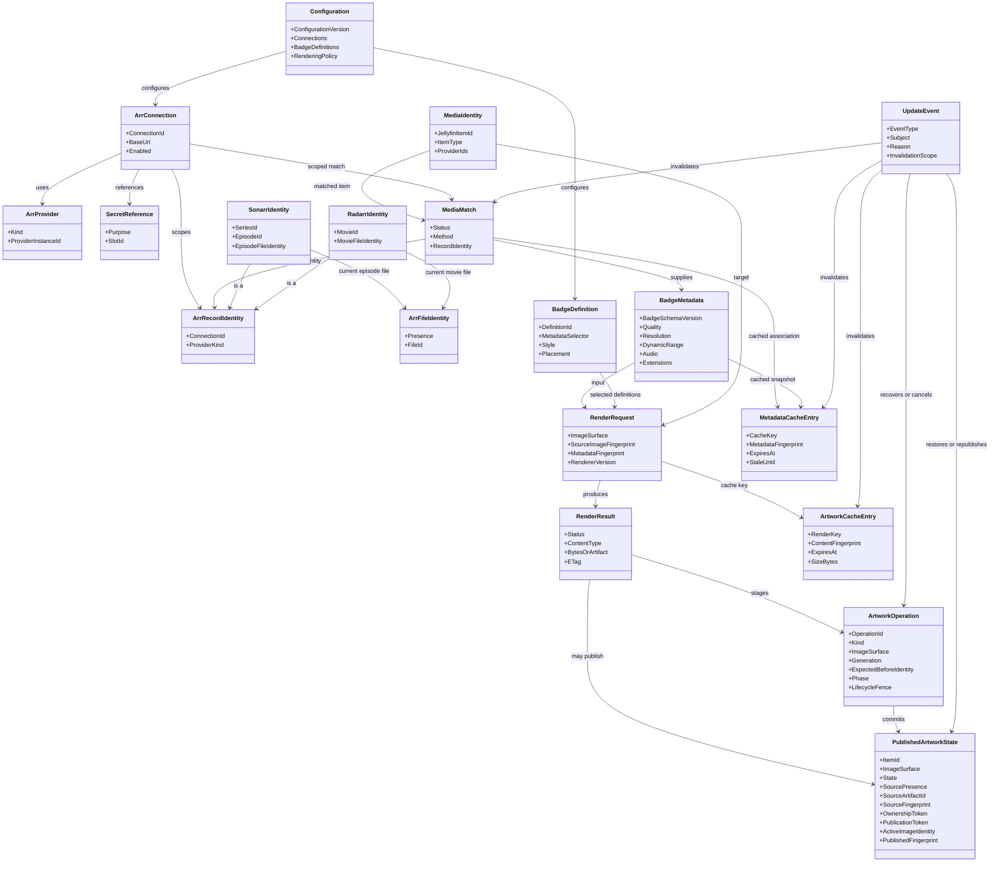

# 2. Model Relationships

`MediaIdentity` is the Jellyfin-side subject. `MediaMatch` connects it to one
scoped Arr record through a typed `ArrRecordIdentity` that distinguishes Sonarr
series/episode/file identity from Radarr movie/file identity.
`MetadataCacheEntry` retains the provider-derived snapshot;
`ArtworkCacheEntry` retains only bounded render work state. `PublishedArtworkState`
tracks the active derived image and the plugin-owned source-artwork provenance.
Jellyfin does not provide an artwork-owner field, so ownership is proven by the
combination of retained source bytes, a persisted expected active-image identity,
and ArrTags-generated publication/session tokens. A cache hit must never be
treated as a new source of truth when it is expired or incompatible.
