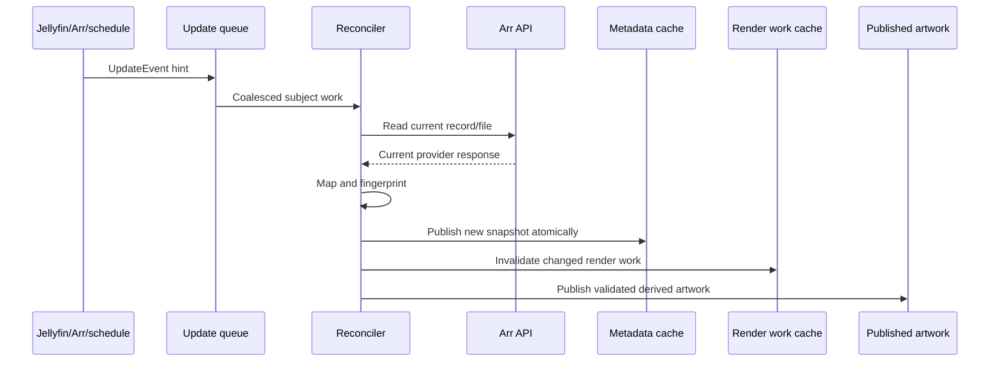

# 7. Event Model

Events are internal work hints. They are bounded, deduplicated, cancellation-
aware, and safe to replay. Provider webhooks never directly publish metadata.

An authenticated inbound Arr webhook (ADR-012) is mapped into this same hint
path. Only the event kind, upgrade flag, and provider-local record/file
identifiers are read from the bounded payload; those identifiers are hints used
to find the Jellyfin items ArrTags has already associated with the provider
record in its persisted metadata-state mapping. The resolution is bounded by the
configured reconciliation batch size, the resulting bounded work hint is
deduplicated with every other trigger, and the worker re-reads current Jellyfin
and Arr state before publishing. A webhook never publishes metadata, mutates
artwork, calls an Arr endpoint, or widens work beyond already-known items.

| Event | Required data | Effect |
| --- | --- | --- |
| Metadata changed | Subject, provider/connection, record/file hint, reason | Re-match or re-read current provider state, then replace the metadata snapshot if its fingerprint changed. |
| Artwork publication requested | Jellyfin item, image surface/index, source fingerprint, reason | Look up current metadata and construct bounded publication work. |
| Artwork published | Item, image surface, source fingerprint, published fingerprint, publication token, active-image identity, operation ID, state revision, status, correlation ID | Record publication state through the supported item-image flow; never write the image cache directly. |
| Item removed | Jellyfin item ID and optional provider scope | Invalidate metadata and artwork entries for the item; do not call provider write APIs. |
| Configuration changed | New configuration version and affected scopes | Replace the configuration snapshot and invalidate affected metadata/artwork state. |
| Cache invalidated | Scope, key/fingerprint, reason | Remove or mark stale only the affected cache entries. |
| Reconciliation requested | Scope, reason, schedule/manual source | Enqueue bounded work that re-reads current Jellyfin and Arr state. |
| Provider health changed | Connection ID, health state, safe error summary | Adjust retry/reconciliation behavior and preserve bounded last-known-good metadata where allowed. |

The common invalidation flow is:

