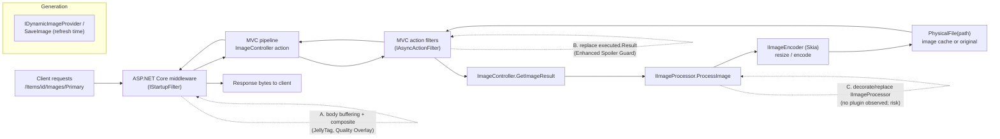
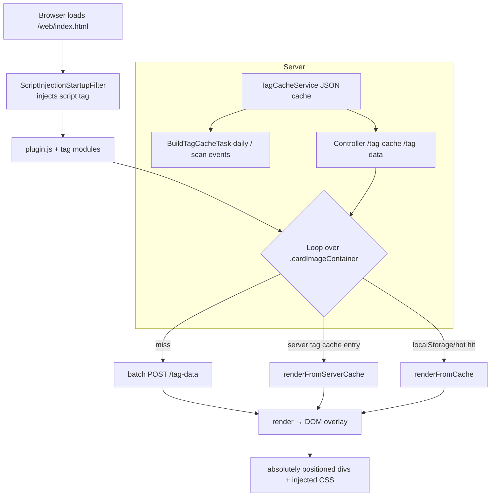
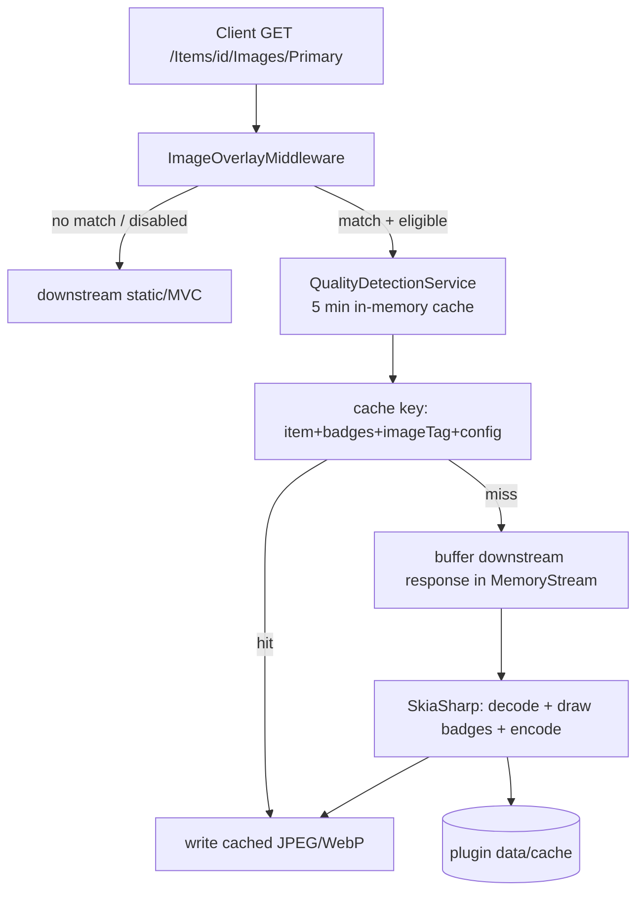
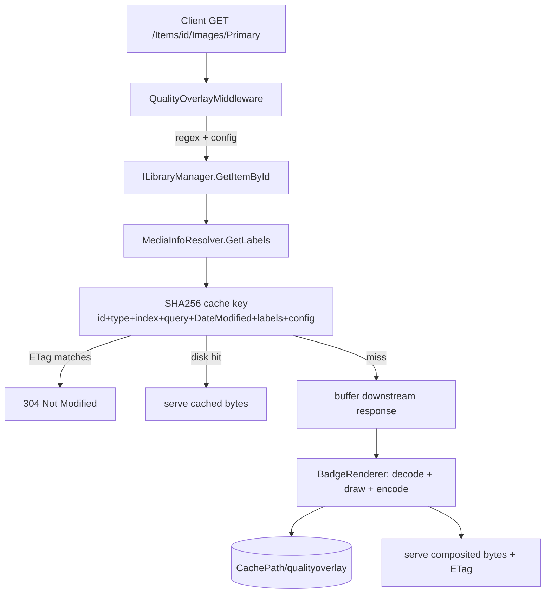
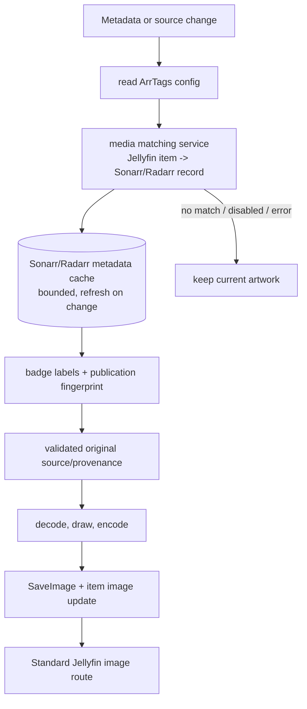

# Poster badge rendering strategies used by existing Jellyfin plugins

## Scope and method

This document is **research and architectural analysis only**. It does not
implement anything. It answers the question posed for ArrTags:

> How do existing Jellyfin plugins render badges on posters, which approach is
> best for ArrTags, and can we avoid permanently modifying poster files?

The analysis is based on direct inspection of the following plugin sources
(shallow clones at the commits below) plus the Jellyfin `v12.0` source. It is
scoped to badge/overlay rendering, not to Sonarr/Radarr data retrieval (see
`docs/media-metadata-mapping.md` and `docs/jellyfin-12-architecture.md`).

| Plugin | Repository | Inspected commit | Declared host |
| --- | --- | --- | --- |
| Jellyfin Enhanced | `n00bcodr/Jellyfin-Enhanced` | `84e6c1b8614ab7a5d71a84f10a16d0ffd05cb6d5` | Jellyfin 10.11 and 12 (`targetAbi` 12.0.0.0 build) |
| JellyTag | `Atilil/jellyfin-plugins` (`Jellytag/`) | `0a6bc5b15928ffe1071aa302e5787cf1e5d8fc1c` | `targetAbi` 10.10.0.0; README says 10.11.x+ |
| Quality Overlay | `obxidion/Jellyfin-Quality-Overlay` | `2a26dbc003563c255af40f667a4c42efe11f6cbe` | `targetAbi` 10.11.0.0 |

Jellyfin core references are pinned to tag `v12.0`
(`6c073e19ddf604b2369c638716164fdab4c952dc`), matching
`docs/jellyfin-12-architecture.md`.

**Evidence labels** (same convention as the sibling docs):

| Label | Meaning |
| --- | --- |
| **Confirmed** | Directly observed in the inspected plugin/core source or official docs. |
| **Inferred** | A conclusion drawn from confirmed source, not a stability promise. |
| **Proposed** | A design option; not API-establishable. |
| **Unresolved** | Needs version-pinned validation or a product decision. |

Two important caveats up front:

1. **JellyTag and Quality Overlay target Jellyfin 10.11, not 12.** Their
   mechanism (ASP.NET Core middleware over the image routes) is very likely to
   keep working on 12 because the image route shapes did not change, but neither
   plugin was compiled or tested against 12. Treat their 12 behaviour as
   **Inferred / to validate**.
2. **Jellyfin Enhanced is the only plugin here with an explicit 12 build.** Its
   poster *quality tags* are client-side; its *Spoiler Guard* is a server-side
   image rewrite. Both are relevant precedent.

---

## 0. Shared context: how Jellyfin 12 serves an image

Understanding the three interception windows requires the serving path.
**Confirmed** from Jellyfin `v12.0` source:

- `ImageController` resolves the request (`/Items/{itemId}/Images/{imageType}`,
  plus indexed and size/format route variants) and calls
  `IImageProcessor.ProcessImage(ImageProcessingOptions)`.
  (`Jellyfin.Api/Controllers/ImageController.cs`, `GetImageResult`, line ~2000)
- `ImageProcessor.ProcessImage` returns a **path** to either the original file or
  a resized/encoded variant in Jellyfin's own `resized-images` image cache; the
  controller then returns `PhysicalFile(...)`.
  (`src/Jellyfin.Drawing/ImageProcessor.cs`, lines ~118–221)
- `ImageProcessingOptions` already carries `Item`, `Image`, `ImageIndex`,
  sizing, `UnplayedCount`, `PercentPlayed`, `Blur`, `BackgroundColor`, and
  `ForegroundLayer`. `ForegroundLayer` is parsed as an **opacity value**, not an
  image path, and the only built-in overlays are the unplayed-count indicator
  and the percent-played drawer. There is **no** generic "draw arbitrary badge"
  option. (`MediaBrowser.Controller/Drawing/ImageProcessingOptions.cs`;
  `src/Jellyfin.Drawing.Skia/SkiaEncoder.cs`, lines ~671–878)
- `IImageProcessor` is a public interface but the implementation
  `Jellyfin.Drawing.ImageProcessor` is `sealed`, and it is registered once as a
  core singleton: `serviceCollection.AddSingleton<IImageProcessor, ImageProcessor>()`.
  (`Emby.Server.Implementations/ApplicationHost.cs`, line 593)
- The provider interfaces `IRemoteImageProvider`, `ILocalImageProvider`,
  `IDynamicImageProvider`, and `ILocalImageProvider` exist.
  `IDynamicImageProvider` is consumed by the **refresh pipeline**
  (`ItemImageProvider.RefreshFromProvider`) and its output is persisted with
  `IProviderManager.SaveImage` — i.e. it produces a stored image, not a
  per-request overlay. (`MediaBrowser.Providers/Manager/ItemImageProvider.cs`,
  lines ~171–248)

### Interception windows

Window **A** (middleware) and window **B** (MVC action filter) are both general
ASP.NET Core extension points, not Jellyfin-specific image hooks. Window **C**
(`IImageProcessor`) is the closest thing to an official per-request image
processing hook, but it is a shared core service and decorating it is not a
documented plugin contract.

### Official Jellyfin 12 extension points relevant to badges

| Extension point | Status | Suitable for dynamic badges? |
| --- | --- | --- |
| `IStartupFilter` + `UseMiddleware` | Standard ASP.NET Core; used by plugins here | Yes, by buffering/rewriting image responses (window A). General framework API, no Jellyfin image-specific guarantee. |
| `IAsyncActionFilter` via `MvcOptions.Filters.AddService<T>` | Standard ASP.NET Core MVC; used by Enhanced for images | Yes, by replacing `ActionExecutedContext.Result` after the image action runs (window B). Cleaner scoping; proven on 12 by Enhanced. |
| `IImageProcessor.ProcessImage` | Plugin-facing public interface, **sealed** core impl, singleton | Technically yes (decorate/replace), but global hot path, no per-image-type hook, high risk. Not recommended. |
| `IDynamicImageProvider` | Plugin-facing public provider API | Only at refresh; output is persisted via `SaveImage` → a stored copy, not a dynamic overlay. |
| `IRemoteImageProvider` / `ILocalImageProvider` | Plugin-facing public provider APIs | Selectable/adopted artwork, not overlays. |
| `IImageEncoder` | Plugin-facing public interface (Skia encoder is the impl) | Too broad: affects all image encoding, not overlay-specific. |
| `IProviderManager.SaveImage` + `UpdateToRepositoryAsync(ImageUpdate)` | Plugin-facing public API | Replaces the item's primary image (generated-poster strategy), not dynamic. |

**Answer to the open question ("is there an official image-processing /
image-provider extension point preferable to custom HTTP middleware?"):**
Jellyfin 12 exposes **no dedicated per-request image post-processing hook**.
`IImageProcessor` is the only official per-request processor, but it is a sealed
core singleton on the hot path and is not intended as a plugin overlay hook.
`IDynamicImageProvider` is official but generates and stores an image during
refresh. Therefore the practical server-side choices remain the ASP.NET Core
middleware (window A) and the MVC action filter (window B). This is an
**Unresolved** area to confirm against the exact 12.x ABI with a spike.

---

## 1. Jellyfin Enhanced

### 1.1 Architecture

**Confirmed.** Poster quality tags are rendered **client-side** as absolutely
positioned HTML `
` overlays over the poster card, with colors and placement
from injected CSS. There is **no** server-side compositing for the tags, and the
poster image bytes are never modified.

Key modules:

- `js/tags/qualitytags.js` — quality detection from `MediaStreams`/`MediaSources`
  and construction of the overlay DOM (`.quality-overlay-container`,
  `.quality-overlay-label`). Detects resolution, HDR/DV, codec, audio, 3D,
  media-stub source, IMAX.
- `js/tags/tag-pipeline.js` — one shared scan → fetch → render pipeline for all
  tag types (genre, language, quality, rating). Uses a `MutationObserver`, chunked
  processing (`requestIdleCallback`, 5 cards/chunk), a `WeakSet` of processed
  cards, and a generation counter to cancel stale work.
- `js/core/tag-renderer-base.js` — shared cache/CSS/ignore plumbing; localStorage
  cache keyed per item with a TTL (30 days default), a hot in-memory map, and a
  server-triggered cache clear timestamp.
- `Services/ScriptInjectionStartupFilter.cs` — an `IStartupFilter` that rewrites
  the `/web` `index.html` response and injects
  `<script src="../JellyfinEnhanced/script?v=...">`. It strips `Accept-Encoding`,
  `Range`, and validators before buffering the HTML.
- `Controllers/JellyfinEnhancedController.cs` — serves the JS bundle and the tag
  data endpoints (`GET /JellyfinEnhanced/script`, `GET /JellyfinEnhanced/js/{path}`,
  `POST /JellyfinEnhanced/tag-data/{userId}`,
  `GET /JellyfinEnhanced/tag-cache/{userId}`).
- `Services/TagCacheService.cs` + `ScheduledTasks/BuildTagCacheTask.cs` — a
  **server-side pre-computed tag cache**: per-item `TagCacheEntry` (including
  stream data) held in memory and persisted as JSON; reconciled by a daily 3 AM
  task and by library-scan events via `TagCacheMonitor`.

Separately, **Spoiler Guard** uses a different, server-side mechanism:
`Services/SpoilerGuard/SpoilerBlurImageFilter.cs` is an `IAsyncActionFilter`
registered globally through
`services.Configure<MvcOptions>(o => o.Filters.AddService<SpoilerBlurImageFilter>())`.
It runs after the image action, and for eligible items replaces
`executed.Result` with a `FileContentResult` containing blurred/placeholder
bytes produced by `ImageBlurService` (SkiaSharp Gaussian blur, in-memory LRU
bounded to 256 entries / 64 MiB). Every client receives the rewritten image
because it happens inside the native image API.

### 1.2 Rendering lifecycle

- **When rendered:** in the browser after the web app mounts; on every DOM
  mutation and navigation, chunked and idle-scheduled.
- **When cached:** three layers — hot in-memory `Map`, persistent
  `localStorage` (TTL 30 days default), and a server-side JSON tag cache.
- **When regenerated:** when an item is not in any cache (batch fetch), when the
  user changes, or when the server bumps `ClearLocalStorageTimestamp`; the
  server cache rebuilds daily and incrementally on library changes.
- **Invalidation:** server cache version/schema bumps, `onServerCacheRefresh`,
  and the server clear timestamp.

### 1.3 Client compatibility

Per the project's own README and source, tags render only where the
**jellyfin-web UI** runs:

| Client | Tags? | Why |
| --- | --- | --- |
| Jellyfin Web | Yes | DOM/CSS is injected and rendered here. |
| Android / iOS official apps | Yes | They embed the jellyfin-web UI. |
| Desktop apps | Yes | Embedded web UI (v3.0.0+). |
| Android TV / Fire TV | No | Native app, no web UI. |
| Kodi | No | External client, does not run jellyfin-web. |
| Other native/compose clients (Roku, Swiftfin, Findroid, Streamyfin…) | No | No web UI. |

### 1.4 Performance

- **CPU:** detection runs in the browser; server cost is the tag-cache precompute
  (stream parsing) once per item and incremental reconciliation. Client work is
  explicitly chunked/yielded to avoid jank.
- **Memory:** server holds the whole tag cache (all items + stream data) in
  memory; client holds hot maps + localStorage. Large libraries are a known
  concern (the cache code cites OOM risk on tens of thousands of items and
  hydrates in pages for that reason).
- **Disk:** persisted tag-cache JSON (plugin data folder); blur cache is
  in-memory only.
- **Network:** one bulk `tag-cache` GET per user (spoiler-stripped) plus small
  incremental requests; no image bytes changed.
- **Scalability:** precompute scales with library size; rendering scales with the
  number of visible cards, throttled.

### 1.5 Advantages

- Never touches image files or Jellyfin's image pipeline; fully reversible.
- Rich, multi-category badges with per-user toggles and live CSS customization.
- No extra image storage; no re-encoding.
- Zero cost for native clients (they simply do not see the tags, rather than a
  half-broken/badged asset).

### 1.6 Disadvantages

- Web-only: invisible to Android TV/Fire TV, Kodi, and most third-party clients.
- Depends on jellyfin-web DOM classes/React rendering; can break on web UI
  changes (the source contains many defensive selectors/workarounds).
- The whole tag cache is server memory; complex.
- Not usable for ArrTags' external metadata unless ArrTags feeds the existing
  pipeline (not a supported contract).

### 1.7 Jellyfin Enhanced compatibility

This **is** Jellyfin Enhanced. For ArrTags the important consequence is that
Enhanced owns the client-side quality-tag surface. ArrTags must not depend on
Enhanced's DOM, JS globals, config files, or private endpoints
(`docs/jellyfin-12-architecture.md` already states this policy). If ArrTags adds
server-rendered quality badges, Jellyfin Web will show **both** Enhanced's
client tags and ArrTags' baked-in badges unless one is disabled.

### 1.8 Can ArrTags reuse/extend it?

**Confirmed:** Enhanced exposes no documented extension point for external
metadata badges. Its quality engine is a closed client-side module; its tag
pipeline is an internal JS API (`JE.tagPipeline`, `JE.core.tagRenderer`), and
plugin config is stateful. Contributing a renderer to it would couple ArrTags to
an undocumented, third-party, independently-released surface.

**Inferred recommendation:** reuse Enhanced's *patterns* (server-side image
mutation via MVC filter; bounded in-memory LRU; precompute + incremental
reconciliation) but do not reuse its internals. Coexist by configuration.

---

## 2. JellyTag

### 2.1 Architecture

**Confirmed.** JellyTag renders badges **server-side** by intercepting Jellyfin
image HTTP responses:

- `Middleware/JellyTagStartupFilter.cs` registers `ImageOverlayMiddleware` via
  `IStartupFilter` + `app.UseMiddleware<ImageOverlayMiddleware>()`.
- `Middleware/ImageOverlayMiddleware.cs` matches
  `^/Items/{id}/Images/(Primary|Thumb)(/{index})?$`, resolves the `BaseItem`,
  filters by item type (`Movie/Series/Season/Episode/Video`) and excluded
  libraries, detects badges, and — on a cache miss — buffers the downstream image
  response into a `MemoryStream`, composites badges with SkiaSharp
  (`Services/ImageOverlayService.cs`), writes the result to a disk cache, and
  returns the composited bytes.
- `Services/QualityDetectionService.cs` detects resolution, HDR
  (`VideoRange`/`VideoRangeType`), video codec, audio codec/channels, language
  flags, and VOST subtitles from `MediaStreams`; a 5-minute in-memory badge cache
  sits in front.
- `Services/ImageCacheService.cs` stores processed JPEG/WebP on disk under the
  plugin data folder; `Tasks/CacheCleanupTask.cs` deletes expired files daily.
- Badges are bundled SVG/PNG assets (`Assets/badge-*.svg`, `flag-*.svg`) or
  text-style badges; admins can upload custom badges.

### 2.2 Rendering lifecycle

- **When rendered:** on image request, lazily, only when a badge exists and the
  response is a 200 image.
- **When cached:** processed bytes written to the plugin's own disk cache.
- **When regenerated:** cache key includes item id, badge set, image tag (the
  `tag` query param or item `DateModified` ticks), and a configuration
  fingerprint; a key change produces a new entry.
- **Invalidation:** TTL (`CacheDurationHours`, default 24) plus a daily
  `CacheCleanupTask`; `InvalidateCache(itemId)` exists for programmatic clears;
  a "Clear Image Cache" button and config changes alter the fingerprint.

### 2.3 Client compatibility

**Confirmed from design:** because the bytes returned by the native image API are
modified, badges appear on **all clients** that fetch the item image — Web,
Android, iOS, Android TV/Fire TV, Kodi, and third-party clients. This is the
decisive difference from client-side overlays.

### 2.4 Performance

- **CPU:** SkiaSharp decode + draw + encode per cache miss (native); detection is
  cheap and cached 5 minutes in memory.
- **Memory:** buffers the full downstream response in a `MemoryStream`, plus a
  decoded `SKBitmap` per concurrent render; no explicit concurrency limit beyond
  Skia's own cost.
- **Disk:** one cached file per (item, badge set, tag, config) variant; cleaned
  daily.
- **Network:** response bytes may change size/format (JPEG/WebP), so client image
  caching is partly overridden and the middleware manages its own `ETag`/cache
  headers.
- **Scalability:** scales with distinct image requests; cache bounds repeat work.

### 2.5 Advantages

- Works on every client (widest compatibility).
- Original image files and Jellyfin's image store are never modified.
- Rich badge categories and per-image-type/per-panel customization.
- No write to Jellyfin's own image cache; only the plugin's private cache.

### 2.6 Disadvantages

- Raw HTTP middleware is brittle: it keys off route regexes, buffers whole
  responses, disables/strips `Range`/conditional headers, and must re-implement
  caching semantics.
- Re-encodes images (quality loss, CPU), including images Jellyfin already
  resized/encoded for a specific client size.
- A second on-disk copy of every processed variant exists (ephemeral, but real).
- Not compiled against Jellyfin 12; needs validation.
- Global interaction with any other image middleware/filter.

### 2.7 Jellyfin Enhanced compatibility

No source-level coupling. Both modify image responses, but at different pipeline
stages: Enhanced's Spoiler Guard runs as an MVC action filter **inside** the
request; JellyTag's middleware wraps the entire pipeline and composites onto the
final body. They can coexist, but ordering/interaction (e.g. compositing a badge
onto a spoiler-blurred or hidden card) is **Unresolved** and should be tested.
On Jellyfin Web, JellyTag's server badges and Enhanced's client quality tags will
render simultaneously (duplication).

### 2.8 Can ArrTags reuse/extend it?

No code is shareable in a supported way (separate plugins, MIT, targeting
10.11). The **architecture** is directly reusable and is the closest precedent
for ArrTags' server-side goal.

---

## 3. Quality Overlay

### 3.1 Architecture

**Confirmed.** Same core mechanism as JellyTag, smaller and cleaner:

- `Startup/QualityOverlayStartupFilter.cs` registers `QualityOverlayMiddleware`
  via `IStartupFilter`.
- `Middleware/QualityOverlayMiddleware.cs` matches
  `^/Items/{id}/Images/(?<type>\w+)(/(?<index>\d+))?`, resolves the item, asks
  `Detection/MediaInfoResolver` for badges, builds a cache key from the item's
  `DateModified`, query string, labels, and render config, and on a miss buffers
  the downstream response, renders with `Drawing/BadgeRenderer` (SkiaSharp), and
  writes the plugin cache.
- `Detection/MediaInfoResolver.cs` derives a video label (4K/1440p/1080p/720p/
  480p/SD) from the highest-resolution non-external video stream via
  `IMediaSourceManager.GetMediaStreams`, and an audio label (codec + channels,
  with Atmos detection) from the best audio stream.
- `Caching/ImageCacheService.cs` stores processed bytes under Jellyfin's
  `CachePath/qualityoverlay`, with a TTL (`CacheExpirationHours`, default 168)
  and lazy deletion on read.
- `PluginConfiguration` exposes position, scale, margin, colors/opacity, image
  types (Primary/Thumb/Backdrop), and cache expiration. `SetCacheHeaders` emits
  a derived `ETag` and `Cache-Control: no-cache`, and the middleware answers
  `If-None-Match` with `304`. It skips processing for responses that are not
  200 image bytes or exceed `MaxImageBytes` (25 MB).

### 3.2 Rendering lifecycle

- **When rendered:** per request, lazily, for selected image types only.
- **When cached:** disk cache under Jellyfin's cache directory; `ETag` enables
  client-side 304s.
- **When regenerated:** key changes on item `DateModified`, query string, labels,
  or render config.
- **Invalidation:** TTL-based lazy expiry on read (no scheduled cleanup task
  observed); `ETag`/`If-None-Match` for client revalidation.

### 3.3 Client compatibility

Same as JellyTag: server-side response mutation means **all clients** see the
badges (Web, mobile, TV, Kodi, third-party).

### 3.4 Performance

- **CPU:** SkiaSharp decode/draw/encode per cache miss; label derivation per
  request (no explicit in-memory badge cache, unlike JellyTag).
- **Memory:** full response buffered in a `MemoryStream` plus a decoded bitmap;
  25 MB cap guards pathological inputs.
- **Disk:** plugin-scoped cache keyed by SHA-256 with configurable expiry.
- **Network:** custom `ETag` → efficient 304 revalidation; bytes replaced.
- **Scalability:** good for typical requests; per-request label lookup and
  re-encode are the main costs.

### 3.5 Advantages

- All clients; originals untouched; no Jellyfin image-store writes.
- Cleaner, smaller implementation than JellyTag; sensible `ETag`/304 handling and
  response-size guard.
- Per-image-type selection and a documented configurable cache.

### 3.6 Disadvantages

- Same structural middleware costs as JellyTag (buffering, re-encode, route
  brittleness, global ordering).
- Only video quality + audio codec categories; no external metadata.
- Targets 10.11; not validated on 12.

### 3.7 Jellyfin Enhanced compatibility

Same as JellyTag: no source coupling, but Web shows duplicate quality badges, and
interaction with Spoiler Guard ordering is untested. Quality Overlay's own
README explicitly positions it as a server-side, original-preserving overlay,
which is exactly the property ArrTags wants.

### 3.8 Can ArrTags reuse/extend it?

No code reuse, but this is the cleanest reference for a server-side badge
renderer (cache key, ETag, size guard, graceful pass-through on any failure).

---

## 4. Comparison of rendering approaches

Notes: "Modifies original poster" means the file in the media folder or
Jellyfin's persisted primary image; all server-side response strategies here
leave it untouched. "Works on all clients" assumes the badge is delivered as the
item image bytes.

| Strategy | Modifies original poster | Requires web UI | Works on all clients | Cache complexity | Performance | Compatibility |
| --- | --- | --- | --- | --- | --- | --- |
| **Client-side HTML/CSS overlay** (Jellyfin Enhanced Quality Tags) | No | Yes (jellyfin-web) | No (Web + embedded-web apps only; native TV/Kodi/third-party excluded) | High: hot map + localStorage TTL + server JSON tag cache + server clear/version | Client CPU/DOM; server precompute memory; chunked, low per-frame cost | Best-effort; depends on undocumented jellyfin-web DOM |
| **Server-side HTTP middleware compositing** (JellyTag, Quality Overlay) | No | No | Yes | Medium: plugin disk cache keyed by item+image tag+config+badges, TTL/ETag | Per-miss decode+draw+encode; full-response buffering; repeats per size variant | Standard ASP.NET middleware; route-regex brittle; validated on 10.11, inferred on 12 |
| **MVC action-filter response rewrite** (Enhanced Spoiler Guard) | No | No | Yes | Medium: filter-level cache key incl. size params; per-request eligibility checks | Reads/replaces the controller result; Skia blur; bounded in-memory LRU | Standard MVC filter; proven on Jellyfin 12 by Enhanced |
| **Image provider replacement** (`IDynamicImageProvider`) | Yes (becomes primary image, persisted) | No | Yes | Low (refresh-driven) but **stored copy** | Generation cost at refresh; no per-request cost | Official provider API; runs only on refresh and only when replacing/adding images |
| **`IImageProcessor` decoration/replacement** | No | No | Yes | Plugin-owned; no built-in hook | Global per-request processor; extra decode/encode on all images | Public interface but sealed singleton core service; not a plugin contract; high risk |
| **Scheduled/generated poster replacement** (`SaveImage` + `UpdateToRepositoryAsync(ImageUpdate)`) | Yes (replaces primary image) | No | Yes | Fingerprint/idempotency state required | Batch generation; no per-request cost; needs original backup for reversibility | Official save API; selected V1 tradeoff requires provenance and guarded restoration |
| **Reverse-proxy overlay** (not found in these plugins) | No | No | Yes | Proxy cache | Proxy CPU; external component | Out of scope for a plugin; operational burden |

---

## 5. Selected architecture

The research alternatives above remain valid, but the project decision is now
recorded in `docs/decisions.md`: use supported persisted derived artwork rather
than response interception.

### 5.1 Direct answers

1. **Can we avoid modifying original media files?**
   Yes. Generate derived artwork asynchronously and publish it through
   `IProviderManager.SaveImage` and the normal item-image update flow. Do not
   write original media files or Jellyfin's image cache directly.

2. **Can we avoid changing the active Jellyfin artwork?**
   No, not while retaining a supported normal-image path and native-client
   coverage. The original source must instead be retained through plugin-owned
   provenance so it can be restored safely.

3. **Can we render badges without slowing image requests?**
   Yes. Compute badges from cached Sonarr/Radarr metadata, render asynchronously
   when the publication fingerprint changes, and let Jellyfin serve the
   completed active image through its normal image path.

4. **Can we reuse/extend Jellyfin Enhanced rather than duplicating
   functionality?**
   Do not reuse Enhanced internals. Enhanced's quality tags are client-side and
   web-only, while ArrTags uses the normal persisted image path. Web may still
   show both systems, so coexistence remains configuration- and test-driven.

5. **Widest client compatibility while maintainable?**
   Supported persisted artwork through Jellyfin's item-image APIs. It gives
   every client the normal Jellyfin image representation, authorization,
   image tags, and cache behavior without relying on response interception.

### 5.2 Selected publication architecture

Properties:

- **Source-preserving:** the original source is retained through plugin-owned
  provenance and is not overwritten by the renderer or media-file writes.
- **Asynchronous:** regeneration occurs when source, metadata, configuration, or
  renderer fingerprints change, not during an image request.
- **Native delivery:** Jellyfin's normal image routes serve the published image
  and own authorization, image tags, and response caching.
- **Failure-safe:** any matching or render error leaves the current usable image
  unchanged.
- **Publication identity:** state includes item/surface, an immutable retained
  source artifact, source and metadata/configuration fingerprints, renderer
  version, an ArrTags ownership token, a per-publication token, and the expected
  active-image identity. Restoration is permitted only after a fresh identity
  match; a mismatch or unverifiable observation blocks mutation.
- **Concurrency/limits:** bound concurrent decode/encode/publication work, cap
  source/output bytes, and never block library events.

---

## 6. Open questions / investigation before implementation

1. **Confirm no newer official hook.** Re-verify against the exact Jellyfin 12.x
   ABI that there is no supported post-processing/overlay extension point beyond
   `IImageProcessor`. **Current finding (confirmed):** none dedicated; the
   closest interfaces are `IImageProcessor` (sealed, singleton, hot path) and
   `IDynamicImageProvider` (refresh-time, persisted). **Unresolved** only in the
   sense of confirming nothing was added in a later 12.x patch.
2. **Publication feasibility.** Validate source-artwork capture, supported
   `IProviderManager.SaveImage` publication, item repository updates, and the
   ADR-002/ADR-003 ownership and crash-recovery contracts on the exact selected
   Jellyfin ABI.
3. **Publication storage and ownership.** Resolved by ADR-002 and ADR-003 at
   the design level: ArrTags stores its own source/operation artifacts, compares
   active content identity, and reconciles uncertain calls by postcondition.
   Exact host storage, readback, permissions, and bounded cleanup remain
   implementation validation.
4. **Enhanced coexistence matrix.** Test ArrTags server badges with Enhanced
   Quality Tags enabled and disabled, and with Spoiler Guard blur/hide on, in
   Jellyfin Web plus at least one non-web client. Confirm no duplicate/visual
   collision and no badge leaking onto spoiler-hidden cards.
5. **Performance acceptance criteria.** Define queue/concurrency limits, maximum
   input/output bytes, cache bounds/eviction, cancellation, and a large-library
   test. The middleware plugins' buffering and re-encoding are the cost to beat.
6. **Multi-version/editions and scope.** Decide which image types and item types
   are badged (Primary/Thumb/Backdrop; movie/series/season/episode), and how
   alternate versions/editions map to Arr records (see
   `docs/media-metadata-mapping.md`).
7. **Jellyfin 12 validation of the publication path.** JellyTag (10.10 ABI) and
   Quality Overlay (10.11 ABI) are useful response-rewrite references, but are
   not part of the selected mechanism. Validate the supported item-image
   publication path on the exact 12.x server instead.
8. **Renderer/format decisions.** Raster format/quality, output size relative to
   the client-requested size (Jellyfin 12 does not upscale), and legibility rules
   remain product decisions.

---

## 7. References

Jellyfin core (`v12.0`, `6c073e19ddf604b2369c638716164fdab4c952dc`):

- `Jellyfin.Api/Controllers/ImageController.cs` — image routes and
  `GetImageResult` (`IImageProcessor.ProcessImage` → `PhysicalFile`).
- `src/Jellyfin.Drawing/ImageProcessor.cs` — per-request processing and
  `resized-images` cache; `IImageProcessor` implementation.
- `src/Jellyfin.Drawing.Skia/SkiaEncoder.cs`, `PercentPlayedDrawer.cs`,
  `UnplayedCountIndicator.cs` — built-in overlays; `ForegroundLayer` is opacity.
- `MediaBrowser.Controller/Drawing/IImageProcessor.cs`,
  `ImageProcessingOptions.cs`, `IImageEncoder.cs`.
- `MediaBrowser.Controller/Providers/IImageProvider.cs`,
  `IRemoteImageProvider.cs`, `ILocalImageProvider.cs`,
  `IDynamicImageProvider.cs`, `DynamicImageResponse.cs`.
- `MediaBrowser.Providers/Manager/ItemImageProvider.cs` — dynamic provider
  consumption via the refresh pipeline.
- `Emby.Server.Implementations/ApplicationHost.cs` (line 593) —
  `AddSingleton<IImageProcessor, ImageProcessor>()`.
- `docs/jellyfin-12-architecture.md`, `docs/media-metadata-mapping.md`,
  `GOALS.md`.

Plugins:

- `n00bcodr/Jellyfin-Enhanced` @ `84e6c1b` — `js/tags/qualitytags.js`,
  `js/tags/tag-pipeline.js`, `js/core/tag-renderer-base.js`,
  `Services/ScriptInjectionStartupFilter.cs`,
  `Controllers/JellyfinEnhancedController.cs`, `Services/TagCacheService.cs`,
  `ScheduledTasks/BuildTagCacheTask.cs`,
  `Services/SpoilerGuard/SpoilerBlurImageFilter.cs`,
  `Services/SpoilerGuard/ImageBlurService.cs`.
- `Atilil/jellyfin-plugins` (`Jellytag/`) @ `0a6bc5b` —
  `Middleware/ImageOverlayMiddleware.cs`, `Middleware/JellyTagStartupFilter.cs`,
  `Services/ImageOverlayService.cs`, `Services/ImageCacheService.cs`,
  `Services/QualityDetectionService.cs`, `Tasks/CacheCleanupTask.cs`,
  `Jellyfin.Plugin.JellyTag/README.md`.
- `obxidion/Jellyfin-Quality-Overlay` @ `2a26dbc` —
  `Middleware/QualityOverlayMiddleware.cs`,
  `Startup/QualityOverlayStartupFilter.cs`, `Caching/ImageCacheService.cs`,
  `Drawing/BadgeRenderer.cs`, `Detection/MediaInfoResolver.cs`,
  `Configuration/PluginConfiguration.cs`, `README.md`.
